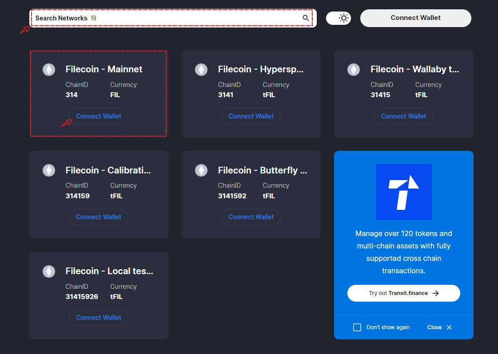

# Version Update (Jan 12th, 2023)

**【The Latest Version】**

iOS: 2.0.0

**【Version Update】**

1\. Support TRON.

2\. Support to add custom networks.

3\. Support to manage networks.

4\. Support the cold wallet and watch wallet.

**【Version download method】‌**

&#x20; Download from [**APP Store**](https://apps.apple.com/hk/app/tp-global-wallet/id6444625622), enter <mark style="color:red;">**\[TP Wallet]**</mark> on the search bar, and the developer is <mark style="color:red;">**\[TP Global Ltd.]**</mark>

<figure><figcaption></figcaption></figure>

**(The developer downloaded in App Store before October 8, 2022 is TOKENPOCKET FOUNDATION LTD, an early version developed by TokenPocket, which is also a legitimate wallet can be used normally, and the update service will be suspended later.)**
