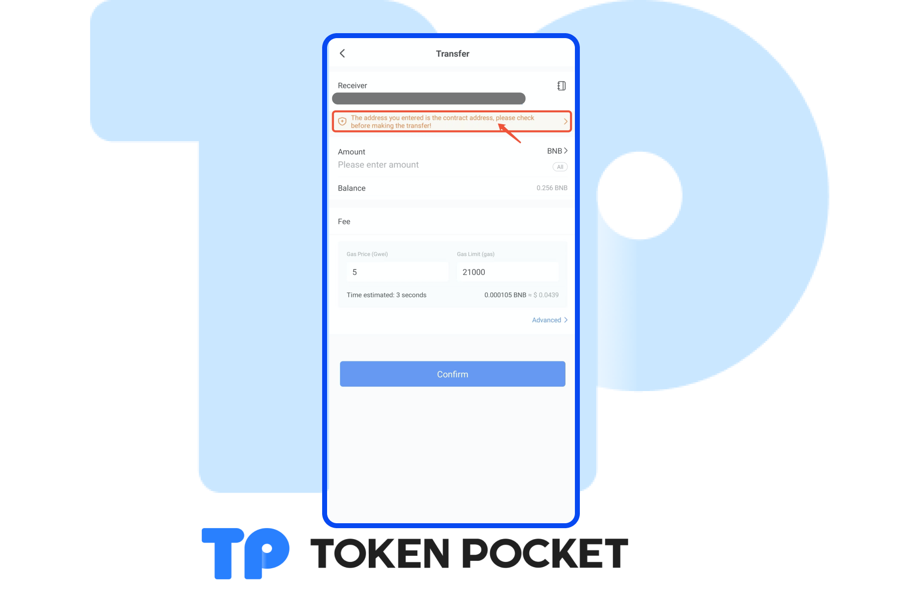
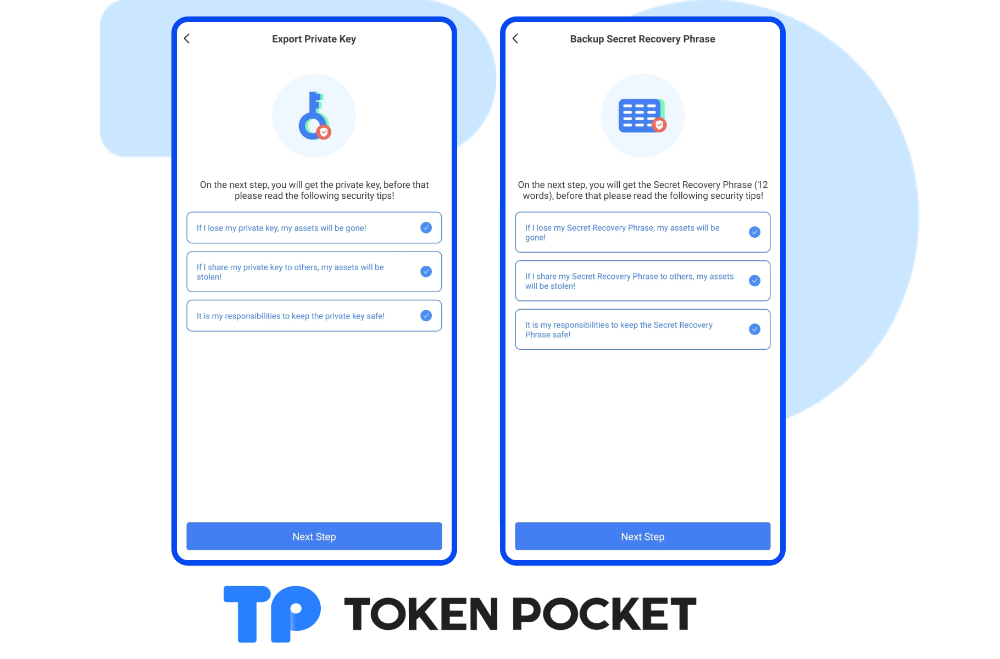
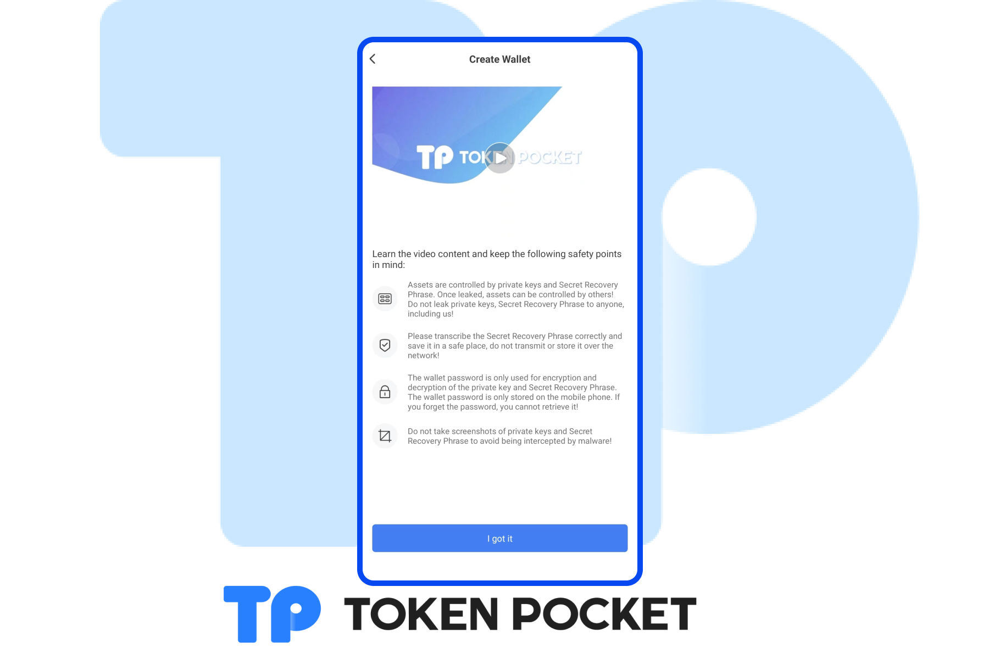

# Version update log(Apr 13, 2022): Transit Swap adds the activity center; etc.

**【Version Update】**

Android: 1.4.4

iOS: 1.8.0

&#x20;

**【Version Update】**

1\. Transit Swap adds the activity center;

2\. Transit Swap supports the third-party Token List;

3\. Transit Swap adds the new balance cache mechanism;

4\. Support the 24h trading price display of NFTs;

5\. Support buy token with fiat;

6\. Optimize the contract address reminder on the transfer page;

7\. Upgrade the process of creating/importing a wallet;

8\. Add video explanation to the page of backup the Secret Recovery Phrase;

9\. Optimize the experience of DApp List;

10\. Optimize the users’ experience;

11\. Fix bugs.

&#x20;&#x20;

**【Details】**

1\. Support buy token with fiat;

2\. Optimize the contract address reminder on the transfer page;

3\. Upgrade the process of creating/importing a wallet;

4\. Add video explanation to the page of backup the Secret Recovery Phrase.

**【Version update method】‌**

The update is prompted in the App, or download the latest version from the official website. (Note: The only official website of TokenPocket is: [https://tokenpocket.pro/](https://tokenpocket.pro))
