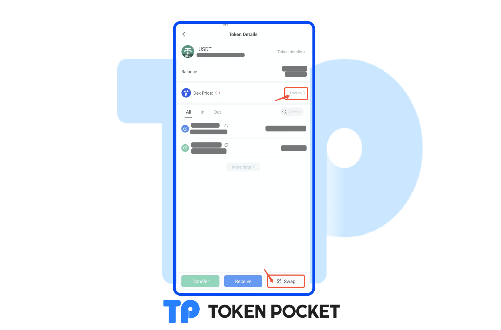

# Version update log(Apr 2, 2022): Support EOS and TRON to connect hardware wallets; etc.

【Version Update】

iOS: 1.7.9

Android: 1.4.3

&#x20;

【Details of version update】

1\. Support EOS and TRON to connect hardware wallets;

2\. Add “Swap” to the Token Details;

3\. Support OKX brand upgrade;

4\. Remove the page of “News”;

5\. Optimize users’ experience;

6\. Fix bugs.

&#x20;

【Details】

1\. Add “Swap” to the Token Details;

【Version update method】‌

The update is prompted in the App, or download the latest version from the official website. (Note: The only official website of TokenPocket is: [https://tokenpocket.pro/](https://tokenpocket.pro))
