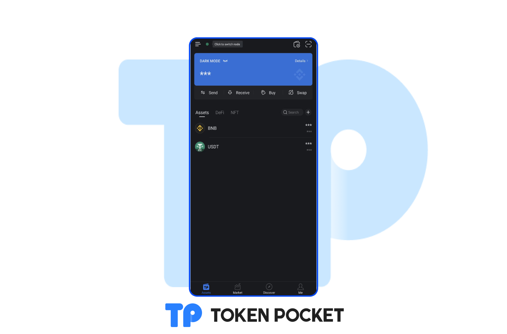

# Version Update (Jun 8, 2022)

**【Version Update】**

iOS: 1.8.4

Android: 1.4.9

**【Version Update】**

1\. Support Dark Mode.

2\. Optimize the data analysis of the DApps on TRON.

3\. Fix the bugs of Android 8.0.

&#x20;

&#x20;**【Details】**

**How to set Dark Mode?**

1\. Open TokenPocket wallet, click 【Me】, and click the "Moon" button in the upper right corner to switch to the dark mode.

2\. Open TokenPocket wallet, click 【Me】, click 【Settings】, click 【Dark Mode】, and continue to click 【Dark Mode】.

**【Version update method】‌**

1. Update from GooglePlay or AppStore

&#x20; 2\. Update from Wallet application (Note: The only official website of TokenPocket is: [https://tokenpocket.pro/](https://tokenpocket.pro/))
