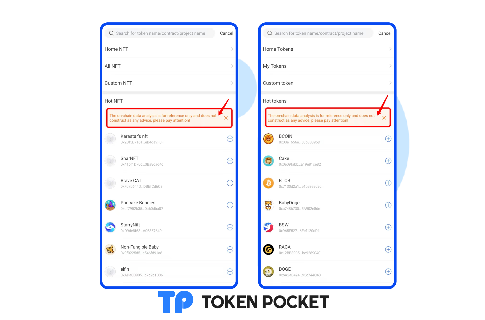
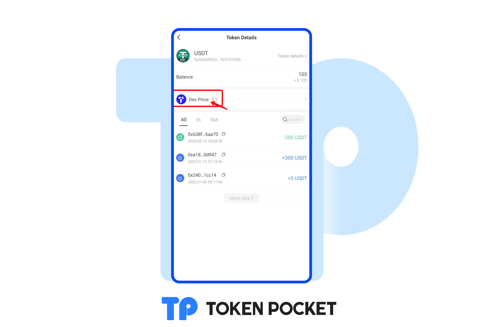

# Version update log(Feb 25, 2022): Support ERC1155; Add NFT administration page; etc.

**【Version Update】**

Android: 1.4.1

iOS: 1.7.7

&#x20;

**【Details of version update】**

1\. Support ERC1155.

2\. Add NFT management page.

3\. Add reminders of hot data.

4\. Optimize the page of token details.

5\. Add the cache clearing function.

6\. Support Thai and Filipino.

7\. Optimize the TRON transfer reminders.

&#x20;

**【Details】**

1\. Add NFT management page.

[**How to manage your NFT assets?**](https://help.tokenpocket.pro/en/wallet-management/how-to-manage-my-nft-assets)****

2\. Add display reminders of hot data.

3\. Optimize the page of token details.

**【Version update method】‌**

The update is prompted in the App, or download the latest version from the official website. (Note: The only official website of TokenPocket is: [https://tokenpocket.pro/](https://tokenpocket.pro/))
