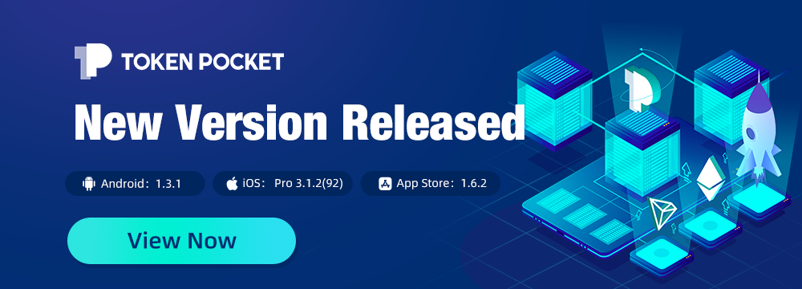
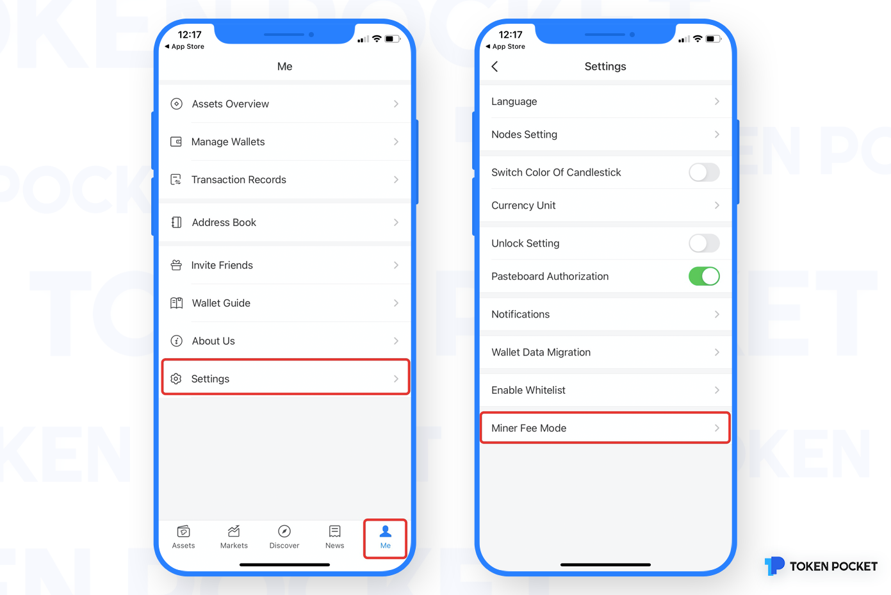
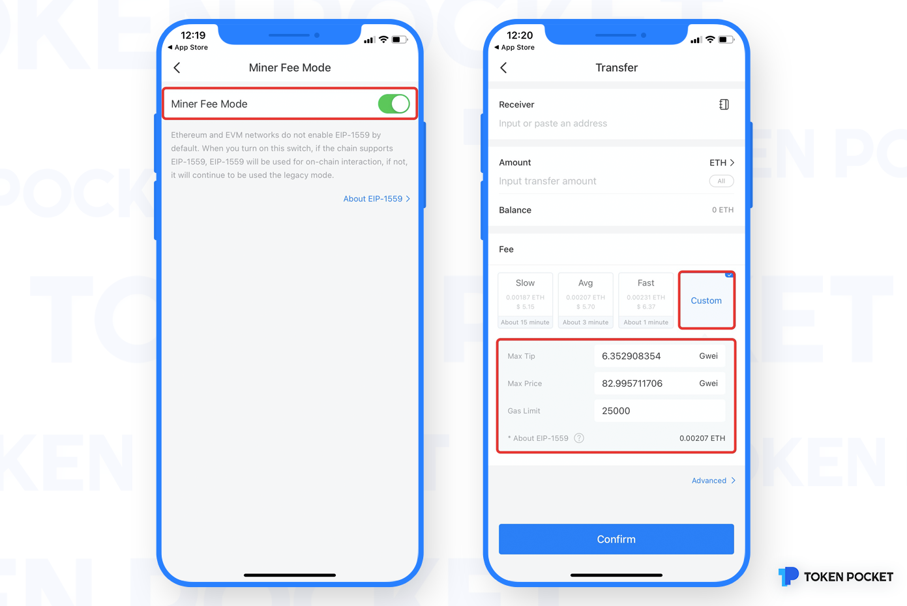

# Version update log (August 5, 2021): Support EIP-1559 miner fee mode, more detailed optimization

**\[Details of version update]**

iOS pro 3.1.2(92)

App Store 1.6.2

Android 1.3.1

‌

**\[Main update content]**

1\. Support Ethereum London upgrade, EIP-1559 miner fee mode

2\. Support TRON wallet to create mnemonic words

3\. Add risk warning on approval operation

‌**How to enable the EIP-1559 mode?**

**\[Version update method]**

The upgrade is prompted in the App, or users can download the latest version from the [**official website**](https://www.tokenpocket.pro/en/download/app). (Note: The only official website of TokenPocket is: [www.tokenpocket.pro](http://www.tokenpocket.pro))

**​**
