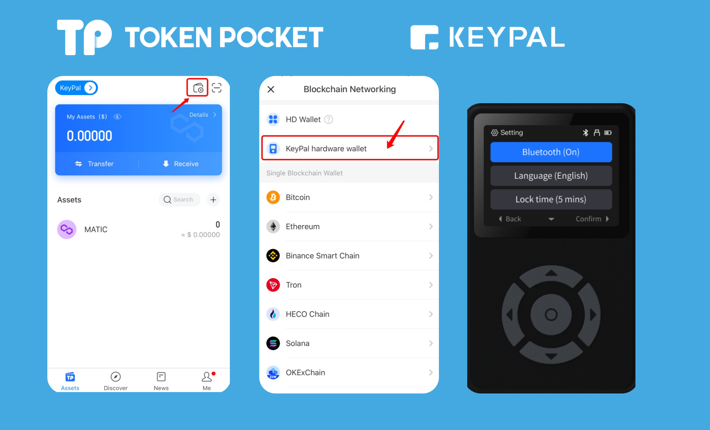

# Version update log (December 30, 2021): Support KeyPal hardware wallet;

**\[Version Update]**

Android: 1.3.8

iOS: 1.7.2

**\[Details of version update]**

1\. Support KeyPal hardware wallet;

2\. Add the portal of “Hardware Wallet” on the official website.

**【Details/Tutorial】**

1\. Activate your KeyPal;

Choose your native language first, now we only support Chinese and English. Press any key to continue. Click \[Import Wallet], select the number of secret recovery phrases.

.png>)

Follow the reminders and enter your secret recovery phrase. (Tips: Since KeyPal supports the association function of the secret recovery phrase, select the number of digits of the secret recovery phrases that need to be imported and enter the phrases in the order of the prompts. After entering the letters, there will be an association function, which can be selected according to the up/down buttons. Press to confirm or right-click to enter the next letter to confirm. After successfully importing the secret recovery phrases and checking them, it will show successful import.)

.png>)

After importing your wallet, you need to set the PIN code. (Attention: PIN code is the password of your KeyPal, please back up and save in a safe place.)

.png>)

2\. How to connect KeyPal with TokenPocket?

First of all, you need to check the Bluetooth state of your KeyPal. Click\[Setting], you can view the state of the Bluetooth. Open your TokenPocket APP, click the wallet pattern on the upper right corner, click \[KeyPal hardware wallet].

Click \[About]-\[Device Information] to view your Bluetooth name. And enter your Bluetooth matching code (Bluetooth code will be displayed in KeyPal.)

.png>)

After the device is successfully connected, the KeyPal Bluetooth connection pattern will be displayed in the upper right corner of the TokenPocket wallet.

3\. How to transfer through KeyPal?

Open TokenPocket APP, click\[Transfer], and enter the receiving address and the amount, click \[Confirm], you need to enter the PIN code of your KeyPal in a one-to-one correspondence.

And you need to check the receiving address, transfer amount, and the gas fee on your KeyPal. After you have confirmed the information below, the KeyPal will show \[Sign successfully], the transfer is successful.

**【Version update method】**‌

The update is prompted in the App, or download the latest version from the official website. (Note: The only official website of TokenPocket is: [https://tokenpocket.pro/)](https://tokenpocket.pro/\))

