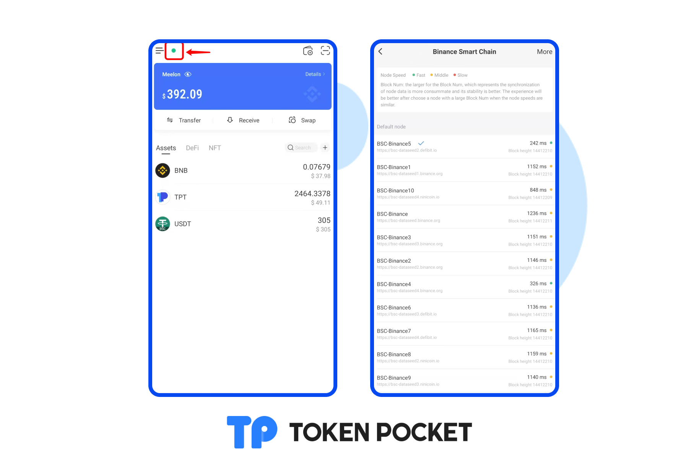

# Version update log (January 17, 2022): Support WAX; Support NFT use cases; etc.

**\[Version Update]**

Android: 1.3.9

iOS: 1.7.3

**\[Details of version update]**

1\. Support WAX;

2\. Support NFT use cases: Background at the TOP of the Assets page; Background of the receiving page; Avatar of the wallet;

3\. Support NFT image download;

4\. Add reminders: reminder of transfer record delay; reminder of the price update delay; remind before transfer;  reminder of using the receiving QR code and copying the receiving address;

5\. Cosmos upgrade;

6\. Optimize the ETH custom network searching;

7\. Support the Optimistic transfer records;

8\. New language supported: Hindi;

9\. Optimize users experience;

10\. Support EOSIO custom network.

**【Details/Tutorial】**

**1. Support WAX;**

[Create/Import a WAX wallet tutorial](https://help.tokenpocket.pro/en/defi-tutorial/how-to-trade-on-dex/wax-use-guide)

**2. Support NFT use cases: Background at the TOP of the Assets page; Background of the receiving page; Avatar of the wallet;**

[How to set NFT Asset Card, Receive Background, and Avatar on TokenPocket?](https://help.tokenpocket.pro/en/wallet-operation/set-nft)

**3. Support NFT image download;**

Click NFT image and click the button on the right, you can download your NFT image.

**4. Add reminders: reminder of transfer record delay; reminder of the price update delay; remind before transfer;  reminder of using the receiving QR code and copying the receiving address;**

 

**5.  Optimize the ETH custom network searching;**

**6. Optimize users' experience.**

Now you can switch your network node on the \[Assets] page.

****
