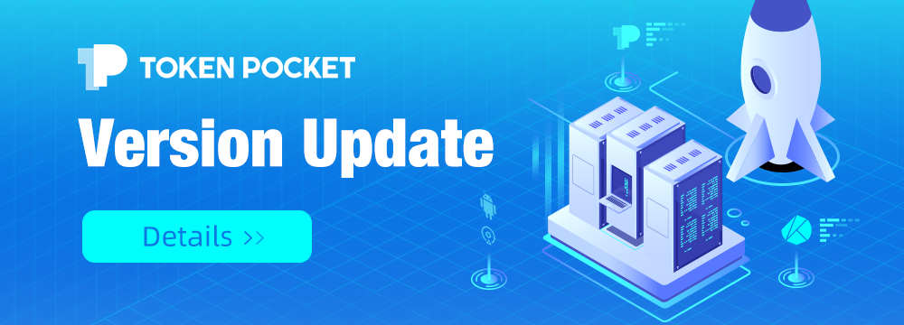

# Version update log \(July 7, 2021\): Klaytn network supported custom token, more detailed optimization

**\[Details of version update\]** 

iOS pro 3.1.3\(89\) 

App Store 1.6.0 

Android 1.2.9

**\[Main update content\]** 

1.Klaytn network supported DApp**s**, watch wallets/cold wallets, token price and custom tokens.

2. Optimized Android node switching 

3. Optimized Android transfer accuracy 

4. Fixed bugs and optimized experience

\*\*\*\*

**\[Version update method\]** 

The upgrade is prompted in the App, or users can download the latest version from the [**official website**](https://www.tokenpocket.pro/en/download/app). \(Note: The only official website of TokenPocket is: [www.tokenpocket.pro](http://www.tokenpocket.pro/)\)

\*\*\*\*

