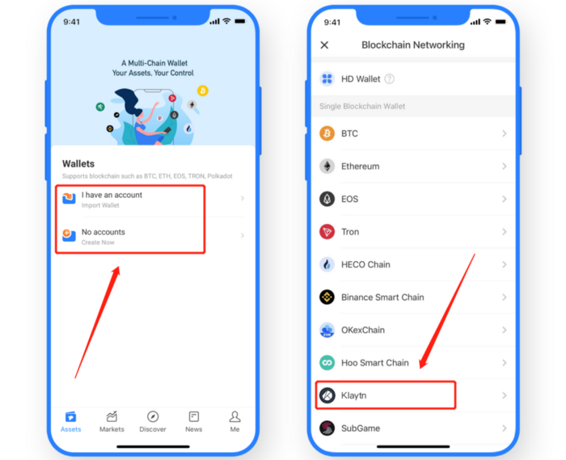

# Version update log \(June 11, 2021\):Support Klaytn, Upgrade Polkadot & Kusama

**\[Details of version update\]** 

The latest version： 

Android: 1.2.8 

iOS pro: 3.1.2\(88\) 

App Store: 1.5.9

\*\*\*\*

**\[Main update content\]** 

1.Polkadot and Kusama network upgrade

2. Support the Klaytn

3. Add security notice when transferring, receiving assets, and scanning codes

4. WalletConnect supports ethSignTypedData\_v4

\*\*\*\*

**\[Version update method\]** 

The upgrade is prompted in the App, or users can download the latest version from the [**official website**](https://www.tokenpocket.pro/en/download/app). \(Note: The only official website of TokenPocket is: [www.tokenpocket.pro](http://www.tokenpocket.pro/)\)

\*\*\*\*

**\[Introduction of key functions\]**

Support the Klaytn, all users can import or create Klaytn wallet through TokenPocket.

