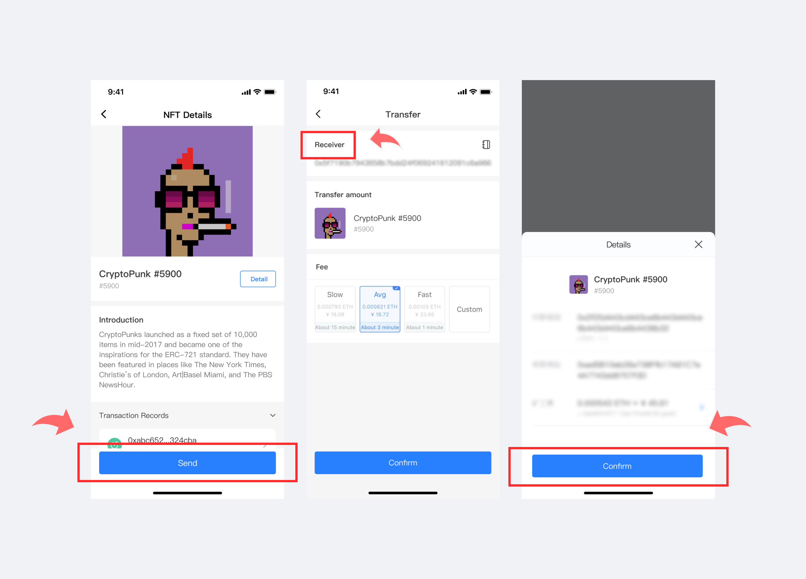

# Version update log (September 18, 2021): Support NFT display

**\[Version Update]**

1\. Support NFT display, we have completed the synchronization of Hoo Smart Chain data now, and other chain data can be displayed soon.

2\. Optimize "Markets" interface

3\. Optimize user experience

**\[Details of version update]**

Added "NFT" section on the "Assets" page. (Support NFT display, transfer, receive, etc.)

**Function 1 - NFT Display**

1\. Open the TokenPocket APP, enter the page of \[Assets], click \[NFT], enter the page of \[NFT Details];

Note: We have completed the synchronization of Hoo Smart Chain data now, and other chain data can be displayed soon!

.png>)

2\. Click any NFT, enter the page of \[NFT Details], you can know about the information and transaction records of this NFT on this page;

.png>)

**Function 2 - Transfer NFT**

Click \[Send], enter the page of \[Transfer], enter the receiving address and choose the miner fee, click \[Confirm] and then enter the page of \[Details], confirm the receiving address again, click \[Confirm]. At this point, you have finished the transaction.

**Function 3 - Add Custom NFT**

Click the \[+] in the upper right corner, enter the page of \[Add Custom NFT], enter the contract address, and check the information, click \[Confirm]. At this point, you have added the custom NFT successfully.

.png>)

**【Version update method】‌**

The update is prompted in the App, or download the latest version from the official website. (Note: The only official website of TokenPocket is: [https://tokenpocket.pro/](https://tokenpocket.pro))
