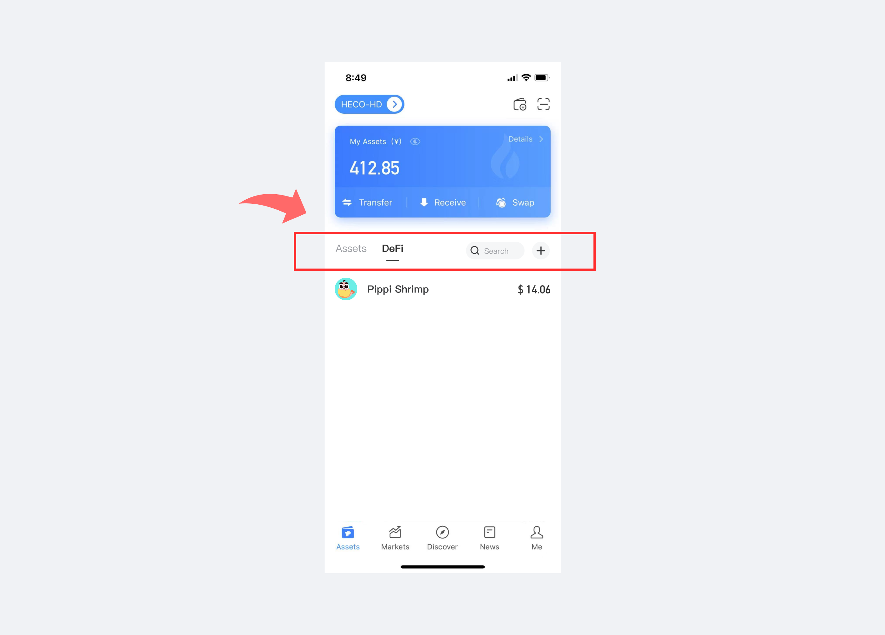
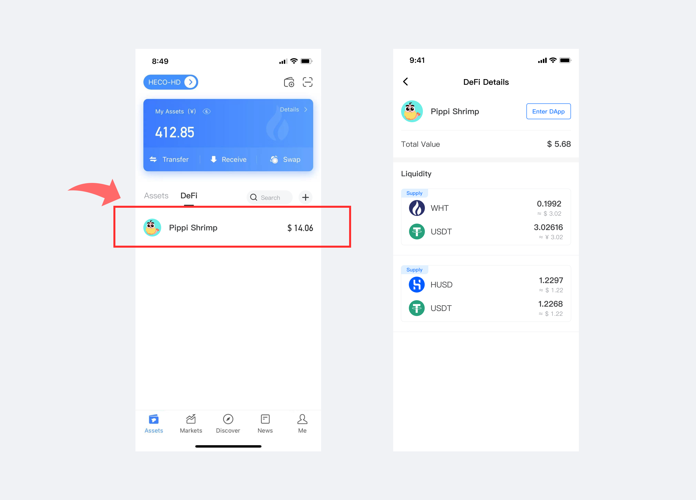
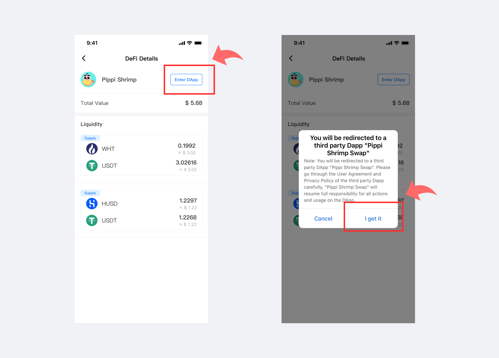
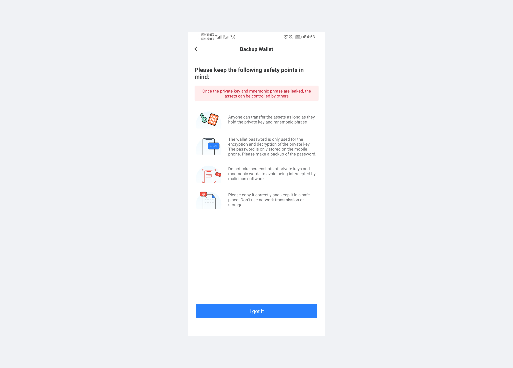
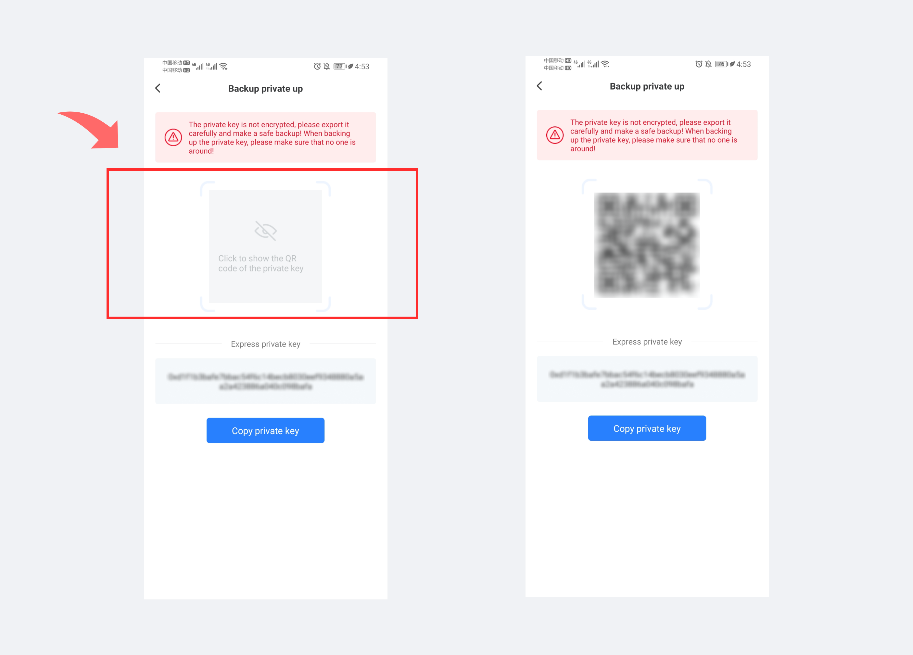
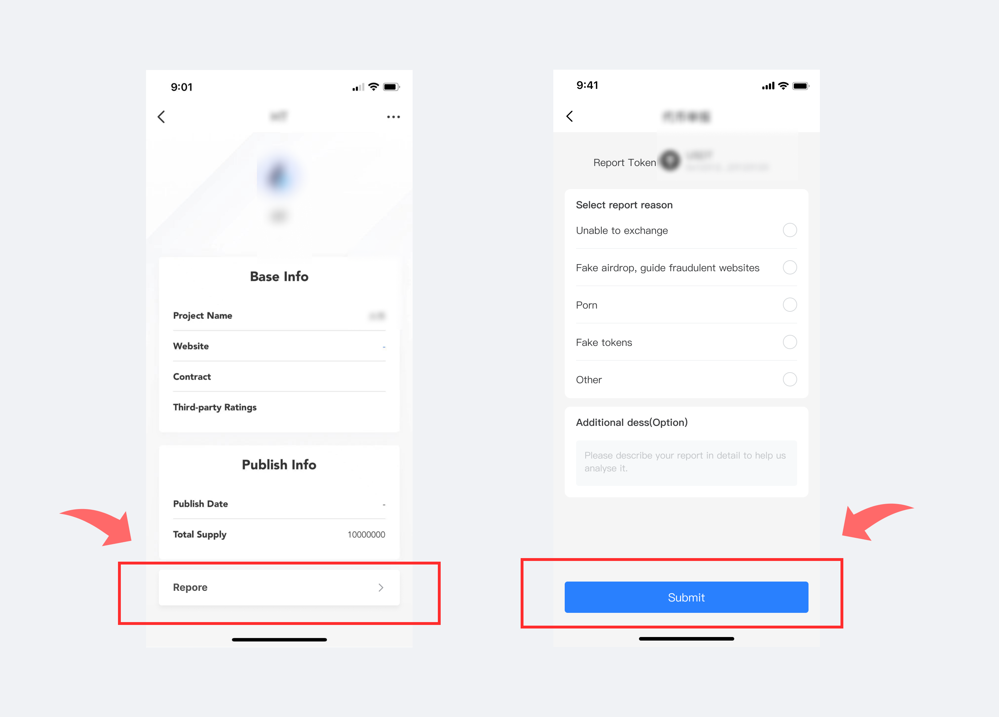
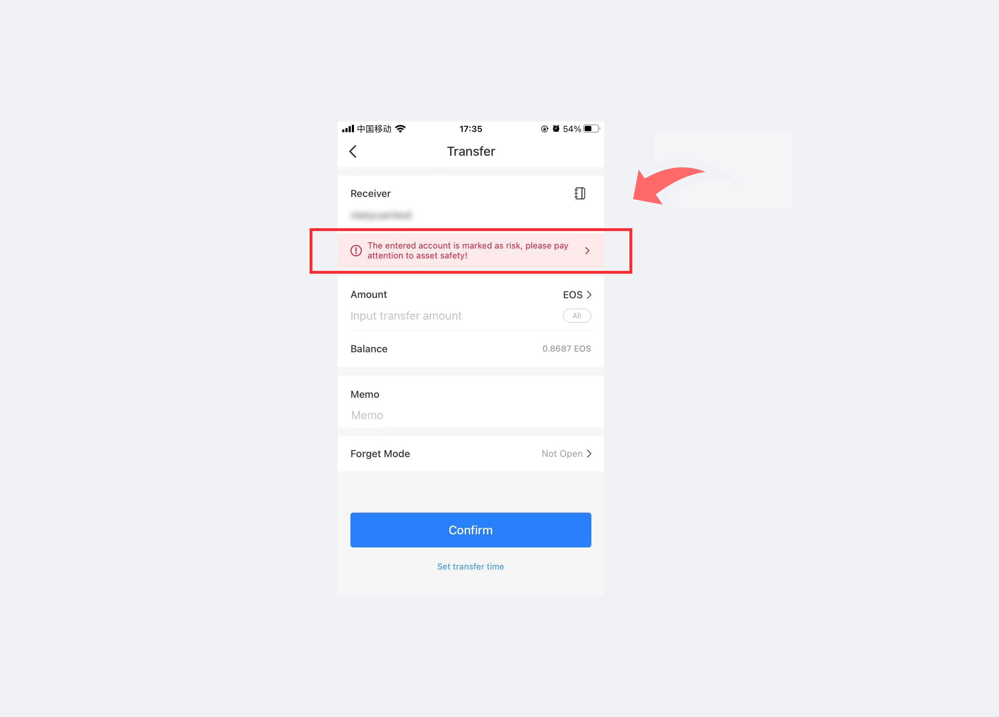
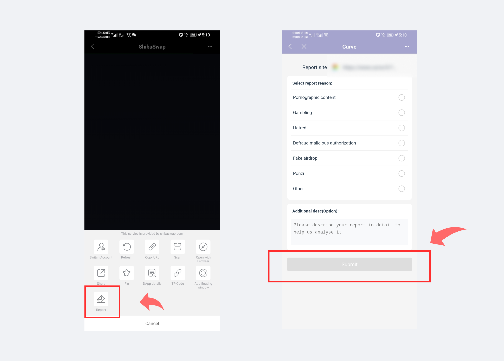
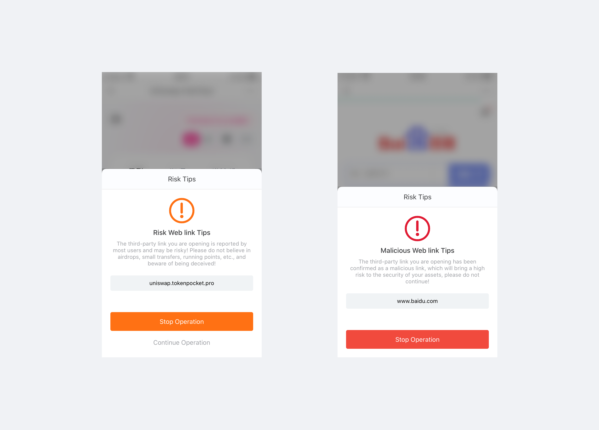

# Version update log \(September 3, 2021\): Assets page supports DeFi data display, upgrade the security

**\[Version update details\]**  
1. Assets page supports DeFi data display  
2. Upgrade the security tips in the wallet  
3. The Polkadot series: support to add custom network  
4. TORN: Supports to add custom token  
5. Support the resolution of DAS's domain name  
6. Upgrade sharing function

**\[Details of version update\]**

Android: 1.3.2.

iOS: pro 3.1.2\(93\).

App Store: 1.6.3

**\[Detailed explanation of part of the update\]**

**1. How to view Defi data?**

1\) After updating the latest version, click the \[Assets\] page, and then click \[DeFi\] to view the data of the DeFi protocol currently in use;

2\) Take Pippi Shrimp as an example, click \[Pippi Shrimp\], you can view the current fund status and liquidity;

3\) Click \[Enter DApp\], and click the jump popup \[I got it\] to enter the official Pippi Shrimp interface.

**2. Upgrade the security tips in the wallet**

1\) Add security reminder when you enter the page of the Export private key;

2\) When exporting the private key, the private key QR code and the express private key can be displayed on the same page; click \[Show QR code of the private key\] to display;

**3. Support \[Report\] risk token function;**

1\) Click on a token, click on \[Token Details\], and click on the \[Report\] button; select the reason for the report to report the risk token;

Note: Please describe the risk information of the token correctly, and TokenPocket will check it!

2\) The address of the contract marked as risk token will give a risk warning during the transfer process;

**4. Support the reporting \[risk\] link function;**

1\) Enter the link address, click \[...\] on the upper right, and click the \[Report\] button to enter the report page; select the reason for the report to report the risk link;

Note: Please describe the link risk information correctly, TokenPocket will check it!

2\) If it is marked as \[Risk Link\] or \[Fraud Link\], it will be prompted on the link access page;

