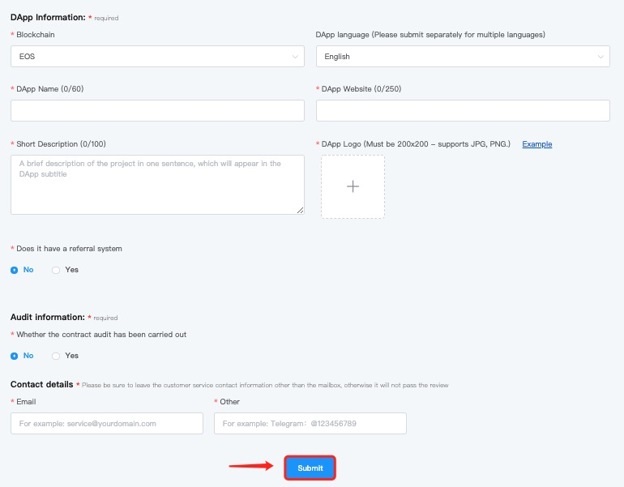

# How to Submit DApps?

1. Open TokenPocket website, click \[Submit Project] and then click \[DApp];

.png>)

2\. Fill in the information in order, and then click \[Submit];

****

**DApp Requirement**\
****1. The provided website is accessible and stable.

2\. The smart contracts have deployed on the mainnet, and the sensitive part requires to be open source.

3\. The sensitive contracts require audit reports from third-party security agencies.

4\. The interaction logic is clear and has been adapted to the mobile UI.

5\. Obey the relevant laws and regulations, without fraud and infringement.

6\. If you violate relevant laws and regulations, you will voluntarily assume corresponding legal responsibilities.

**Contact Us**\
****Email: [dapp@tokenpocket.pro](mailto:service@tokenpocket.pro)\
