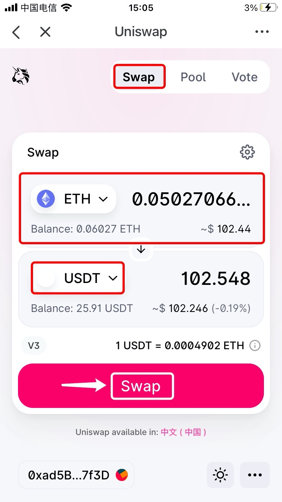
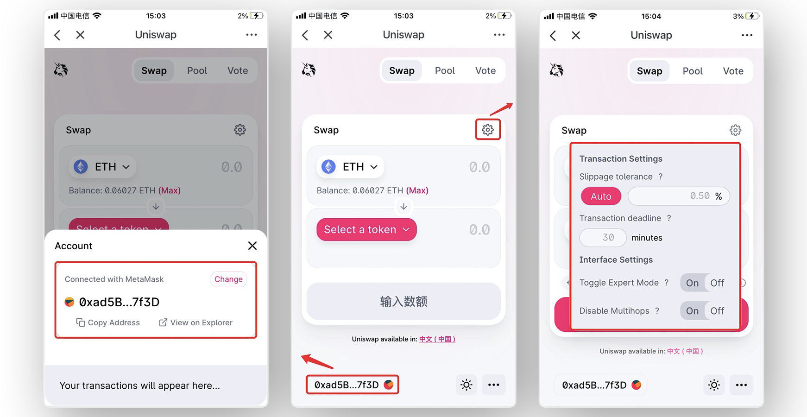
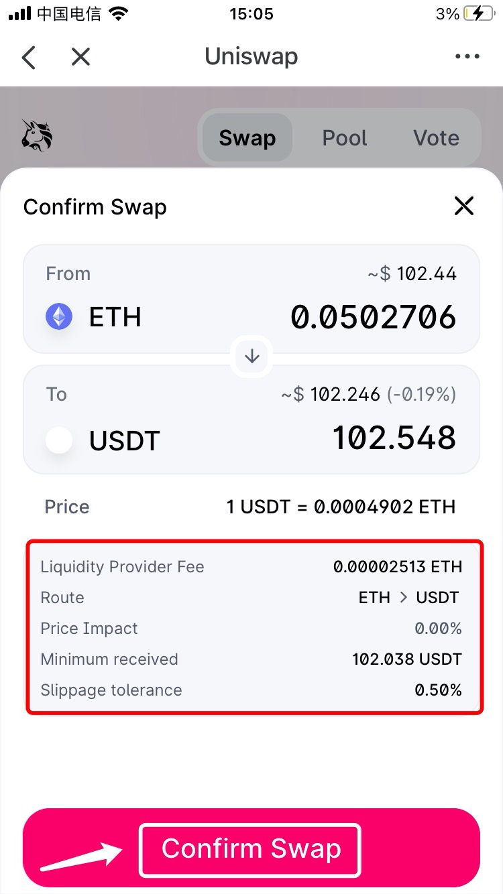
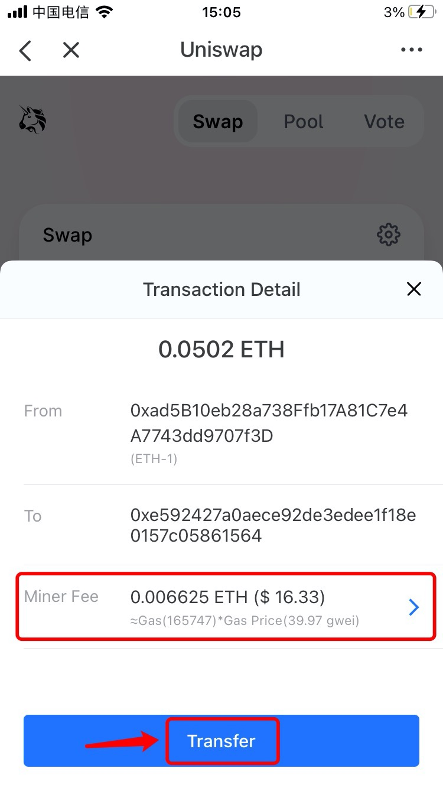

# How to Trade on DEX——Uniswap \(Ethereum\)

**About** [**Uniswap**](https://uniswap.org/)  
****Uniswap empowers developers, liquidity providers and traders to participate in a financial marketplace that is open and accessible to all. Currently, Uniswap supports **Ethereum network**.

**How to swap tokens ?**  
1. Open TokenPocket, click \[Discover\] and then search Uniswap on the top of search bar; \(Take Uniswap V3 as an example here\)

2. After entering the \[Swap\] page, enter the token name and amount you need to transfer, choose the receiving token \(Selecting a token by searching the contract address is recommended\), and the amount will be matched by default. After that, click \[Swap\] to procceed. \(Take ETH swap to USDT as an example here\)

Tips: 1\) Click the button of the bottom of left corner to check your connected wallet and receiving address.

2\) Clik the button of the upper right corner to set the \[Slippage tolerance\] and \[Transaction deadline\]. 

3. You can check the transaction details, and then click \[Confirm Swap\].

4. Double check your transaction details and then click \[Transfer\] after confirming. And then enter your wallet password to complete the transfer. 

Note: You can click \[Miner Fee\] to adjust the gas fee for avoding the transaction congested.

