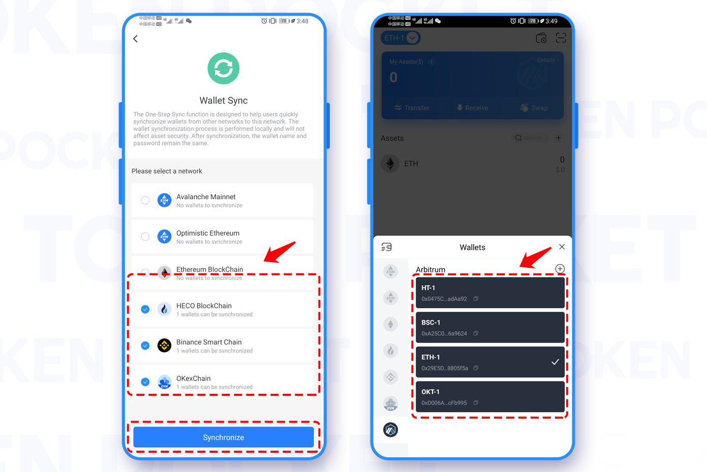

# Arbitrum Use Guide!

TokenPocket supports the highly anticipated Ethereum layer 2 platform, Arbitrum One. Users in TokenPocket wallet can get Arbitrum wallet account creation, token transfer/deposit, DApps ，and other one-stop experience

**How to create an Arbitrum Wallet?**

1\. Open the TokenPocket App, click the upper left corner to switch the wallet, then select Arbitrum, and click \[Add Wallet];

 (1).png>)

2\. Click \[Create Wallet], and continue to click \[Create Wallet];

 (1).png>)

3\. Set \[Wallet Name] and \[Password] in turn, then click \[Service Regulations and Privacy clause], click \[Create Wallet]; then start to back up the mnemonic, and click \[Completed backup, verify it now];

**Attention: Do not disclose the mnemonic to anyone!**

 (1).png>)

4\. Verify the mnemonic in order, and then click \[Confirm]. At this point, you have successfully created the Arbitrum wallet.

.png>)

**How to import an Arbitrum Wallet?**

1. Open the TokenPocket App, click the upper left corner to switch the wallet, then select Arbitrum, and click \[Add Wallet];

 (1).png>)

2\. Click \[Import Wallet], and continue to click \[Mnemonic import] or \[Keystore import];

 (1) (1) (1).png>)

3\. Take mnemonic import as an example, enter the backup \[mnemonic words], \[wallet name], \[password], and click \[Service Regulations and Privacy clause];

**Attention: Do not disclose the mnemonic words to anyone!**

.png>)

4\. Click \[Import Wallet]. At this point, you have successfully imported the Arbitrum wallet.

.png>)

**How to sync an Arbitrum Wallet?**

"Wallet Sync" is designed to help users quickly synchronize wallets on this network to other networks. When you transferred assets by the wrong network protocol (chain), this function can get your assets back.

1\. Open the TokenPocket App, click the upper left corner to switch the wallet, then select Arbitrum, and click \[Add Wallet];

.png>)

2\. Click \[Create Wallet], and continue to click \[One-Step Sync];

.png>)

3\. Tick \[Synchronized Wallet] and click \[Synchronize]; at this point, the Arbitrum wallet network has been synchronized, and you can select Arbitrum to view it on the asset page.

**Attention: To ensure the safety of your funds, please do not disclose the mnemonic or private key to anyone!**
