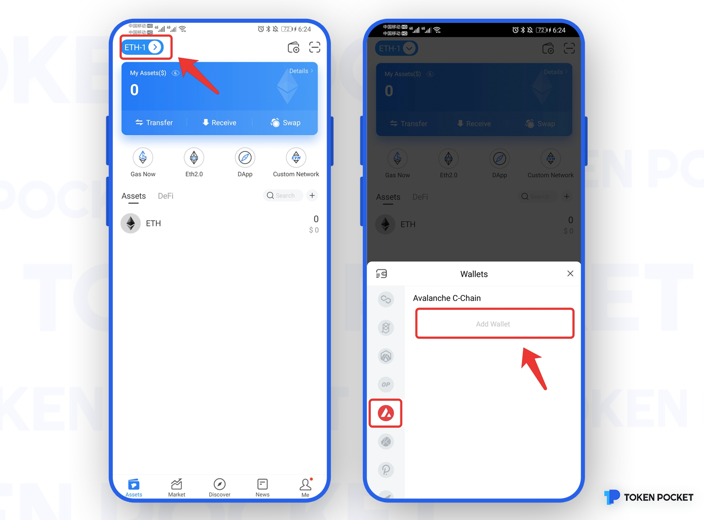
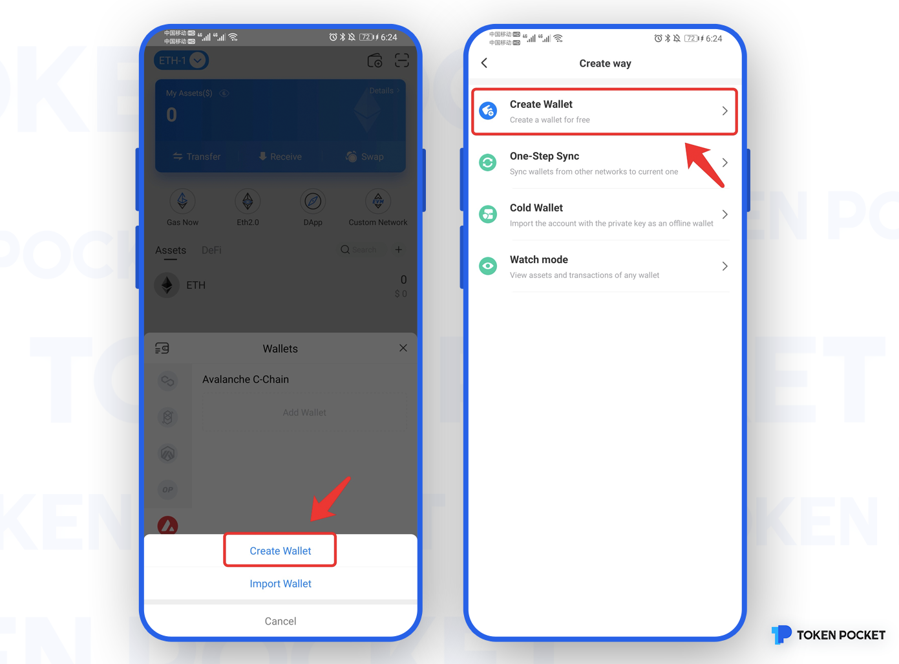
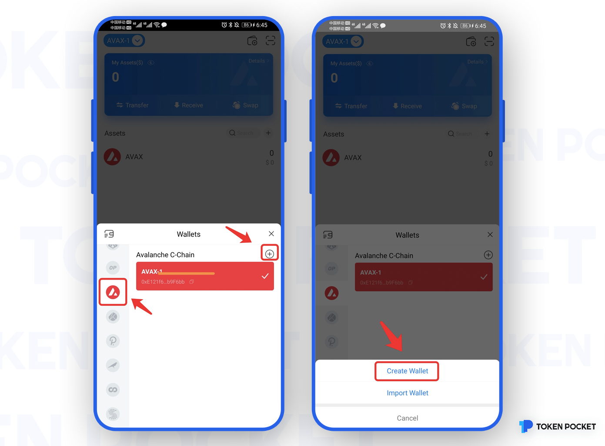

# Avalanche Use Guide!

**How to create an Avalanche Wallet?**

1. Open the TokenPocket App, click the upper left corner to switch the wallet, then select Avalanche, and click \[Add Wallet\];

2. Click \[Create Wallet\], and continue to click \[Create Wallet\];

3. Set \[Wallet Name\] and \[Password\] in turn, then click \[Service Regulations and Privacy clause\], click \[Create Wallet\]; then start to back up the mnemonic, and click \[Completed backup, verify it now\];

**Attention: Do not disclose the mnemonic to anyone!**

4. Verify the mnemonic in order, and then click \[Confirm\]. At this point, you have successfully created the Avalanche wallet.

**How to import an Avalanche Wallet?**

1. Open the TokenPocket App, click the upper left corner to switch the wallet, then select Avalanche, and click \[Add Wallet\];

2. Click \[Import Wallet\], and continue to click \[Mnemonic import\] or \[Private Key\];

Take mnemonic import as an example, enter the backup \[mnemonic words\], \[wallet name\], \[password\], and click \[Service Regulations and Privacy clause\]. Click \[Import Wallet\]. At this point, you have successfully imported the Avalanche wallet.

**Attention: Do not disclose the mnemonic words to anyone!**

**How to sync an Avalanche Wallet?**

"Wallet Sync" is designed to help users quickly synchronize wallets on this network to other networks. When you transferred assets by the wrong network protocol \(chain\), this function can get your assets back.

1. Open the TokenPocket App, click the upper right corner to switch the wallet, then select Avalanche, and click \[Add Wallet\];

2. Click \[One-Step Sync\];

3. Click \[Synchronized Wallet\] and click \[Synchronize\]; at this point, the Avalanche wallet network has been synchronized, and you can select Avalanche to view it on the asset page.

**Attention: To ensure the safety of your** **assets, please do not disclose the mnemonic or private key to anyone!**

