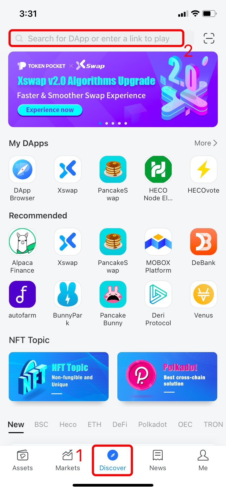
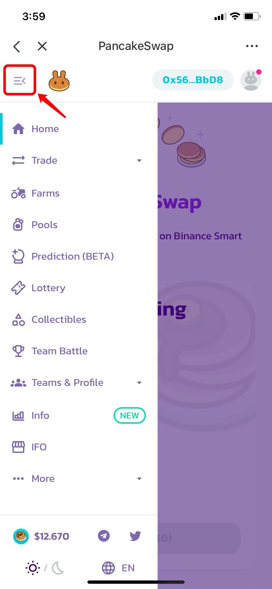
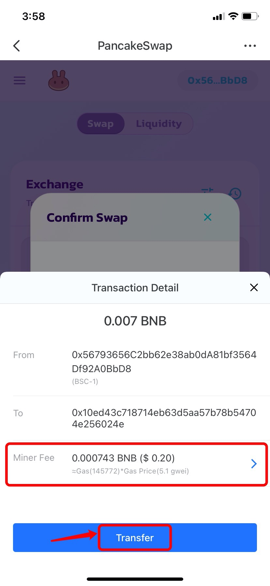

# Guide To Use PancakeSwap \(BSC\)

**About** [**PancakeSwap**](https://pancakeswap.info/)  
PancakeSwap is a decentralized exchange on **Binance Smart Chain** with many functions such as \[Trade\], \[Farm\], \[Pools\] and so on.

**How to Trade on PancakeSwap?**  
1.Open TokenPocket App, choose BSC wallet, click \[Discover\] at the bottom, and then search \[PancakeSwap\] to enter;

2. After entering, click the navigation bar at the upper left corner to view all functions on PancakeSwap. The dark mode can be switched at the bottom.

3. The main functions are on the top of the page, and you need to connect the wallet address at the upper right corner before trading. 

After connecting, click \[Swap\], choose the trading pairs and the amount you need to swap, and then the receiving amount will be filled in automatically. Click \[Swap\] to proceed. \(Take BNB and TPT as an example here\)

4. The swap process has two steps at the first time: \[Approve\] - \[Swap\]. Please double confirm the swap information below, and then click \[Confirm Swap\] to approve.

5. After completing the approved operation, click \[Transfer\] after confirming the transaction details. After inputting your wallet password, your transaction will be done.

Note: You can adjust the gas fee by clicking the \[Miner Fee\] to speed up your transaction.

**Contact:** [https://docs.pancakeswap.finance/contact-us](https://docs.pancakeswap.finance/contact-us)

