# Klaytn Use Guide

**About** [**Klaytn**](https://www.klaytn.com/)\*\*\*\*

Kakao’s global public blockchain project Klaytn is an enterprise-grade, service-centric platform that brings user-friendly blockchain experience to millions. It combines the best features of both public blockchains \(decentralized data & control, distributed governance\) and private blockchains \(low latency, high scalability\) via an efficient 'hybrid' design. Klaytn is secured by participation from numerous highly-reputable brands around the globe, working together to create a reliable business platform atop a robust system of decentralized trust. Klaytn enables businesses and entrepreneurs today to capture value using blockchain technology. Klaytn is the future, designed by GroundX.

**How to Create a Klaytn Wallet on TokenPocket?**

1.Open TokenPocket App, tap wallet name in the upper left corner to switch to Klaytn network, and then tap \[Add Wallet\];

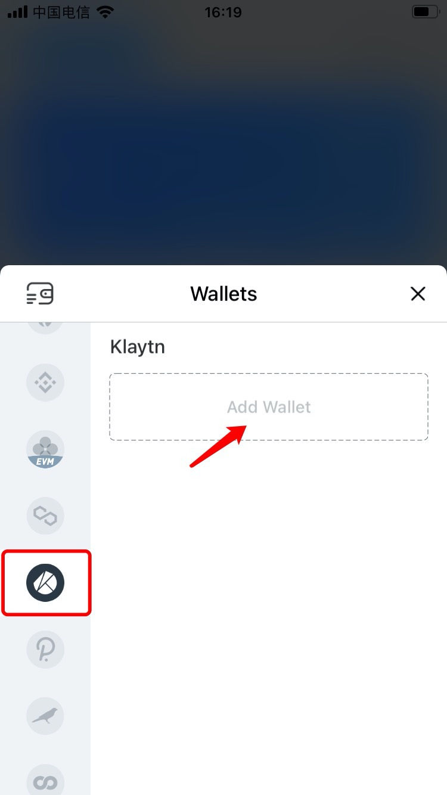

2. Tap \[Create Wallet\] to create a Klaytn wallet;

**Attention: Do not disclose your mnemonic words to anyone and keep them safe!**

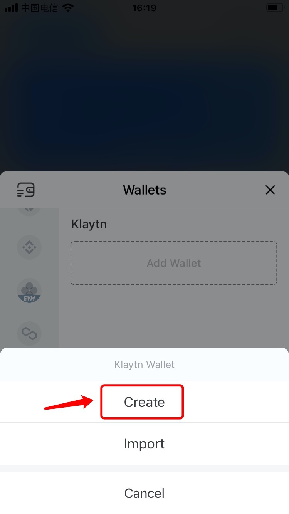

**More tutorials:**  
1\) [How to create a wallet?](https://tphelp.gitbook.io/en/wallet-management/how-to-create-a-wallet)  
2\) [How to import a wallet?](https://tphelp.gitbook.io/en/wallet-management/how-to-import-a-wallet)

\*\*\*\*

**How to Transfer Assets from ETH chain to Klaytn Chain through** [**OrbitBridge**](https://bridge.orbitchain.io/)**?**

1.Open OrbitBridge website: [https://bridge.orbitchain.io/](https://bridge.orbitchain.io/) \(conversion function is currently not supported on mobile devices\), click \[Select Coin\] in the upper right corner;

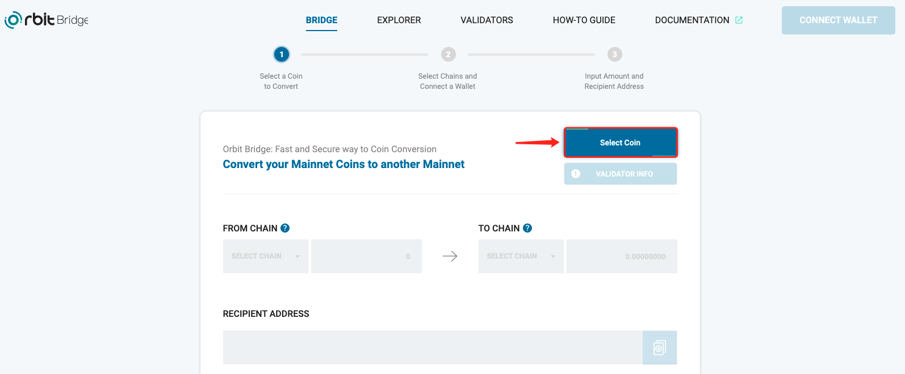

2. Click a token/coin you need to transfer, and then click \[OK\]; \(Transfer ETH to Klaytn Chain as an example here）

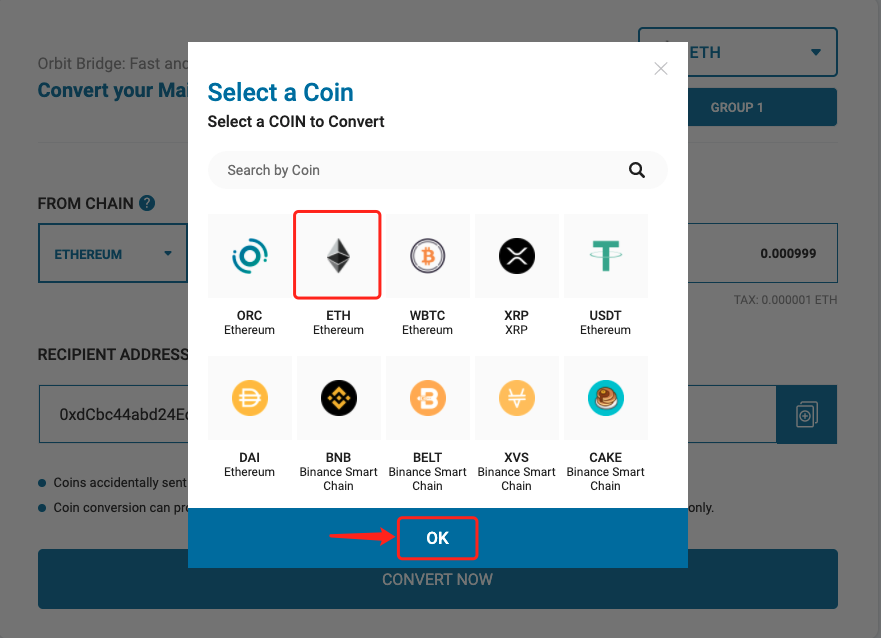

3. Select a validator group, and then click \[OK\] to proceed;

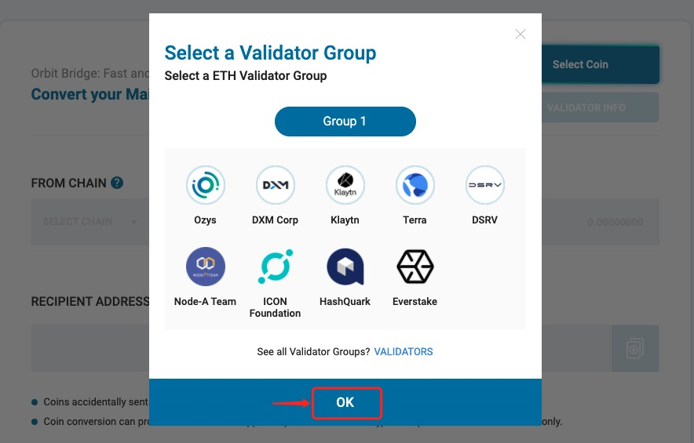

4. Choose the \[From Chain\]; \(From Ethereum chain to Klaytn chain as an example here\) 

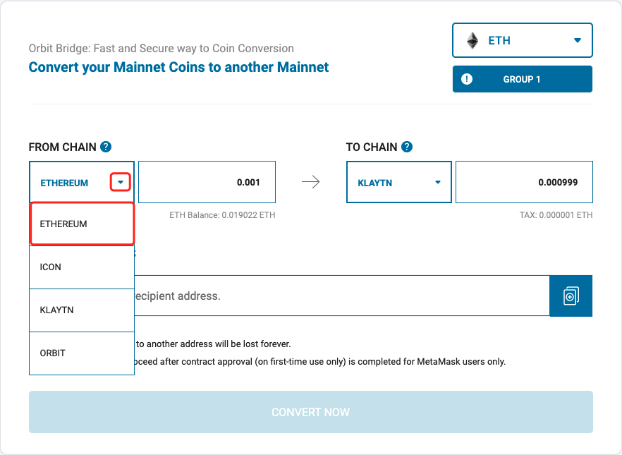

5. Select a wallet you want to connect, and then click \[OK\];

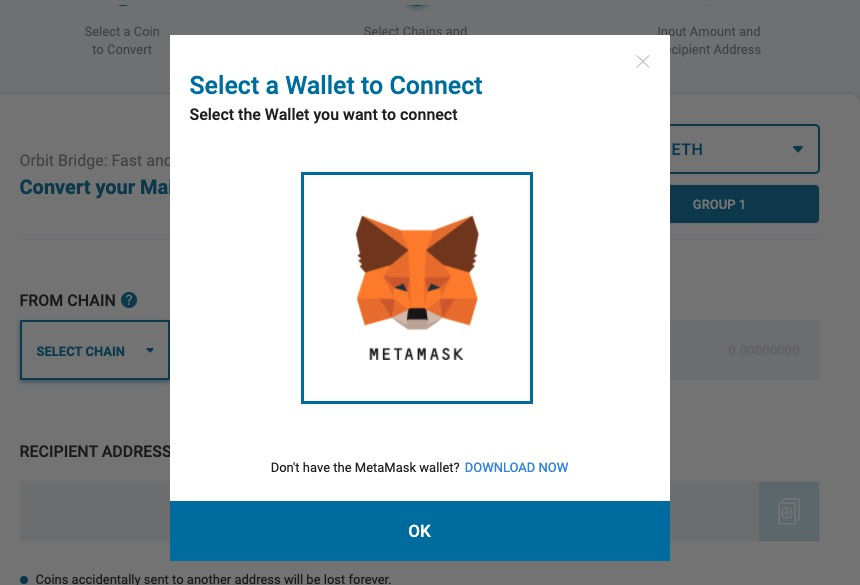

6. After connecting the wallet successfully, enter the token amount and then choose Klaytn on \[TO CHAIN\], and the received amount will be displayed automatically.

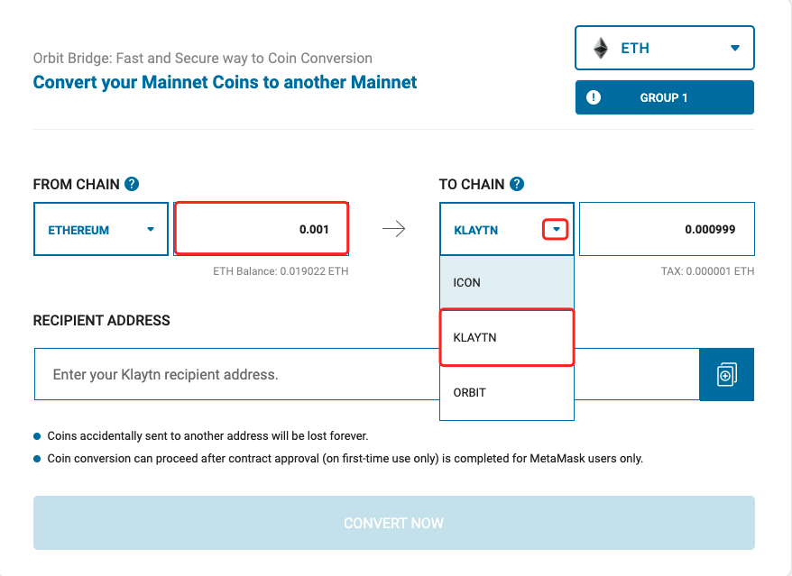

7. Enter your Klaytn recipient address, and then click \[CONVERT NOW\];

**Notes:  
 1\) Please check your recipient address carefully;  
2\)  A certain amount of transfer/tax fee is required when transferring.**

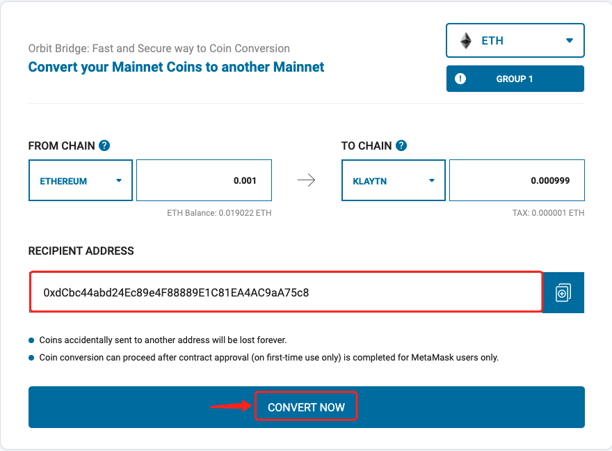

8. Click \[Confirm\] after confirming your conversion information.

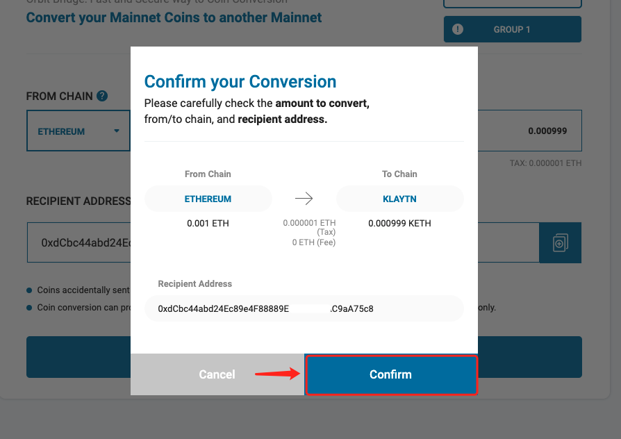

9. The \[Transfer Complete\] notification will pop up after few seconds. You may click \[Tx History\] to view your transaction status.

After transferring successfully, you may check your assets on Klaytn wallet and start to experience projects on Klaytn Chain.

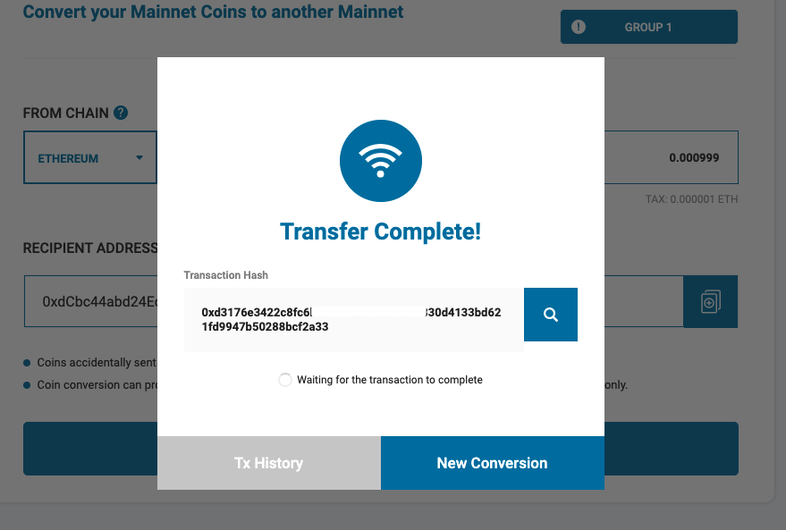


_This tutorial is only for the DApp in the wallet side of the operation guide, does not represent the investment advice of TokenPocket. Investing involves risks, you should be fully aware of the risks and make your own investment decisions._


