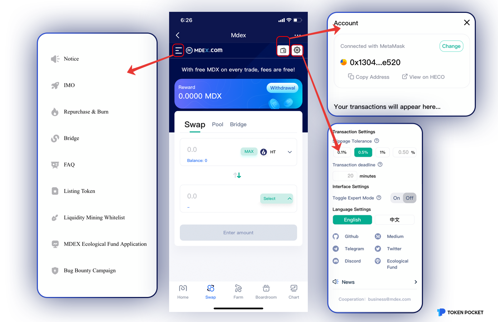
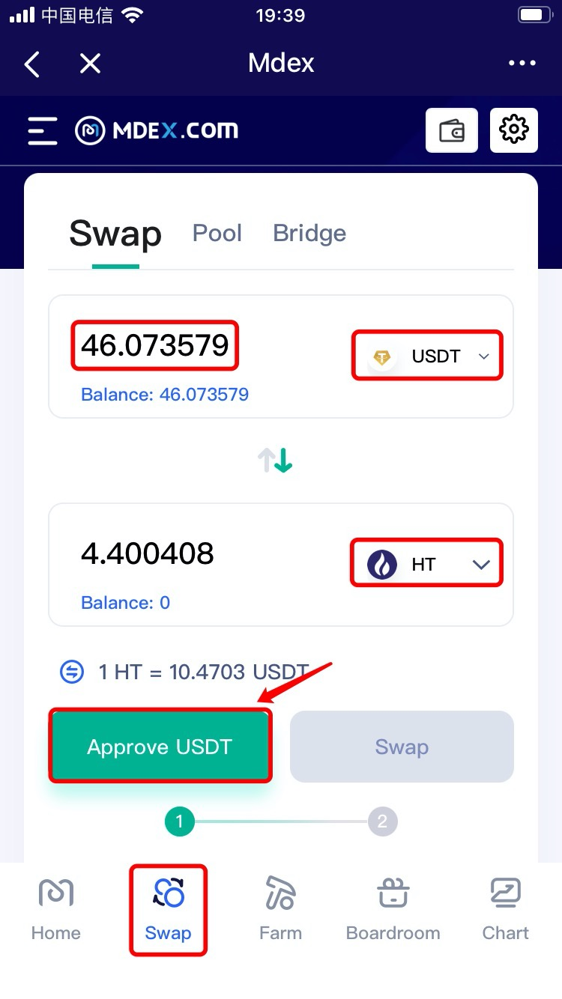
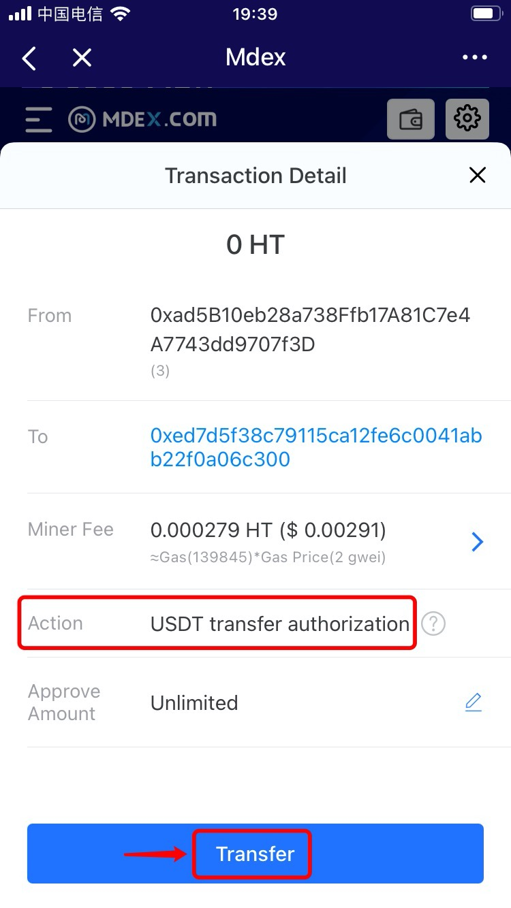

# MDEX on HECO Guide

**About** [**MDEX**](https://mdex.com/)  
****A composite DeFi ecosystem that integrates DEX, IMO, and DAO. MDEX is a decentralized exchange and supports **BSC/HECO/ETH**, with many functions such as \[Swap\], \[Farm\], \[Bridge\] and so on. And here is a tutorial based on HECO.

**How to trade on MDEX through HECO**  
1.Open TokenPocket App, choose HECO wallet, click \[Discover\] at the bottom, and then search \[MDEX\] to enter;

2. After entering the MDEX page, you may click the wallet connecting button in the upper right corner, click the navigation bar in the upper left corner to view all functions on MDEX, click the settings button next to the wallet connecting button to set slippage tolerance, interface, and language.

3. Click \[Swap\] at the bottom, select the swap token, enter the amount, and select the receiving token, then the receiving amount will be filled in automatically. Click \[Approve\] to proceed. \(Take exchanging USDT for HT as an example here\)

**Tips: You can find a token by searching for its name or symbol or by pasting its address below.**

4. The swap process has two steps at the first time: \[Approve\] - \[Swap\]. Please double confirm the swap information below, and then click \[Transfer\] to approve.

5. After completing the approved operation, click \[Swap\] after confirming the transaction details. Your transaction will be done after inputting your wallet password.

**Note:** You can adjust the gas fee by clicking the \[Miner Fee\] to speed up your transaction.

**Please click** [**Here**](https://t.me/MdexEN) **to contact MDEX** 


_This tutorial is only for the DApp in the wallet side of the operation guide, does not represent the investment advice of TokenPocket. Investing involves risks, you should be fully aware of the risks and make your own investment decisions._


