# Polygon (Matic) Use Guide

**About** [**Polygon (Matic)**](https://polygon.technology/)****

TokenPocket has supported Polygon mainnet (Matic before), so users can use Polygon through TokenPocket. Polygon is a protocol and a framework for building and connecting Ethereum-compatible blockchain networks. Aggregating scalable solutions on Ethereum supporting a multi-chain Ethereum ecosystem.

**How to create Polygon?**

1. Open TokenPocket App, click the wallet name in the upper left corner to switch wallet, choose \[Polygon], and then click \[Add Wallet];

 (1) (1).png>)

2\. Click \[Create], and then click \[Create Wallet];

 (1).png>)

3\. Set wallet name and password in order, and then tick \[Terms of Service and Privacy], click \[Create Wallet] to continue. Back up your mnemonic and then click \[Completed Backup, Verify it]

**Attention: Do not disclose mnemonic words to anyone!**

.png>)

4\. Now, you need to fill in order your mnemonic to verify, and then click \[Confirm]. At this moment, you have created Polygon (Matic) successfully !

 (1).png>)

**How to use Polygon Bridge and xPollinate on TokenPocket ?**

**About** [**Polygon Bridge**](https://wallet.matic.network/bridge/)****\
****If you want to move funds from **Ethereum** to Polygon, you must go through the so-called "bridge", and the "bridge" works through a locking and exit mechanism. On Polygon, users can choose to use two types of bridges: **Plasma Bridge** and **PoS Bridge**. Plasma **** provides advanced security with plasma exit mechanism. It will take **7 days** to transfer your funds back to Etnereum, while the PoS security will only take about **3 hours** back to Etnereum since it is provided by the PoS validators.&#x20;

**About** [**xPollinate**](https://www.xpollinate.io/)****\
****xPollinate supports the mutual transfer of funds among the Polygon, BSC, and xDAI, which means that users can move  assets from BSC to Polygon and xDAI. Currently, only stable tokens are supported.&#x20;

The following are the detailed steps for Polygon Bridge and xPollinate:

**How to transfer founds from Ethereum to Polygon by Polygon Bridge?** (Take PoS Bridge as an example)\
1.Click \[Discover] on the bottom of TokenPocket, and then search \[Polygon Bridge];

2\. Click \[Polygon Bridge];

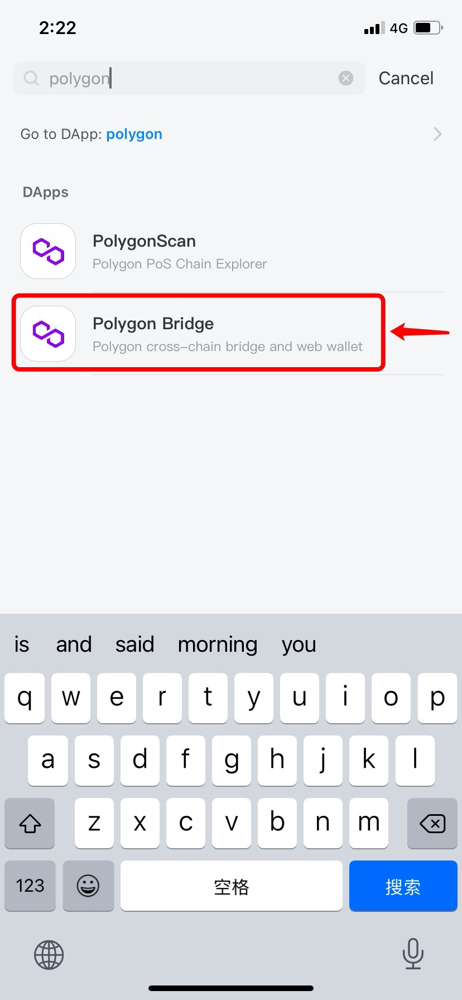

3\. After entering the page, choose the method of connecting a wallet; (Take Metamask as an example)

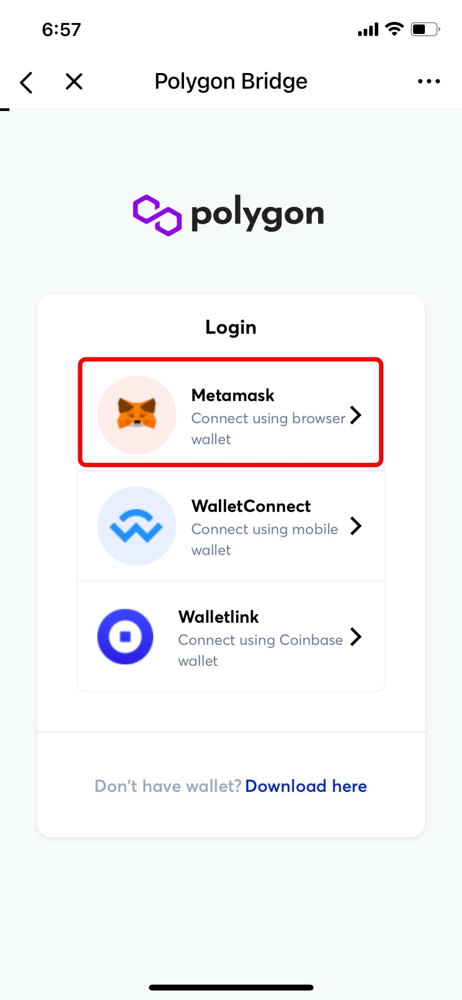

4\. Confirm the approved information, and then click \[Confirm];

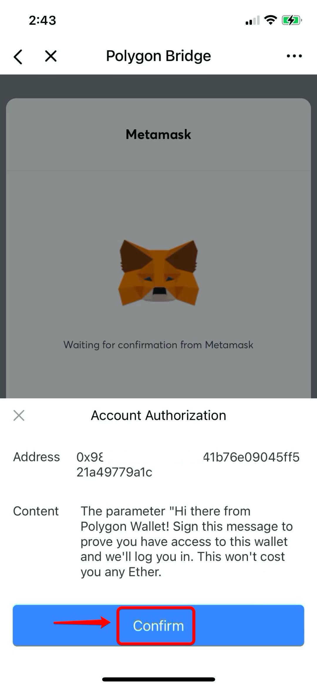

5\. After entering the Polygon Bridge page, click \[Back to Wallet];

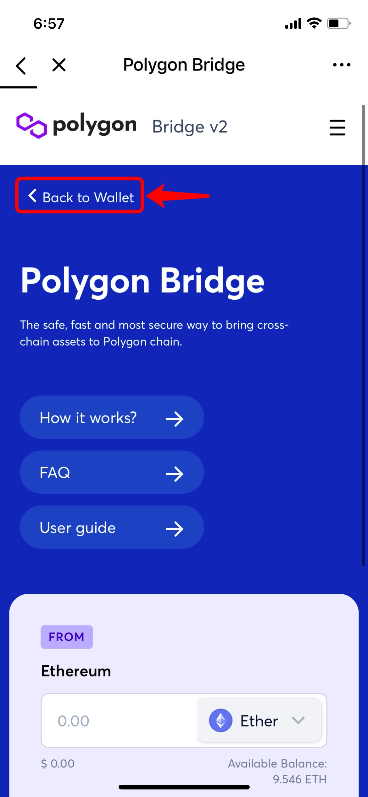

6\. Choose a token you need to move to Polygon, and then click \[Deposit]; (Take depositing USDT to Polygon as an example)

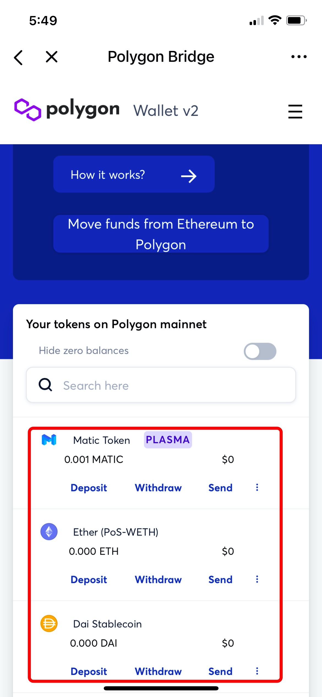

7\. Enter the token amount, or click \[MAX] for all, and then click \[Transfer] to procceed.

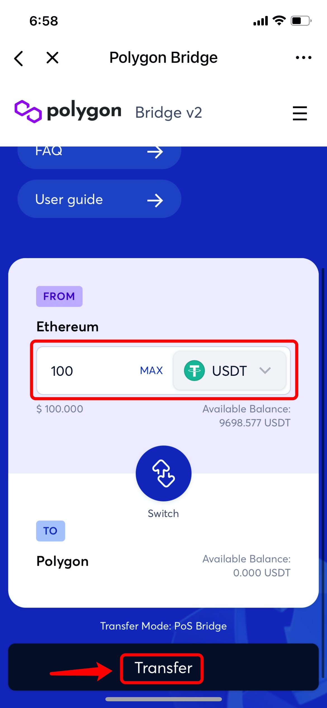

8\. Double confirm that the transfer way is from Ethereum to Polygon, and then click \[Continue];

**Note: Delegation/Staking tokens are not supported.**

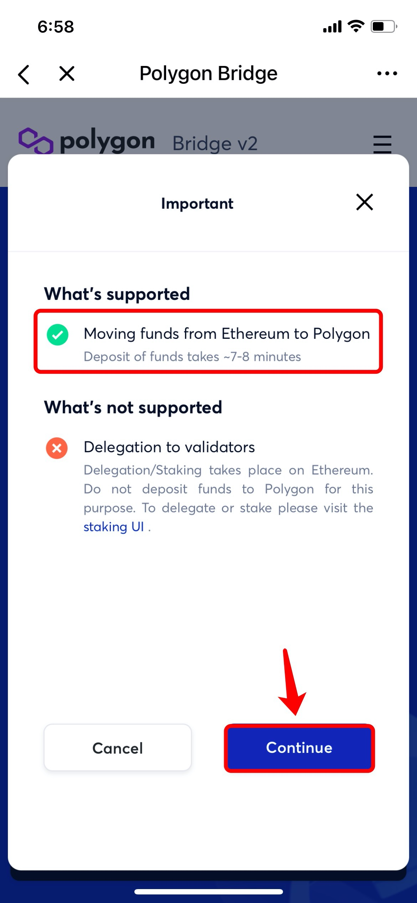

9\. Please kindly know that deposit process consists of two transactions (Approve and Complete deposit), and then click \[Continue];

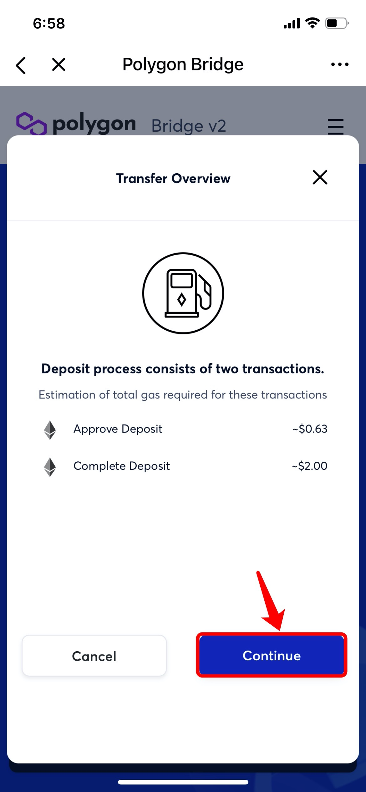

10\. Double confirm the transfer route and mode, and then click \[Continue] to procceed;

**Note:** Using PoS Bridge mode will take approximately 3 hours if you need to transfer your funds back to Ethereum.

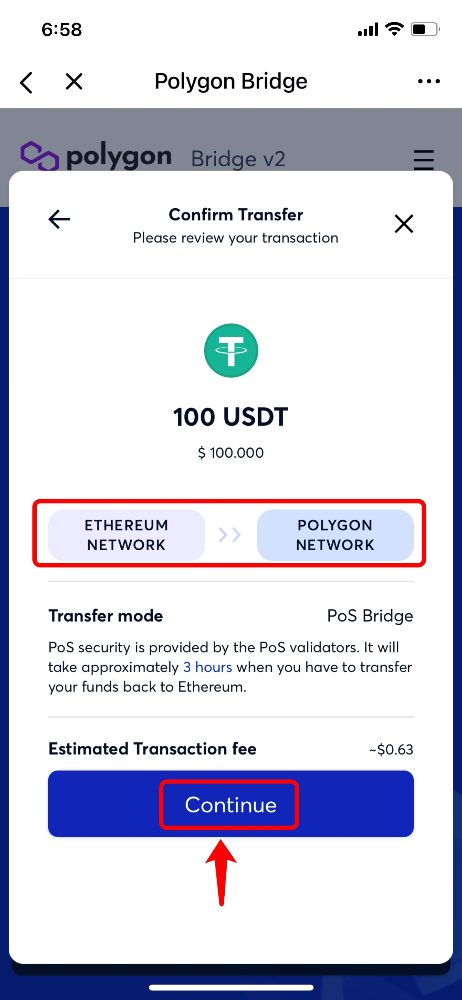

11\. Next step, you will enter the \[Confirm Approve] page, click \[Confirm] to approve. And then click \[Continue] to confirm the deposit;

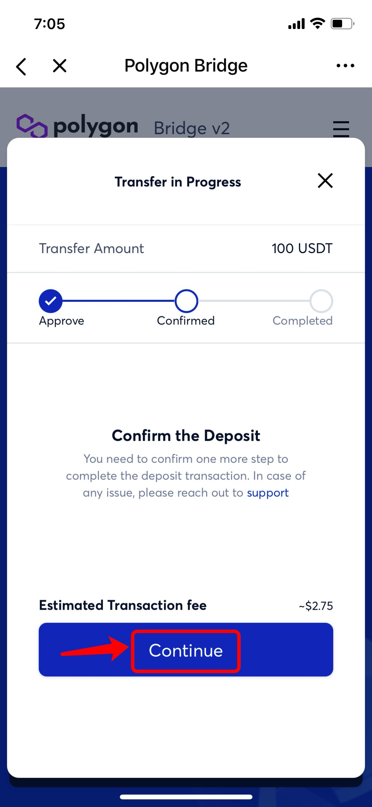

&#x20;12\. Here is the last step, after confirming the transfer information, click \[Confirm] to transfer your funds and then wait patiently since the process will take 7-8 minutes for the deposit to get completed. After completion, your balance on Polygon will be updated.

**Tip:** You can set the miner fee to adjust Gas Price and Gas Limit on payment page by your own preference.

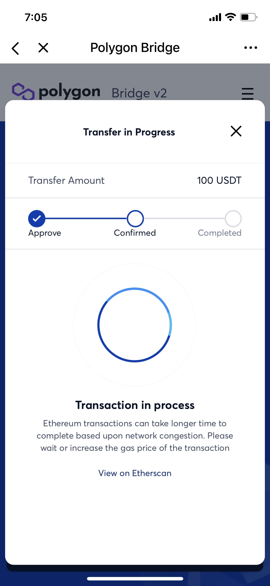

****

**How to transfer funds from BSC to Polygon by xPollinate ?** \
1\. Search \[xPollinate] on the \[Discover] page and then enter the xPollinate page, click \[Connect] to connect your wallet address; (Take connecting BSC network as an example)&#x20;

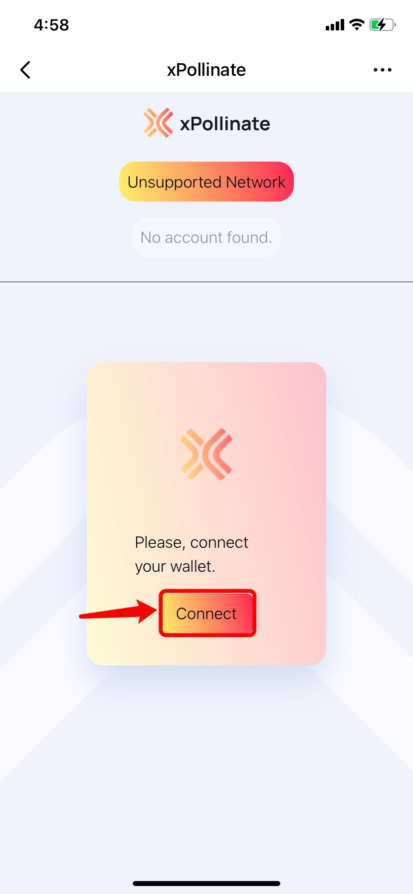

2\. Select a mainnet that you need to transfer out/to funds; (Take cross BSC chain to Matic chain as an example here)

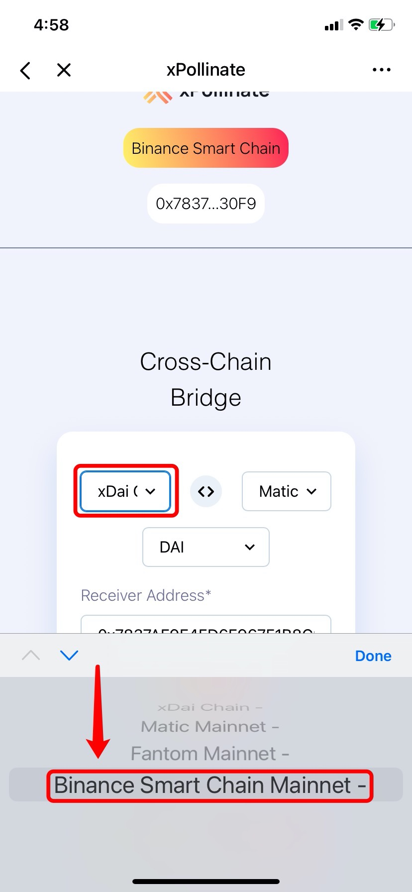

3\. Select the token you need to transfer; (Currently, only stable tokens are supported.)

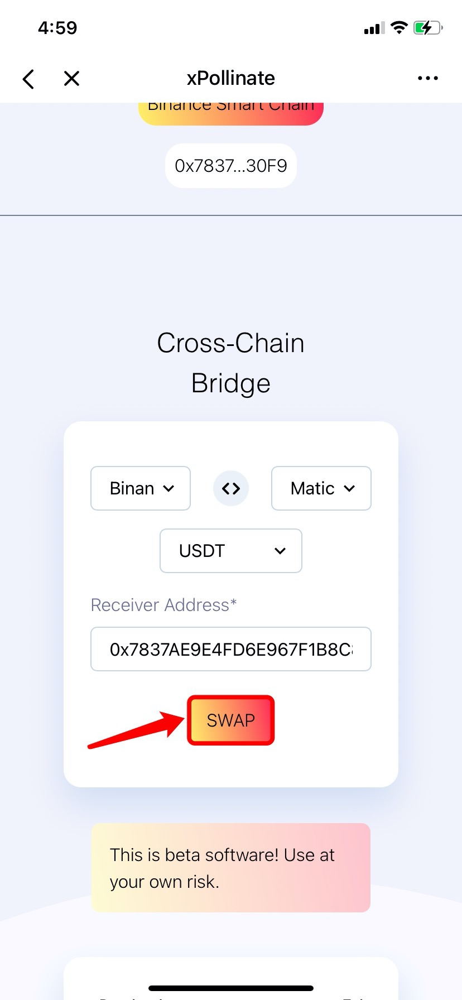

4\. After approving, enter the token amount, and then the receiving token will be filled in automatically, click \[Swap] to proceed.

5\. After entering the wallet password, your transaction will be processed.

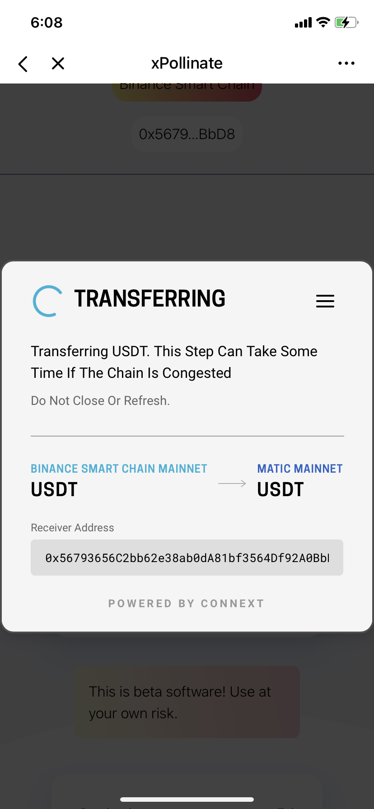

**Note:** This beta software, use at your own risk.

**Related Tutorials**

1\) Polygon [FAQ](https://docs.matic.network/docs/faq/wallet-bridge-faq) and [Help](https://polygon.technology/contact-us/)

[2) How to sync the wallet from other chains to Polygon?](https://tphelp.gitbook.io/en/wallet-management/how-to-sync-the-wallet)


_This tutorial is only for the DApp in the wallet side of the operation guide, does not represent the investment advice of TokenPocket. Investing involves risks, you should be fully aware of the risks and make your own investment decisions._


__
