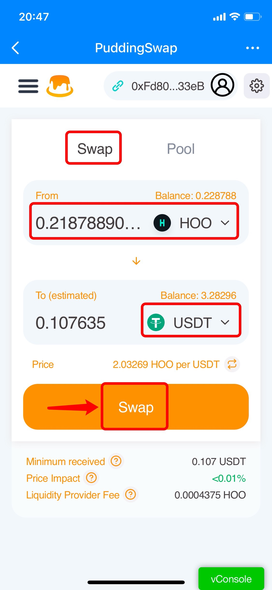

# PuddingSwap on HSC Guide

**About **[**PuddingSwap**](https://puddingswap.finance)****

Pudding Finance is a decentralized exchange running on Hoo Smart Chain, with lots of features such as Exchange, Farm, Staking, etc.

**How to Swap on PuddingSwap through HSC?**

1.Open TokenPocket App, choose Tron network wallet, click \[Discover] at the bottom, and then search \[PuddingSwap] to enter.

.jpg>)

2\. After entering the PuddingSwap page, you may click the wallet connecting button in the upper right corner to view your wallet address and balance, click the navigation bar in the upper left corner to view all functions on PuddingSwap, click the settings button next to the wallet connecting button to set slippage tolerance, transaction deadline, and toggle audio mode.

.png>)

3\. Select the swap token on the \[Swap] page, enter the amount, and select the receiving token, then the receiving amount will be filled in automatically. Click \[Swap] to proceed. (Take exchanging HOO for USDT as an example here)

**Tip: You can find a token by searching for its name or symbol or by pasting its address.**

4\. Click \[Confirm Swap] after you double confirm the swap information.

5\. Click \[Transfer] and then verify your wallet password to complete the transfer.

**Note:** You can adjust the gas fee by clicking the \[Miner Fee] to speed up your transaction.


_This tutorial is only for the DApp in the wallet side of the operation guide, does not represent the investment advice of TokenPocket. Investing involves risks, you should be fully aware of the risks and make your own investment decisions._


####

