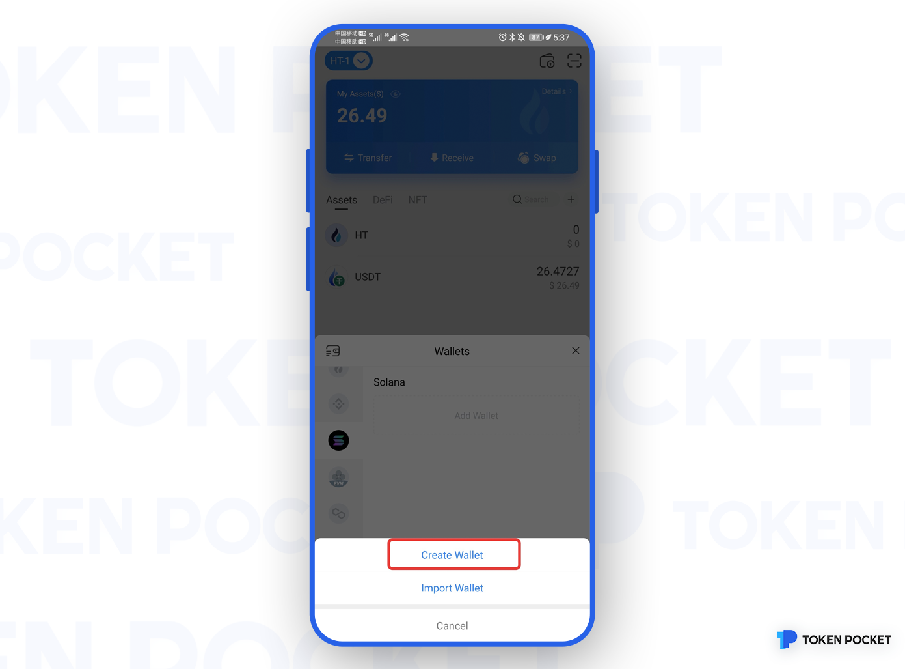
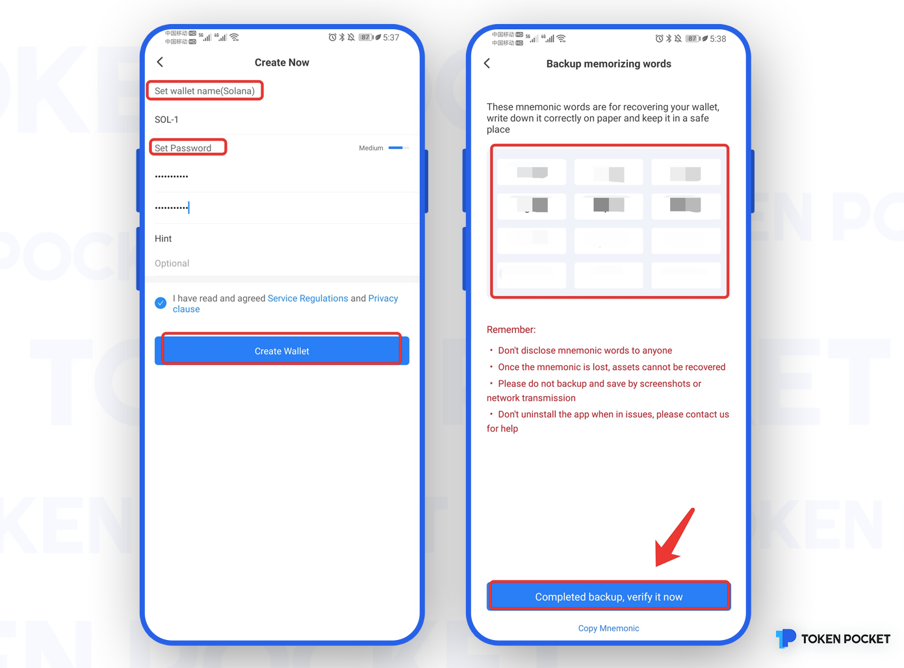
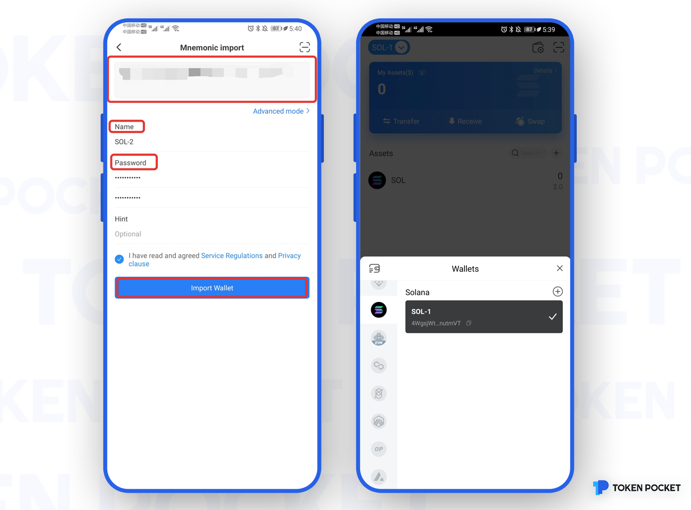

# Solana Use Guide!

**How to create a Solana Wallet?**

1\. Open the TokenPocket App, click the upper left corner to switch the wallet, then select Solana, and click \[Add Wallet];

.png>)

2\. Click \[Create Wallet];

3\. Set \[Wallet Name] and \[Password] in turn, then click \[Service Regulations and Privacy clause], click \[Create Wallet]; then start to back up the mnemonic, and click \[Completed backup, verify it now];

**Attention: Do not disclose the mnemonic to anyone!**

4\. Verify the mnemonic in order, and then click \[Confirm]. At this point, you have successfully created the Solana wallet.

.png>)

**How to import a Solana Wallet?**

1.Open the TokenPocket App, click the upper left corner to switch the wallet, then select Solana, and click \[Add Wallet];

.png>)

2\. Click \[Import Wallet], and continue to click \[Mnemonic import] or \[Private Key];

.png>)

Take mnemonic import as an example, enter the backup \[mnemonic words], \[wallet name], \[password], and click \[Service Regulations and Privacy clause]. Click \[Import Wallet]. At this point, you have successfully imported the Solana wallet.

**Attention: To ensure the safety of your** **assets, please do not disclose the mnemonic or private key to anyone!**
