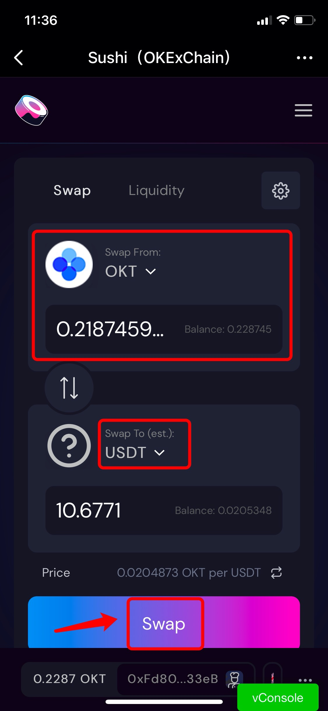
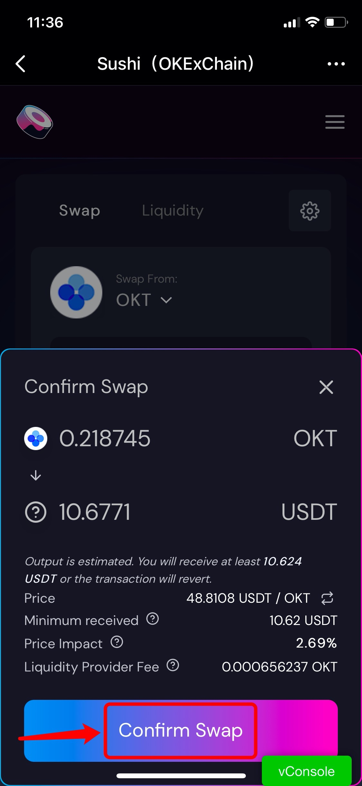
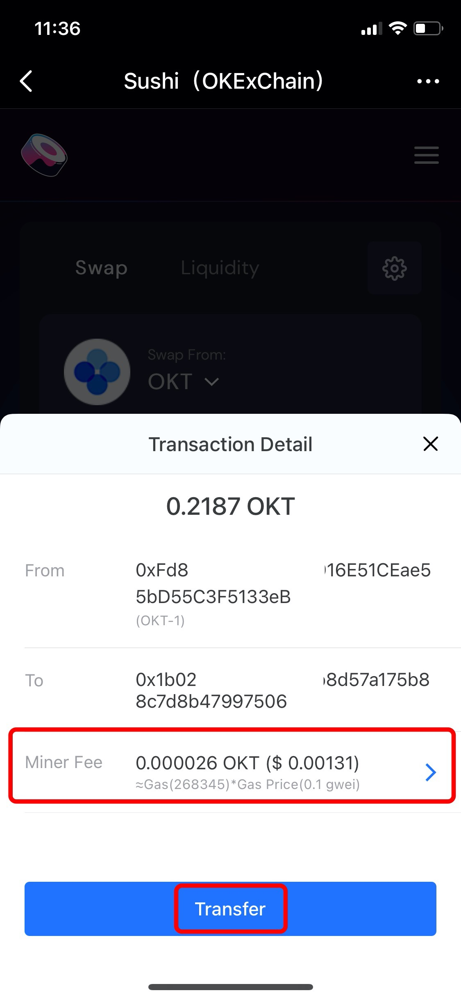

# SushiSwap on OKChain Guide

**About** [**SushiSwap**](https://sushi.com)****

SushiSwap **** is a community-driven DeFi platform based on OKChain, with features of Swap, Pool, etc.

**How to Swap on SushiSwap through OKChain?**

1.Open TokenPocket App, choose OKChain wallet, click \[Discover] at the bottom, and then search \[SushiSwap] to enter;

.jpg>)

2\. After entering the SushiSwap page, 1) you may click the wallet connecting button at the bottom to view your connecting wallet address, 2) click the navigation bar in the upper right corner to view all functions on SushiSwap, 3) click the settings button can set slippage tolerance, deadline, and interface.

3\. Select the swap token on the \[Swap] page, enter the amount, and select the receiving token, then the receiving amount will be filled in automatically. Click \[Swap] to proceed. (Take exchanging OKT for USDT as an example here)

**Tip: You can find a token by searching for its name or symbol or by pasting its address.**

4\. Click \[Confirm Swap] after you double confirm the swap information.

5\. Click \[Transfer] and then verify your wallet password to complete the transfer.

**Note:** You can adjust the gas fee by clicking the \[Miner Fee] to speed up your transaction.

**Please click** [**Here**](https://twitter.com/SushiSwap) **to contact SushiSwap**


_This tutorial is only for the DApp in the wallet side of the operation guide, does not represent the investment advice of TokenPocket. Investing involves risks, you should be fully aware of the risks and make your own investment decisions._

