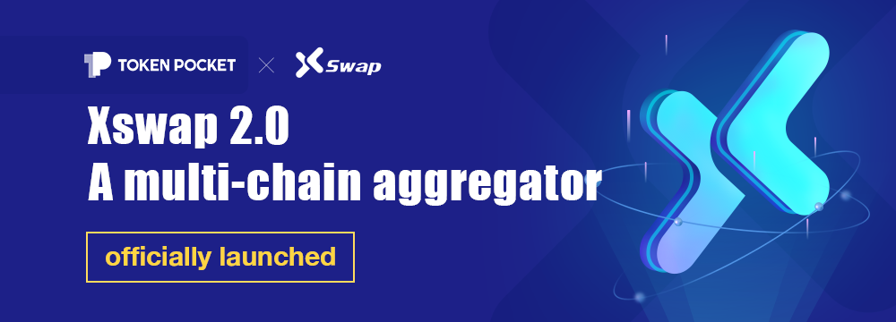
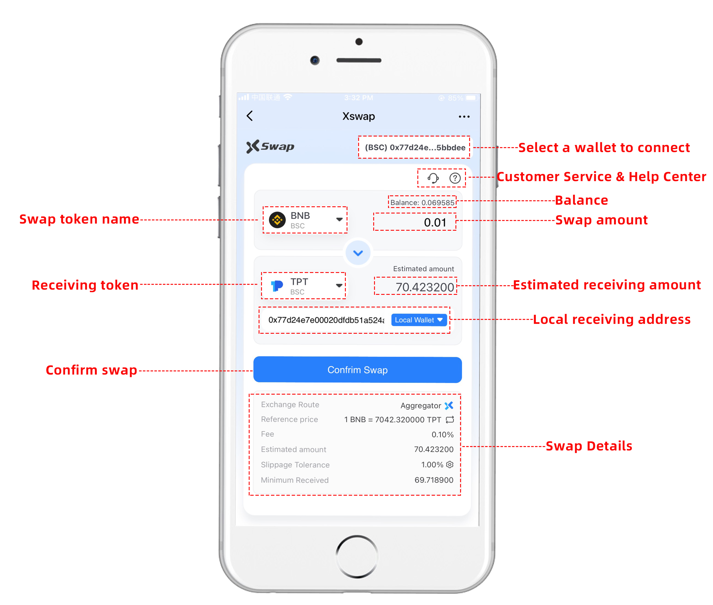
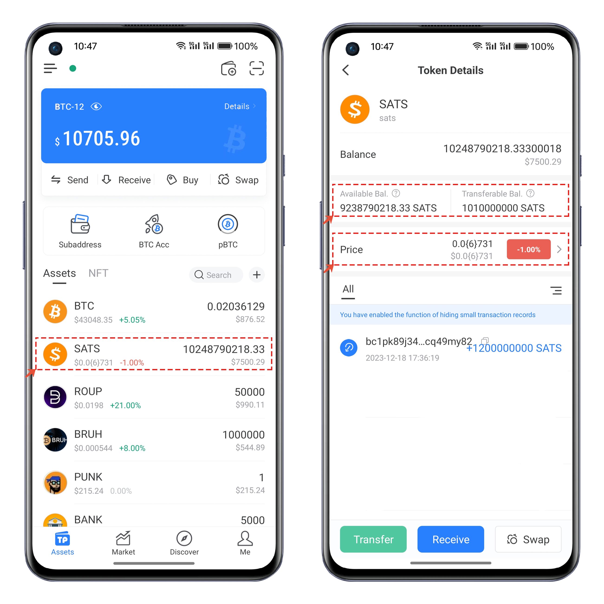
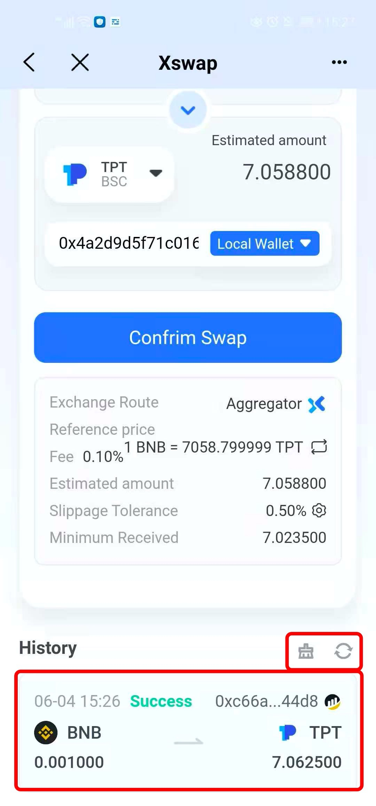
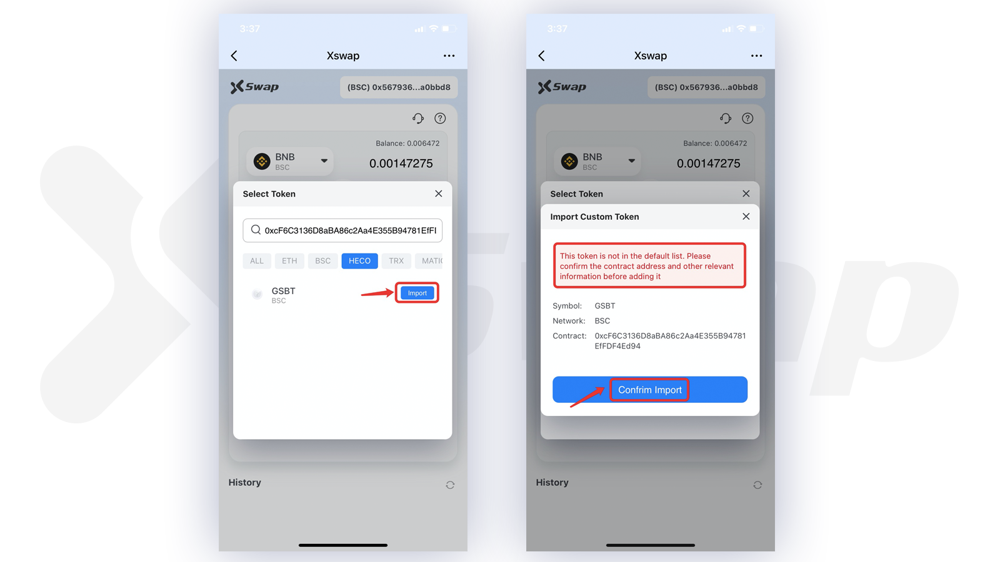
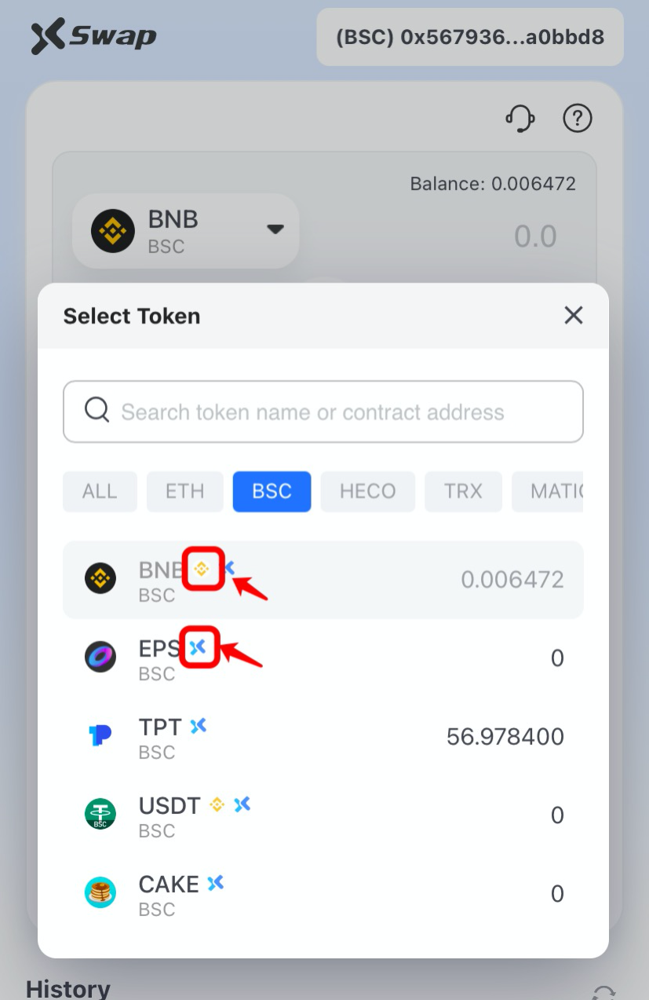

# Guide to Use Xswap 2.0

                            **TokenPocket Official Website:** [**www.tokenpocket.pro**](www.tokenpocket.pro)\*\*\*\*

**About Xswap**  
As a cross-chain swap aggregator platform powered by TokenPocket, Xswap integrates all functions in one including decentralized swap, aggregated transactions, and one-stop cross-chain. For users, decentralized instant trade and swap can be completed in multiple chains supported by TokenPocket. It expands multi-chain deployment including but not limited to ETH, BSC, HECO, Polygon \(Matic\), HSC, TRON, and its algorithm strategy will have more advantages in the market.

Xswap will open up the cross-chain liquidity channel of mainstream public chain assets, and provide one-stop cross-chain services for users and projects to create a cross-chain gathering place for the top public chains.

**Functions Introduction**  
The new version of Xswap2.0 adds an swap aggregator based on the 1.0 cross-chain swap. It will automatically analyze the optimal price to swap according to the current public chain selected by users, so that optimize the swap of tokens, and it reaches "one for all, all in one"

**Tutorial**  
1.Search \[Xswap\] in \[Discover\] page after you open TokenPocket, select a wallet to connect by clicking the button in the upper right corner, and then select the swap token and receiving token. \(Use BNB to swap TPT in BSC wallet as an example here\)

2. Set the swap amount \(Enough miner fee is required\), and then the receiving amount will be automatically calculated, click on \[Confirm Swap\] to proceed. After that, detailed information will be shown below. \(A certain fee will be charged for using aggregator\)

Note: The receiving address is the current connecting wallet address by default. 

3. After double checking the information, click \[Transfer\] to complete the swap. There is no limit for swap amount since the swap operation is on the same chain, and the swap process will be successful quickly, even in less than a minute.

Note: If the current public chain network is congested, you can custom the miner fee to speed up the transaction.

4. You can check history records by pulling down to the bottom after completing the swap operation, and delete the swap records or refresh the status on the right side of the \[History\].

**What should I do if the token can't be found in the list ?**

1.Click \[Select\], and fill in the contract address of the token to search the token you want to swap \(as long as it is a token issued on the chain, it can be found\).

2. Click \[Import\] and then click \[Confirm Import\] to proceed. After adding the token successfully, you can start to swap.

**Note:** Please ****double check the token information before you add it to avoid adding the fake tokens.

**Notes:**  
1.In the \[Select Token\] list, the small icon behind the token means that this token can be swapped by cross chains, the small X icon means it can be swapped by aggregator on the current public chains.

2. For swap between different public chains, the two-way conversion function cannot be used.

3. For the token attached destruction mechanism, it will be necessary to increase the slippage. So, you can click on \[Slippage Tolerance\] to adjust flexibly.


_This tutorial is only for the DApp in the wallet side of the operation guide, does not represent the investment advice of TokenPocket. Investing involves risks, you should be fully aware of the risks and make your own investment decisions._


