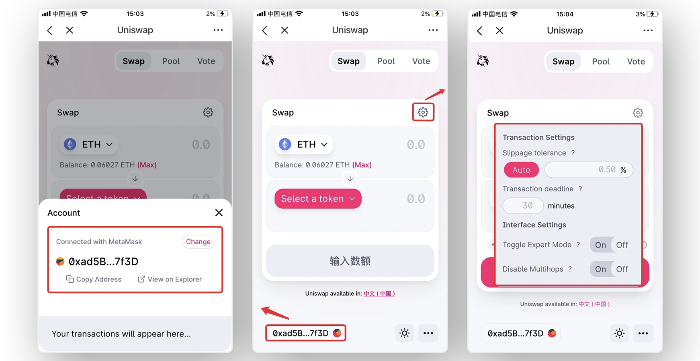
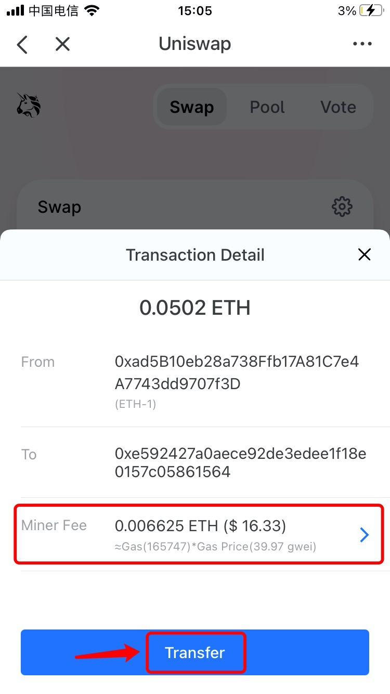

# Uniswap on Ethereum Guide

**About **[**Uniswap**](https://uniswap.org)****\
****Uniswap empowers developers, liquidity providers and traders to participate in a financial marketplace that is open and accessible to all. Currently, Uniswap supports **Ethereum network**.

**How to swap tokens?**\
****1. Open TokenPocket, click \[Discover] and then search Uniswap on the top of search bar; (Take Uniswap V3 as an example here)

.jpg>)

2\. After entering the \[Swap] page, enter the token name and amount you need to transfer, choose the receiving token (Selecting a token by searching the contract address is recommended), and the amount will be matched by default. After that, click \[Swap] to procceed. (Take ETH swap to USDT as an example here)

Tips: 1) Click the button of the bottom of left corner to check your connected wallet and receiving address.

2\) Clik the button of the upper right corner to set the \[Slippage tolerance] and \[Transaction deadline]. 

3\. You can check the transaction details, and then click \[Confirm Swap].

4\. Double check your transaction details and then click \[Transfer] after confirming. And then enter your wallet password to complete the transfer. 

Note: You can click \[Miner Fee] to adjust the gas fee for avoding the transaction congested.


_This tutorial is only for the DApp in the wallet side of the operation guide, does not represent the investment advice of TokenPocket. Investing involves risks, you should be fully aware of the risks and make your own investment decisions._

