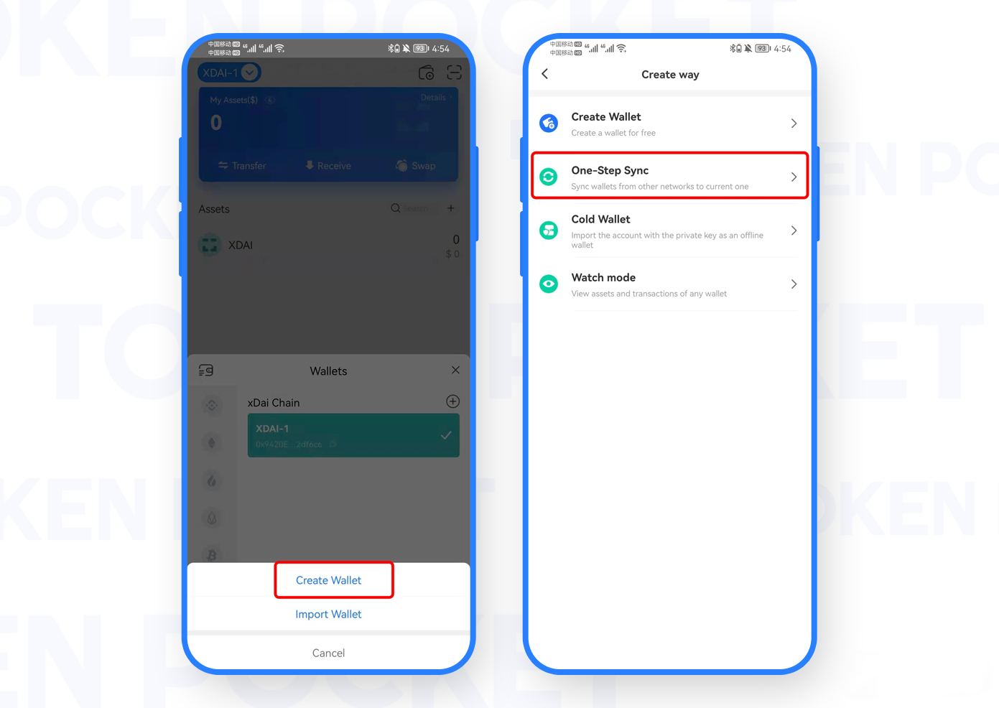

# xDai Use Guide!

**How to create an xDai Wallet?**

1. Open the TokenPocket App, click the upper left corner to switch the wallet, then select the xDai, and click \[Add Wallet], click \[Create Wallet];

 (1).png>)

2\. Click \[Create Wallet] again;

 (1).png>)

3\. Set \[Wallet Name] and \[Password] in turn, then click \[Service Regulations and Privacy clause], click \[Create Wallet]; then start to back up the mnemonic, and click \[Completed backup, verify it now];

<mark style="color:red;">**Attention: Do not disclose the mnemonic to anyone!**</mark>

 (1).png>)

4\. Verify the mnemonic in order, and then click \[Confirm]. At this point, you have successfully created the xDai wallet.

.png>)

**How to import an xDai Wallet?**

1. Open the TokenPocket App, click the upper left corner to switch the wallet, then select xDai, and click \[Add Wallet];

 (1).png>)

2\. Click \[Import Wallet], and continue to click \[Mnemonic import] or \[Private Key];

.png>)

Take mnemonic import as an example, enter the backup \[mnemonic words], \[wallet name], \[password], and click \[Service Regulations and Privacy clause]. Click \[Import Wallet]. At this point, you have successfully imported the xDai wallet.

.png>)

**How to sync an xDai Wallet?**

"Wallet Sync" is designed to help users quickly synchronize wallets on this network to other networks. When you transferred assets by the wrong network protocol (chain), this function can get your assets back.

&#x20;

1\. Open the TokenPocket App, then select xDai, and click the upper right corner \[+];

.png>)

2\. Click \[Create Wallet] and then click \[One-Step Sync];

3\. Click \[Synchronized Wallet] and click \[Synchronize]; at this point, the xDai wallet network has been synchronized, and you can select xDai to view it on the asset page.

.png>)

<mark style="color:red;">**Attention: To ensure the safety of your assets, please do not disclose the mnemonic or private key to anyone!**</mark>
