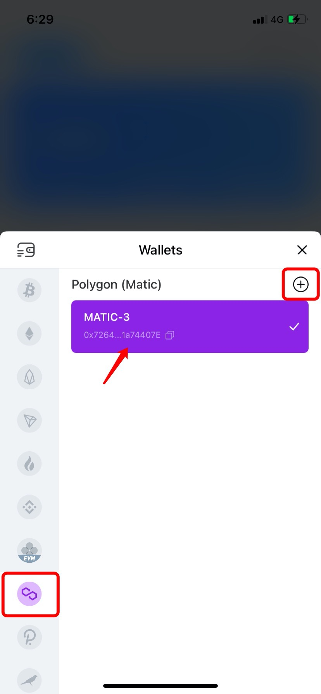
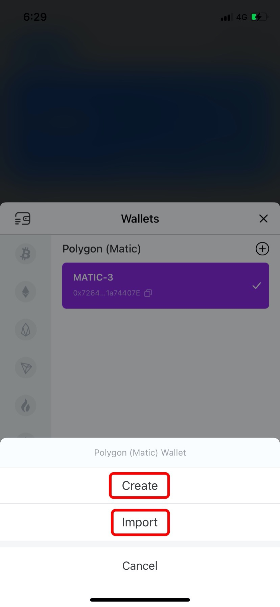
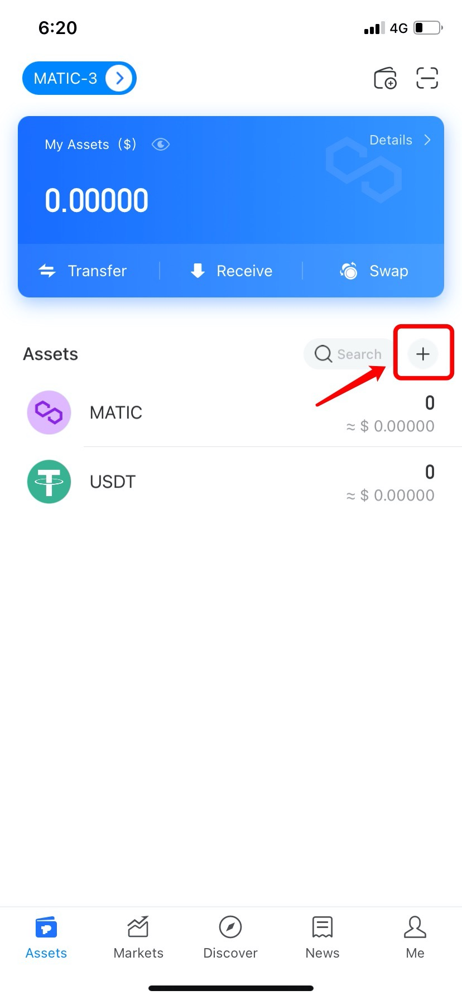
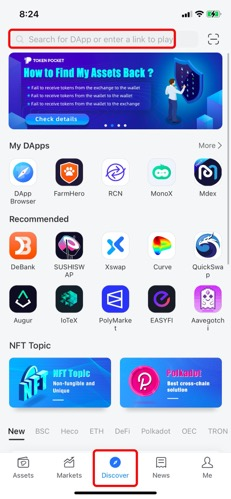
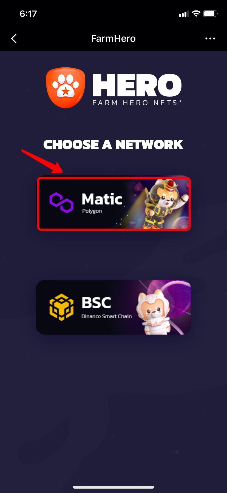

# Guide To Transfer Assets From BSC To Polygon

**How to transfer your assets on FarmHero from BSC to Polygon?**

1.Open TokenPocket App, search \[xPollinate\] on the \[Discover\] page, and then click \[Connect\] to connect your wallet address;

Note: Currently, xPollinate only supports stable tokens. If you need to transfer your assets from BSC to Polygon, please exchange to stable tokens such as USDT first.

2. Select the way from BSC mainnet to Matic; 

3. Select the token you need to transfer; \(Take USDT as an example here\)

4. After approving, enter the token amount, and then the receiving token will be filled in automatically, click \[Swap\] to proceed.

5. After entering the wallet password, your transaction will be processed.

**Note:** This beta software, use at your own risk.

6. After successfully transferring, you can create/import Polygon wallet by creating or importing your private key/mnemonic on TokenPocket.

7. Add your tokens by clicking \[+\], and then your assets will be shown on the page;

2. Search \[Farmhero\] on the \[Discover\] page, and then you can select \[Matic\] network to use Farmhero;

**About** [**FarmHero**](https://bsc.farmhero.io/)\*\*\*\*

FarmHero is a novel protocol that mixes NFT, gaming and DEFI concepts.

**About** [**TokenPocket**](https://www.tokenpocket.pro/)\*\*\*\*

TokenPocket is the world’s leading decentralized wallet, which supports mainstream public chains including BTC, ETH, BSC, HECO, TRX, Polygon, OEC, HSC, Polkadot, Kusama, EOS, etc., and has provided reliable services for over 10 million users around the world. The number of monthly active users exceeds 3 million and the users of TokenPocket are located in more than 200 countries and regions around the world. 

