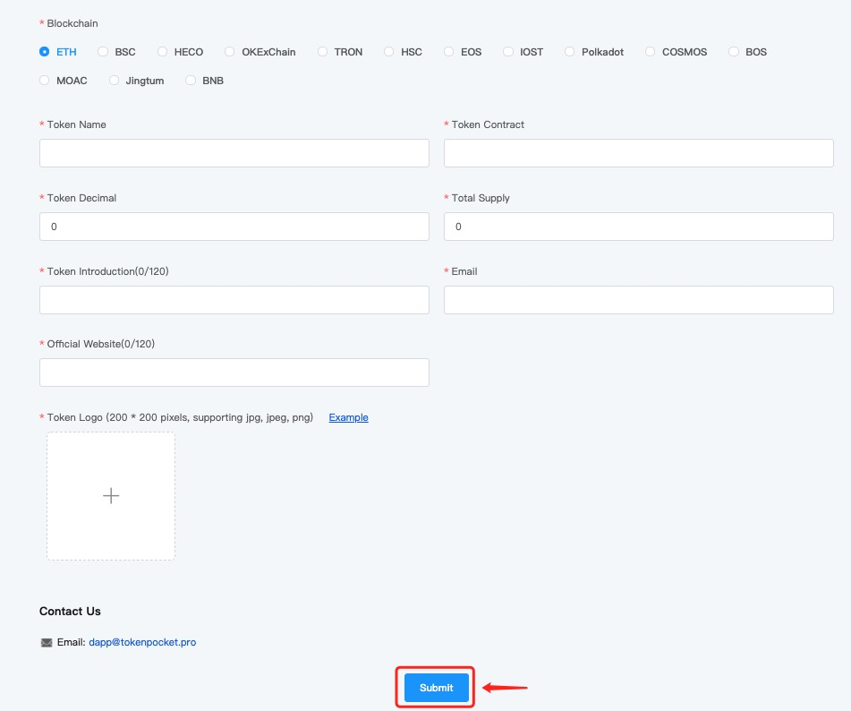

# How to Submit Tokens?

1.Go to TokenPocket official website: [https://www.tokenpocket.pro/](https://www.tokenpocket.pro/), click \[Submit Project] on the navigation bar, and then click \[Token];

.png>)

2\. Fill in the token information in order, and then click \[Submit].

**Note:** Admins will audit your token submission as soon as possible, so, your patience will be appreciated.

**Related tutorial:**\
****[**How to update the token logo & info ?**](https://tphelp.gitbook.io/en/wallet-operation/how-to-submit-a-token-logo)****

