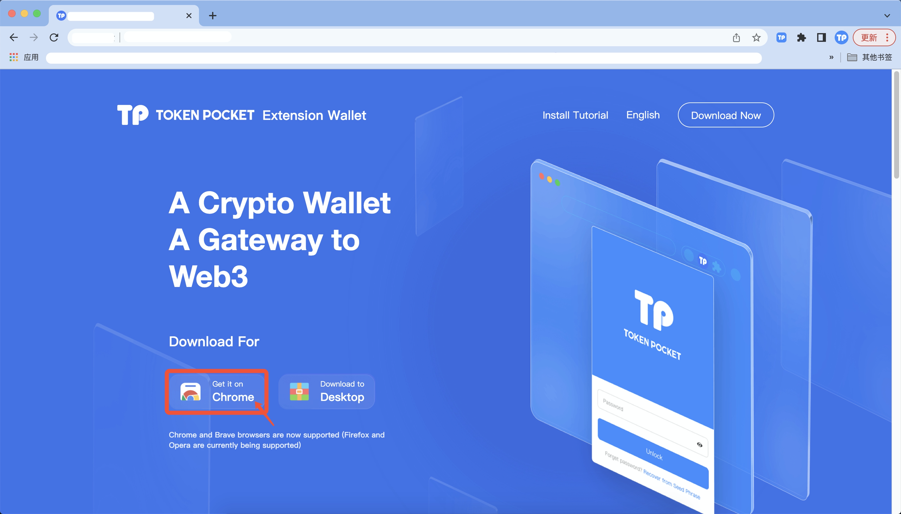
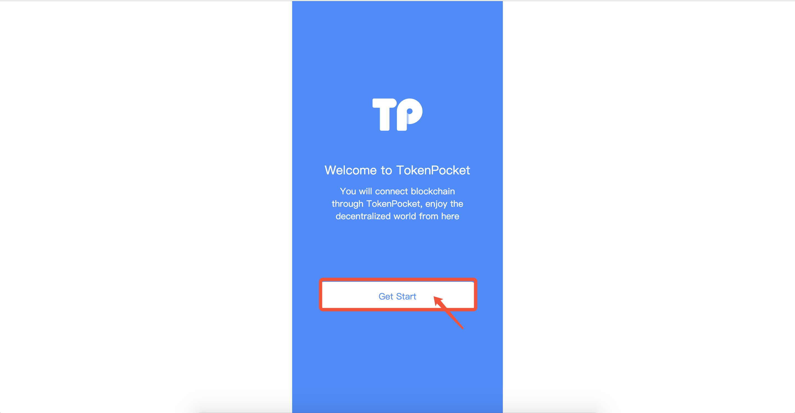
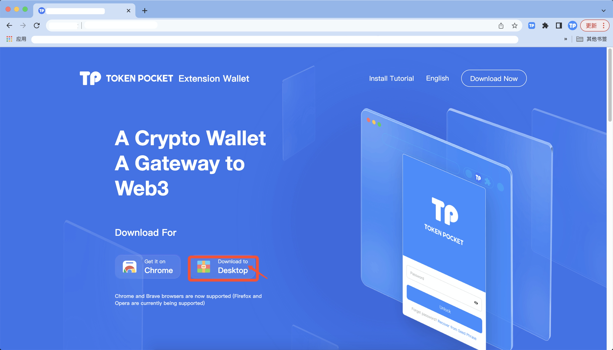

# Installation Tutorial

TokenPocket Extension Wallet is an extension to connect the blockchain world to experience DApps, DeFis, GameFis, and crypto assets easily just in your Chrome browser. There are two ways to add TokenPocket Extension Wallet to your extension installation.&#x20;

**First, GET IT ON Chrome.**

1. Click <mark style="color:orange;">**\[GET IT ON Chrome]**</mark>;

2\. Click <mark style="color:orange;">**\[Add to Chrome]**</mark>;

3\. Click <mark style="color:orange;">**\[Add extension]**</mark>；

4\. After adding TokenPocket Extension Wallet to the extended function in the chrome browser, click <mark style="color:orange;">**\[Get Started]**</mark>;

**Second, download to desktop.**

1. Click <mark style="color:orange;">**\[Download to desktop]**</mark>;

2\. Unzip the TokenPocket installation package as a folder.

3\. Open the chrome browser, click <mark style="color:orange;">**\[Settings]**</mark> - <mark style="color:orange;">**\[Extensions]**</mark>-open the <mark style="color:orange;">**\[Developer mode]**</mark> - <mark style="color:orange;">**\[Load the unpacked]**</mark>, and then load the TokenPocket folder;

4\. After adding TokenPocket to the extended function in the chrome browser, click <mark style="color:orange;">**\[Get Started]**</mark>;

****

****
