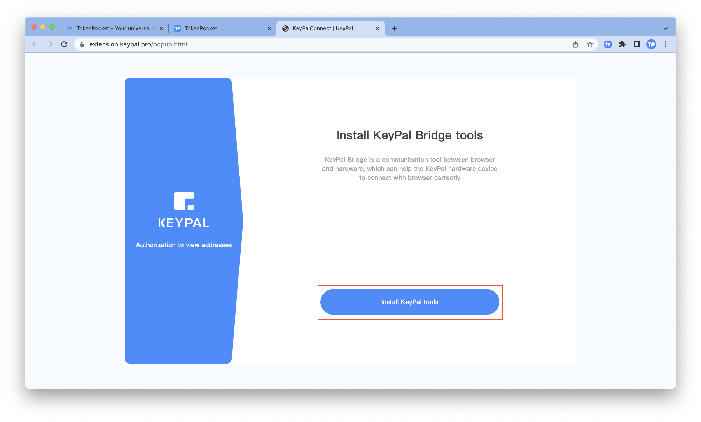
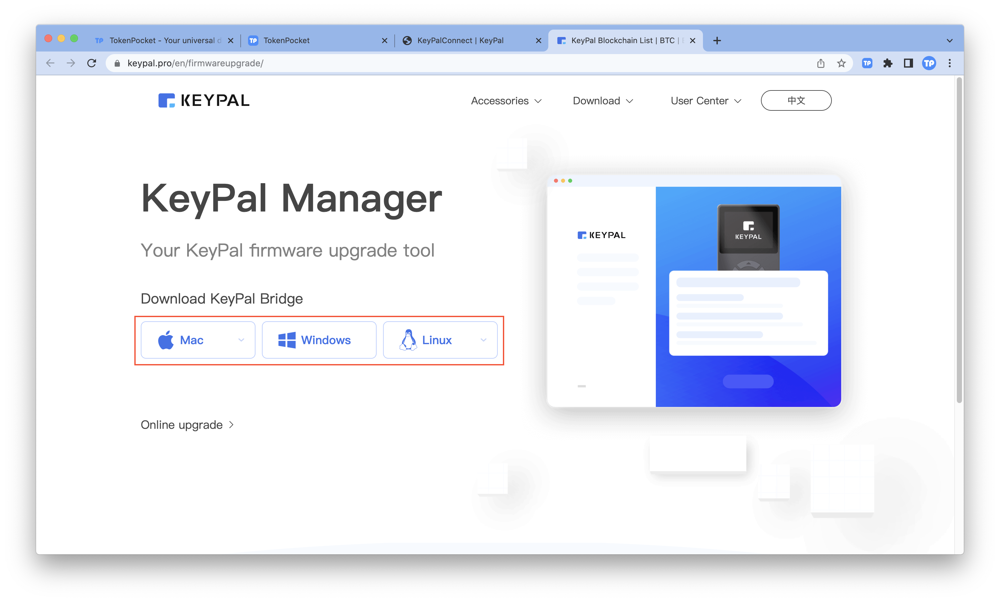
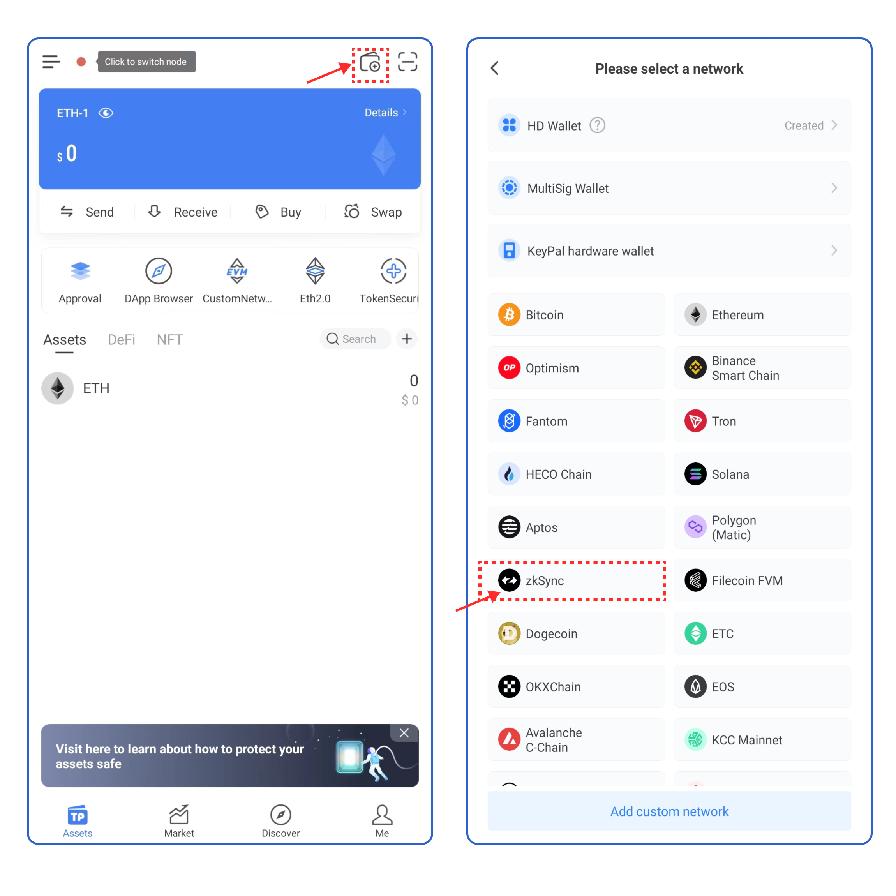
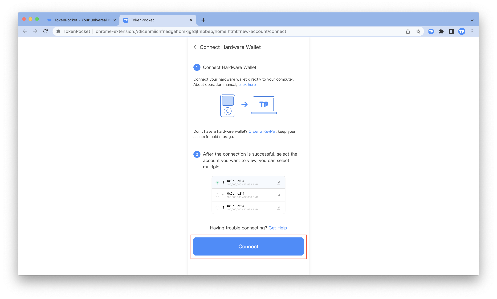
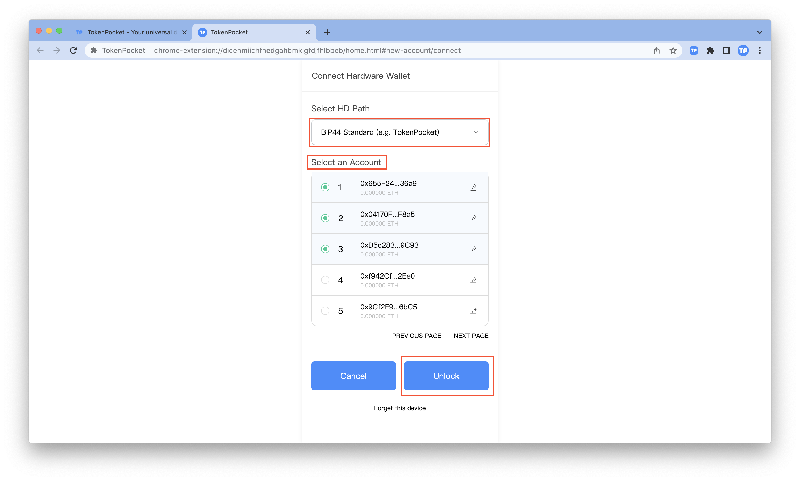

# How to connect to KeyPal?

****[**TokenPocket extension wallet**](https://extension.tokenpocket.pro/#/) **(1.1.4) has already supported users to connect to the KeyPal hardware wallet.**&#x20;

1. Firstly, you need to install the KeyPal tools from [**https://extension.keypal.pro/popup.html**](https://extension.keypal.pro/popup.html) **** to connect to <mark style="color:blue;">****</mark> [<mark style="color:blue;">**KeyPal**</mark>](http://keypal.pro/). Click **\[Install KeyPal tools]**.&#x20;

2\. Select the corresponding Bridge you need to download.

3\. After you've finished downloading the KeyPal Bridge, you need to connect your hardware wallet directly to your computer. Open TokenPocket extension wallet and click the upper left corner to enter the settings page.

2\. Click **\[Connect Hareward Wallet]**.

3\. Select **\[KeyPal]** and then, click **\[Connect]**.

4\. Select the account you want to connect to and click **\[Unlock]**.

5\. At this point, you've successfully connected to [<mark style="color:blue;">**KeyPal**</mark>](http://keypal.pro/).&#x20;

