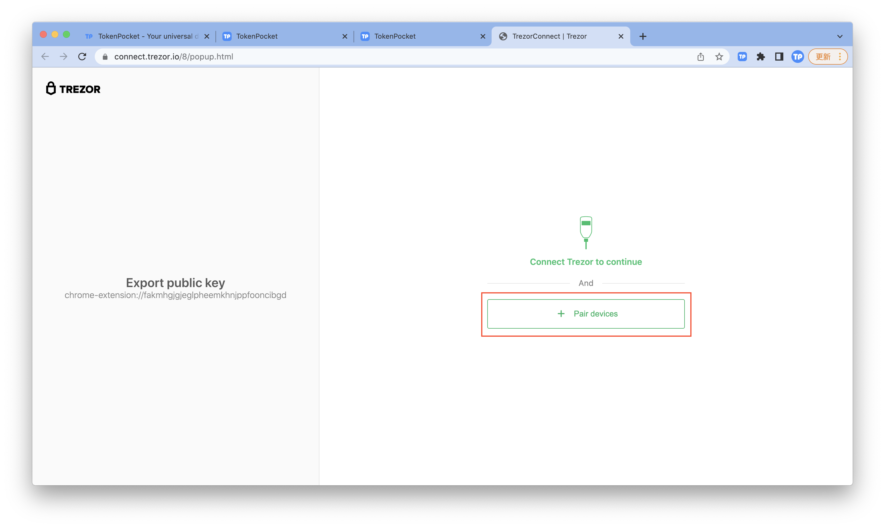
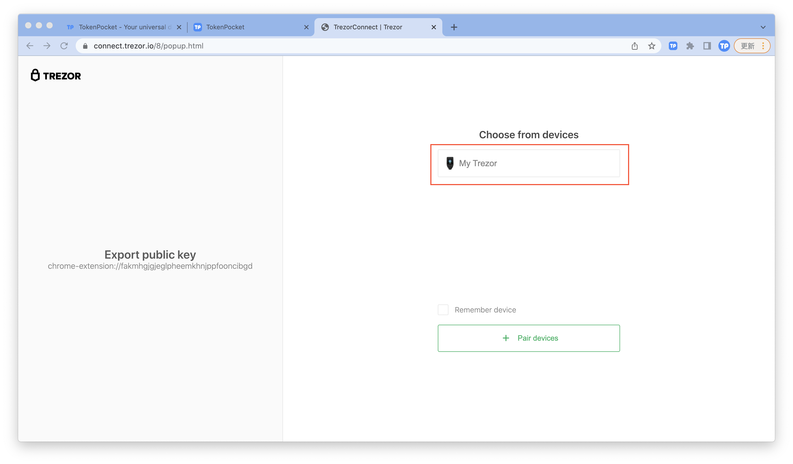

# How to connect Trezor?

****[**TokenPocket extension wallet**](https://extension.tokenpocket.pro/#/) **(1.1.3) has already supported users to connect Trezor hardware wallet. There are two ways to connect to the Trezor hardware wallet.**

1. Firstly, you need to enter the PIN code to verify your Trezor. Open TokenPocket extension wallet and click the upper left corner to enter the settings page, click **\[Connect Hareward Wallet]**.

2\. Click **\[Trezor],** follow the steps to connect your Trezor to the computer, and click **\[Connect]**.

3.Click**【+ Pair device】,** choose the device that has connected to the computer and click **【Connect】**.

4\. Click**【My Trezor】.**

5\. Choose the wallet you need to connect to the TokenPocket extension wallet and click **\[Unlock].**

&#x20;

6\. At this point, you have successfully connected your Trezor to the TokenPocket extension wallet.
