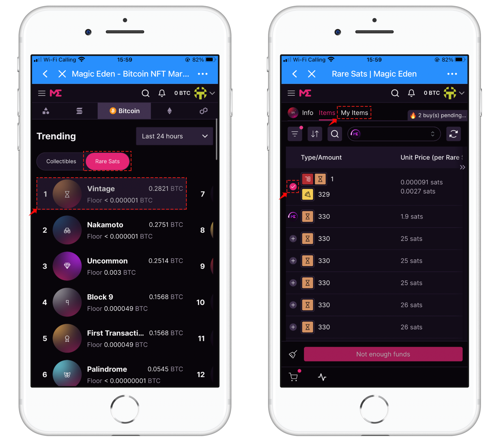

# How to import/create a wallet in TP Extension Wallet?

<mark style="color:blue;">**Import a wallet**</mark>

1. If you **have a wallet**, please click <mark style="color:orange;">**\[Import Wallet]**</mark>;

.png>)

2\. According to the tips enter your Secret Recovery Phrase and password, in order to ensure that the secret recovery phrase is entered correctly, we recommend you to click <mark style="color:orange;">**\[Show Secret Recovery Phrase]**</mark> and make sure you have entered a space between each phrase. After completing the operation of entering the Secret Recovery Phrase and password, please click the button in front of <mark style="color:orange;">**\[ I have read and agreed to the 《Terms of Use》]**</mark>, and then click <mark style="color:orange;">**\[Import]**</mark> to complete the wallet import operation.

.png>)

<mark style="color:red;">**Safe Tips**</mark>\ <mark style="color:red;">**• Save a backup in multiple places.**</mark>\ <mark style="color:red;">**• Never share the phrase with anyone.**</mark>\ <mark style="color:red;">**• Be careful of phishing! TokenPocket Extension Wallet will never ask for your Secret Recovery Phrase.**</mark>\ <mark style="color:red;">**• If you need to back up your Secret Recovery Phrase again, you can find it in Settings → Security.**</mark>\ <mark style="color:red;">**• It is your responsibility to keep your Secret Recovery Phrase safe. TokenPocket Extension Wallet cannot recover your Secret Recovery Phrase.**</mark>

3\. At this point, you have successfully imported your wallet.

.png>)

<mark style="color:blue;">**Create a wallet**</mark>

1\. If you **don’t have a wallet** before, click <mark style="color:orange;">**\[Create a wallet]**</mark>;

.png>)

2\. Enter your new password, click<mark style="color:orange;">**\[Create];**</mark>

.png>)

3\. After watching the video and understanding the security points of Secret Recovery Phrase , click <mark style="color:orange;">**\[Unferstood, next]**</mark>;

 (1).png>)

4\. Click <mark style="color:orange;">**\[CLICK HERE TO REVEAL SECRET WORDS]**</mark>, and back up the secret recovery phrase, click <mark style="color:orange;">**\[Create]**</mark>, enter the recovery phrase correctly, and then click <mark style="color:orange;">**\[Confirm]**</mark>;&#x20;

5\. <mark style="color:red;">****</mark> At this point, you have successfully created a new wallet account.

.png>)

<mark style="color:red;">**Disclaimer: This tutorial has no investment advice.**</mark>
