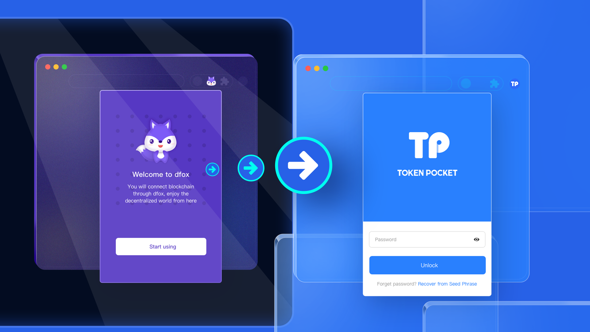

# TokenPocket Brand Upgrade

dfox Extension Wallet Announced Rebranding, Brand Name Officially Upgraded to&#x20;

[**TokenPocket Extension Wallet**](https://extension.tokenpocket.pro/#/).

On April 24, 2022, dfox officially announced that the dfox Extension Wallet rebrand to [**TokenPocket Extension Wallet**](https://extension.tokenpocket.pro/#/).

From now on, the trinity of [**TokenPocket mobile wallet**](https://tokenpocket.pro/), [**chrome extension wallet**](https://extension.tokenpocket.pro/#/), and [**hardware wallet**](http://keypal.pro/) has been formally formed. With the cross-chain aggregation swap platform [Transit Finance](https://www.transit.finance/) and [Transit NFT marketplace](https://nft.transit.finance/#/)(coming soon), it has become an important portal to the blockchain world, providing users with a smooth crypto experience.
