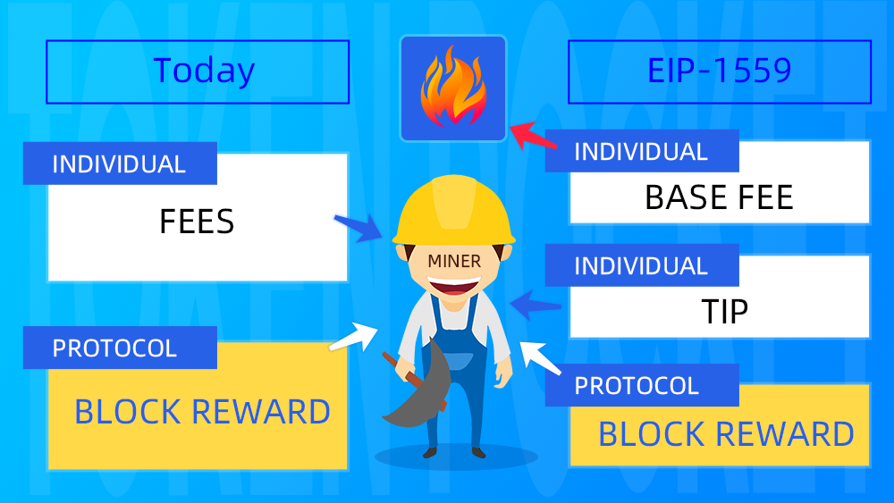

# What Is EIP-1559?

**What Is EIP-1559?**

EIP-1559 stands for “**Ethereum Improvement Proposal**”. It will change the fee market mechanism of Ethereum and this change will see gas fees split into two: **Base fee and Tip**. Both of these fees will be transparent for users. 

It will include a tip from the sender to motivate miners to package the transaction during periods of high congestion and a base fee which is then burned.

In order to protect the rights and interests of users, complete the transfer within the maximum acceptable range, and improve the efficiency, EIP-1559 adopts the **Max Tip** and **Max Price** as well. 

**Max Price** refers to the highest miner fee that a user is willing to pay.

**Max Tip** refers to the upper limit of the tip that the user set. If the miner fee \(Base Fee + Tip\) exceeds the Max Price, the exceeded part of the fee will be refunded to the user; 

For a better understanding, we will explain the following three cases ****based on the chart **** \(**under the condition that the basic fee remains unchanged**\):

1.When the tip paid by the user is insufficient to cover the miner fee required, the transfer might take a long time to complete, or may not be completed; 

2. When the tip paid by the user reaches the miner fee required but does not exceed the Max Price, then the tip that exceeds the miner fee required will not be refunded;

3. When the tip paid by the user exceeds the Max Price, the exceeded part of the fee will be refunded to the user.

**Why is EIP-1559 being released?**

In order to solve the problem of low efficiency caused by the current congestion of Ethereum transactions, the EIP-1559 proposal adjusts the gas fee according to actual usage needs, and changes the fee ****structure and flow direction to ensure the utilization rate of the block. The idea is to make fees based on block demand more transparent for the user.

The EIP-1559 proposal can dynamically adjust the upper limit of the Gas fee to cope with short-term transaction congestion, thereby improving transaction efficiency and **improving user experience.**

