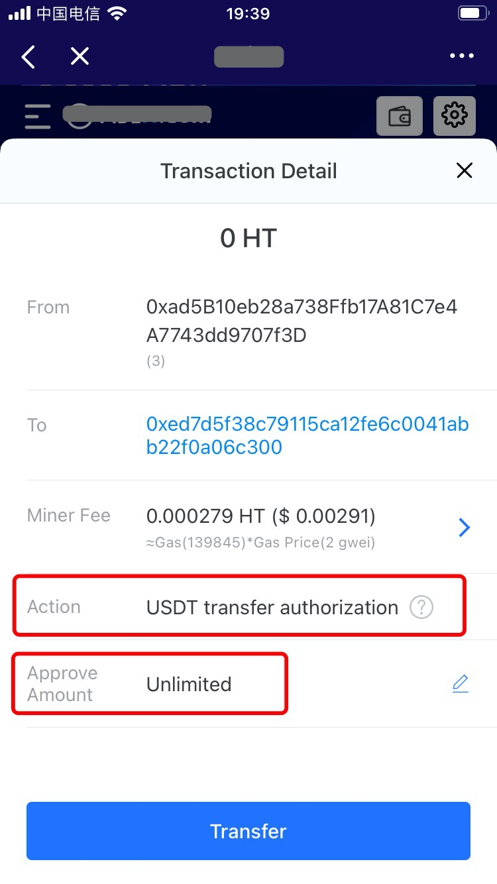

# What is Token Transfer Approval, and What Risk Does it Involve?

## **What is ERC20 token approval?** 

Most DApps on ETH involve contract operations, so the approval operations, that is, the user is actually allowing the contract to have access to a certain amount of tokens in the address.

**For example,**

Account A has 10,000 tokens. Account B has no token, and so does account C.

So how does account A delegate B to send 100 tokens to account C?

Firstly, accounts A and B will have to establish a delegating relationship. The user needs to login account A and run approve\(b,100\) to the result: \_allowed\[A\]\[B\]=100token

Then, account B needs to be logged in and run transferFrom\(A,C,100\). Account B is the delegated sender, from which account the gas is deducted. So the amount of tokens sent must below the \_allowed\[A\]\[B\] level.

**In conclusion, this is how a transfer is made from A to C through B.** 

## The risks may be involved in the process 

In the process, if the user approves the transfer to a malicious contract, it means that the contract is able to use the user’s tokens to make collateral or do other malicious things.

**DeFi on ETH is already widely recognized by the public, with well-known projects like Uniswap, Curve, and Balancer. These tools have easiness of use and powerful functions, which are also easy to list tokens. However, these features may make the tools a hotbed for evildoers. Hence, whenever we conduct ERC20 token swap \(especially some new tokens\), the process involves a certain degree of risk. The new version of TP wallet comes in to place at the right time — the newly added \[Action\] and \[Approved Amount\] are evidently important.** As mentioned above, to approve a transfer is like to sign a contract. In TokenPocket, if the maximum amount of the tokens that can be used in the contract is X, and when the required amount is larger than X, second approval permission will be triggered.

