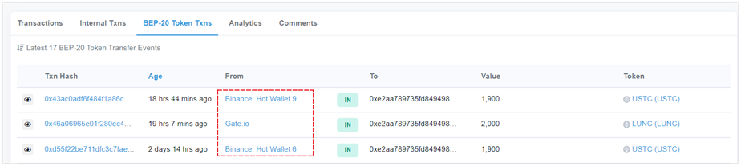

# Prevent a new type of token transfer scam

Recently, we received feedback from the users that they’ve received the airdropped tokens from the exchange. Attention, the type of this transaction is to imitate the exchanges’ transfer label. When users received this token and try to transfer or swap it, they found that there are some problems with the token, such as the situation that the token can be bought but cannot be sold, etc. The TokenPocket security department has analyzed the on-chain information and we found that it is a new type of token transfer scam. **The scammers forge transaction records of transfers between arbitrary addresses by using the browser or wallet to parse the transfer transaction records.** This falsification of transaction records can only be done against tokens issued by scammers but they can forge the mainstream tokens.

<figure><figcaption></figcaption></figure>

## **The best way to prevent this scam:** 

**Don’t** trust any unknown-source tokens or NFTs airdrop. The exchanges will not airdrop tokens to the on-chain wallets randomly.

**Don’t** use any recommended website or APP.

**Don’t** open third-party links and approve randomly.

**Keep private keys and secret recovery phrases safe** and don’t share them with anyone.
