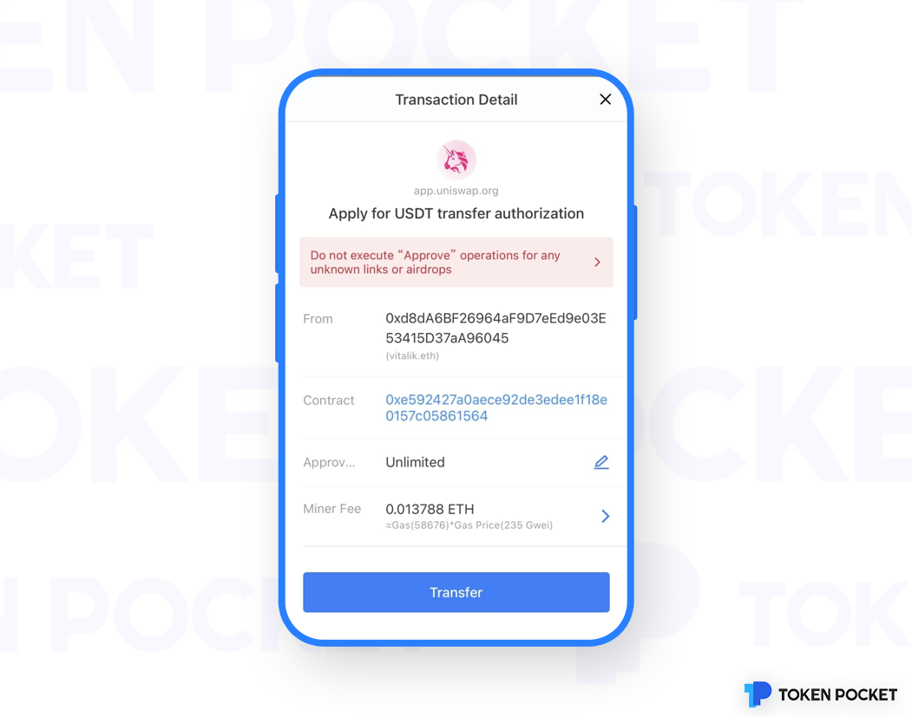

# About Approve

**What is an Approve?**

Approve is to allow another account (It can be an ordinary personal account or a contract account), <mark style="color:red;">which can control your asset without your permission</mark>. Therefore, Approve is a very dangerous action.

**Why Approve?**

Take ETH Network as an example, since ETH is a native asset, it will carry the ETH to the target contract when transferring to the target smart contract; when the non-native asset ERC20 token is transferred to the target contract, it only changes the ledger of ERC20 token itself but the target contract won’t receive any notification, so the approve is to inform the ERC20 token contract that an approval account can transfer my assets in the future. At the same time, Approve widely exists in ETH, BSC, HECO, TRON, Matic, OEC, Fantom, and all blockchain networks whose address formats are consistent with Ethereum (which is, EVM compatible public chain).

**What scenarios will use Approve in the process of using the wallet?**

The ordinary transfers won’t ask the Approve in the process of using the wallet; Only when it involves interacting with the contract (DApp, DeFi, etc.), the Approve operation will be performed when the contract needs to be approved. Therefore, when you are in the process of using the wallet, and the following interface appears, you are asked about the Approve. <mark style="color:red;">You must be more careful and confirm whether the current link you are visiting is safe and credible. If not, stop operating!!</mark>

**How dangerous Approve is?**

<mark style="color:red;">Approve is to allow the third-party to control your assets without your permission, which means that they can transfer all your assets away without your permission.</mark> So it is very dangerous to approve. Please be more careful when you encounter the Approve! Be sure to determine whether the code is verified and open-sourced, whether it has a code audit, whether the team is trustworthy, etc.!

**How to manage/cancel the Approve?**

Follow this tutorial:[**https://help.tokenpocket.pro/en/security-knowledge/security-measure/cancel-malicious-authorization**](https://help.tokenpocket.pro/en/security-knowledge/security-measure/cancel-malicious-authorization)****

**How to prevent Approve scams?**

1. Don't play DApps from <mark style="color:red;">unknown sources</mark>, don’t play DApps have <mark style="color:red;">no open-sourced</mark>, don’t play DApps have <mark style="color:red;">no audit reports</mark> and <mark style="color:red;">not from trustable teams</mark>.
2. Regularly use DeBank, **** Cointool and other tools to cancel the approval;
3. Create a new wallet. After the approval and other operations are completed, transfer the Token to the new wallet address, which is relatively safe because there is no approval history (Attention: the cancel the approve doesn’t mean absolutely safe, there is no tools on the market that can guarantee a complete cleanup.)
