# Cancel the malicious Approval, please act now!

Approve means authorization. It allows users who hold tokens to authorize a certain amount to a specified account by calling the Approve method, giving the account the right to freely spend the Token within the quota. If authorized to malicious accounts, then authorized assets will be extremely risky.

[about-approve.md](about-approve.md "mention")

**How to check whether the wallet address is** **authorized?**

\-APP Operation Tutorial-

1\. Open TokenPocket App, change your wallet that you need to check first, take TRON as an example;

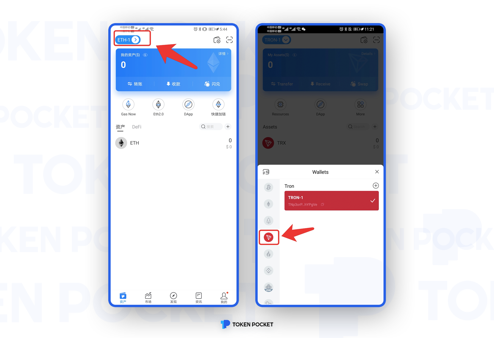

2\. Click \[Discover] and enter \[CoinTool] in the search bar, then CoinTool will appear automatically, click the second \[CoinTool];

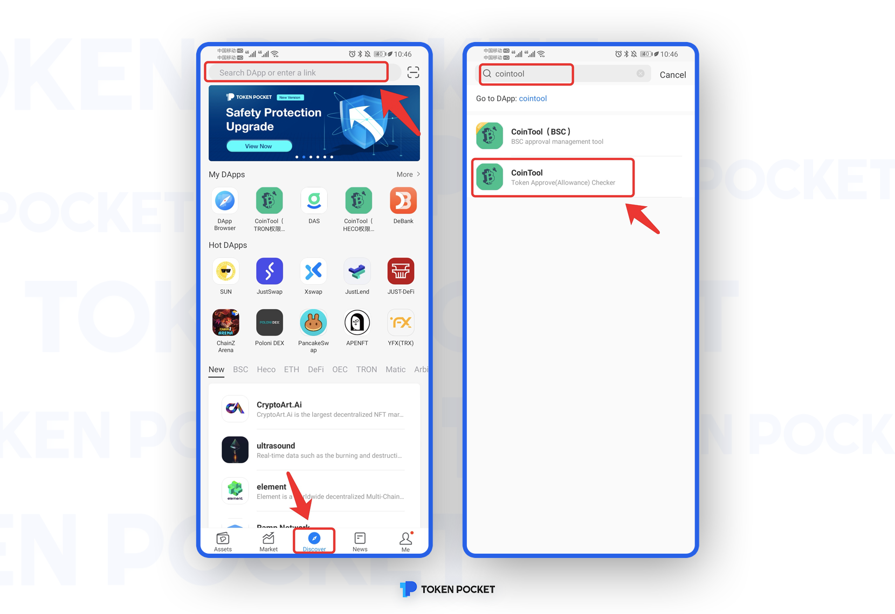

3\. Enter the query page of TRX, and enter your TRX wallet address you want to check; the authorization will appear on the bottom; if your address did not authorize, it will tell you that \[You don’t have an authorization token for a contract. It’s great!]

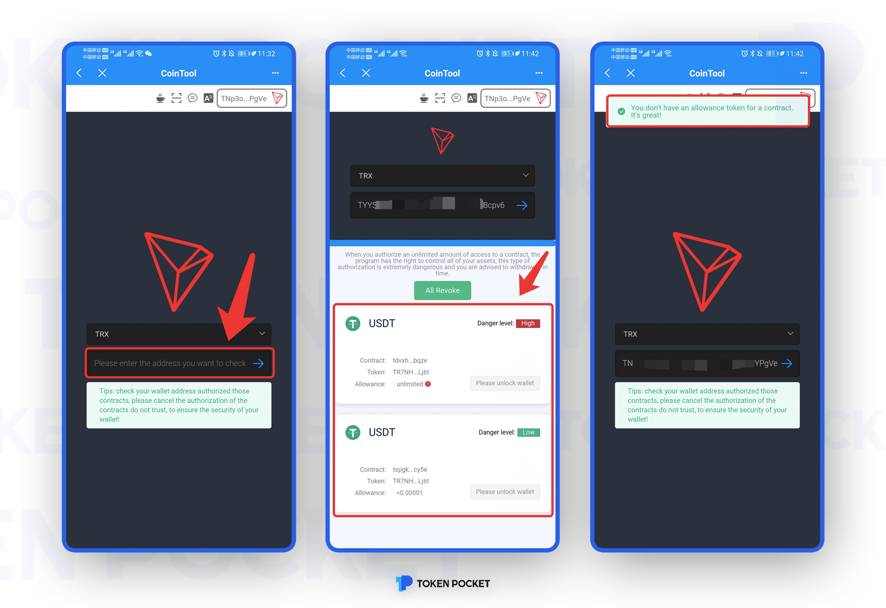

\-PC Operation Tutorial-

**一、Search in CoinTool**

1. Search [https://cointool.app/dashboard](https://cointool.app/dashboard) ，click「Token Allowance Checker」and click the chain you need to check, and then enter your wallet address.

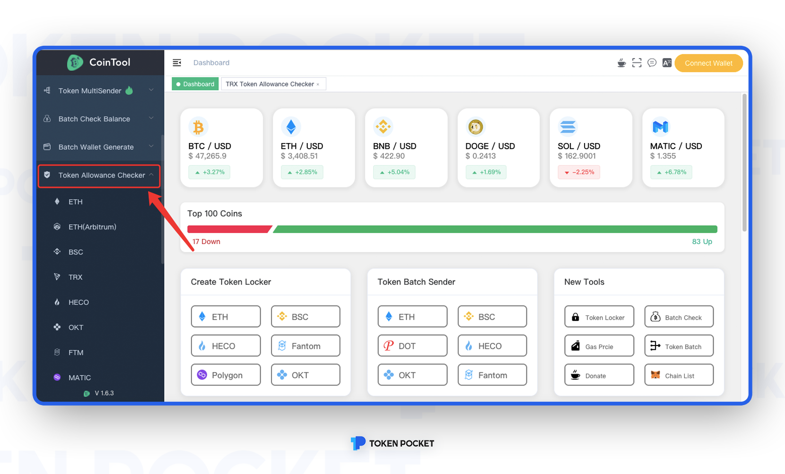

2\. Take TRON as an example, enter the wallet address, you can check the authorization on the bottom if your address has been authorized before;

.png>)

Here are two records of USDT authorized by this address. What is the difference between them? Before that, let’s briefly explain the definition of each position in the figure below:

.png>)

1\. Contract: When we exchange USDT for other tokens for the first time, we will first authorize (Approve), and we will leave traces after the authorization is completed;

2\. Token: This is the corresponding Token contract address;

3\. Allowance: When we authorize, we will flexibly choose from the interface that pops up in the wallet. By default, it is unlimited;

4\. Danger level: The danger level here **does not correspond to the virus database**, which is directly linked to the authorized number, and **does not represent absolute safety or danger**;

**Note:** When using JustSwap authorization, you will see JustSwap prompts in the authorized smart contract position. This type of authorization is relatively safe. If you see that the authorization contract is an ordinary TRON address instead of the JustSwap or Token contract address, there is a high probability of such a situation is a malicious authorization. The originator of the lost USDT hash value is usually this maliciously authorized address.

二、**Search in Blockchain Explorer(Take TRON as an example)**

1\. Open [https://tronscan.io/#/](https://tronscan.io/#/), and then enter your wallet address and enter the page of “Account”, click \[Approval] and you can check the authorization;

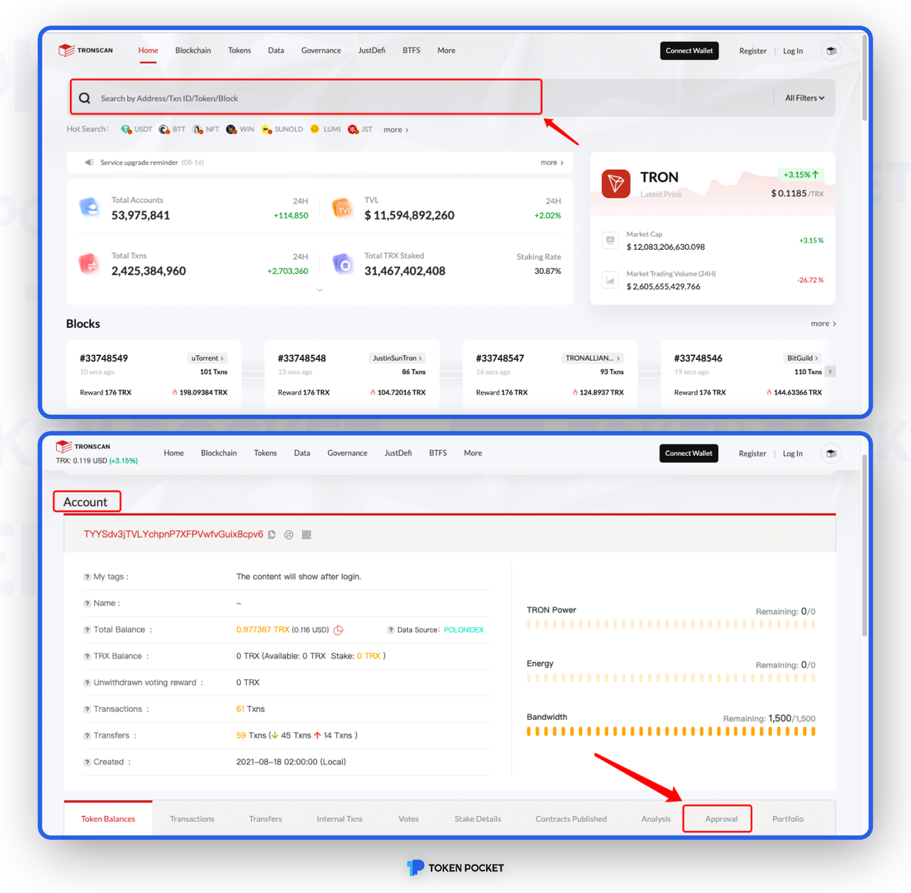

2\. In the \[Apprvoal List], you can check the authorization ;

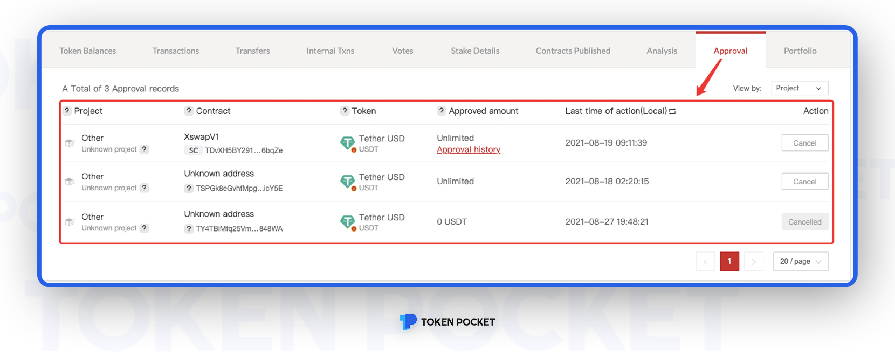

**How to confirm the** **malicious authorization address?**

Malicious authorization addresses have the following characteristics:

1\. Unknown airdrop lure;

Open an authorized address, click \[Token Balances], and click a token at any point; and then click \[Token Transfer];

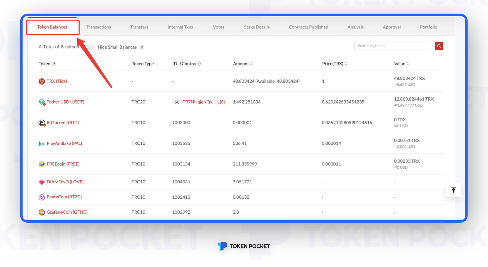

In some transfers, the thief will attach a note and use the airdrop as bait to allow you to exchange it through a third-party DApp. This is the most common way to obtain user authorization, please take precautions! ! Don't believe in any airdrops from unknown sources! !

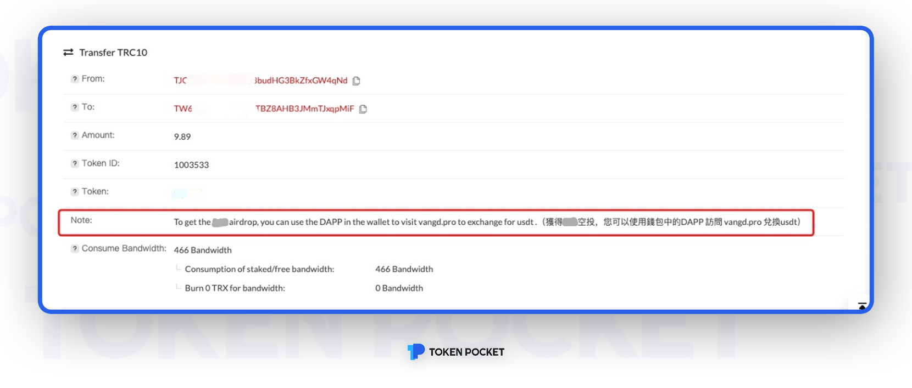

2\. Authorized address to issue multiple tokens of same types；

After checking the authorized address, it was found that multiple TRC10 tokens issued by this address are as follows:

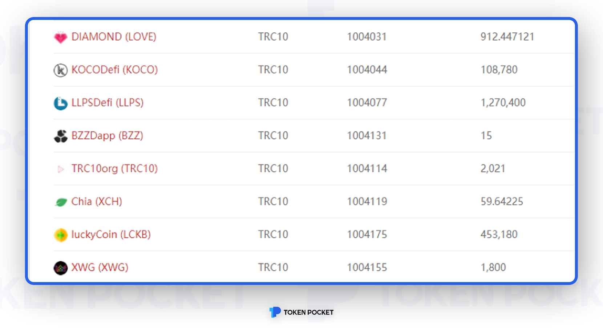

There are so many TRC10 tokens that cannot be exchanged in Swap. They must be used for other purposes. Click on the tokens one by one to get the following content, the answer is obvious.

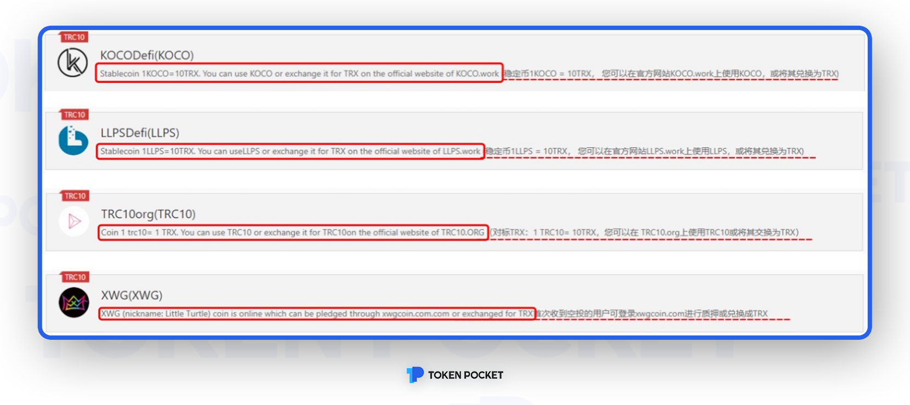

The token introduction is accompanied by a link. After the user opens the Token introduction to access the link and authorizes the asset, the asset is stolen.

**Note:** In addition, there is also a scammer who uses a fake payment interface to transfer money with users, and uses Approve malicious authorization to achieve the purpose of stealing money. Therefore, you must be cautious in dealing with others.

**ATTENTION!!**

**The POINT is here!!**

** How to cancel the authorization? (Take TRON as an example)**

After you confirm the authorized address is a malicious address, open the TokenPocket APP, enter the page of canceling the authorization in CoinTool, choose the authorization address you need to cancel, click \[Revoke] and finish.

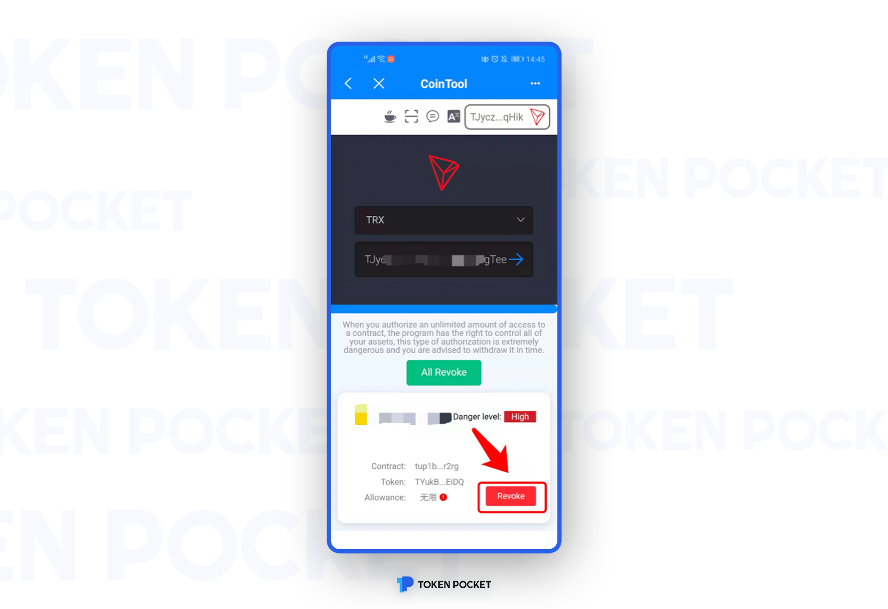
