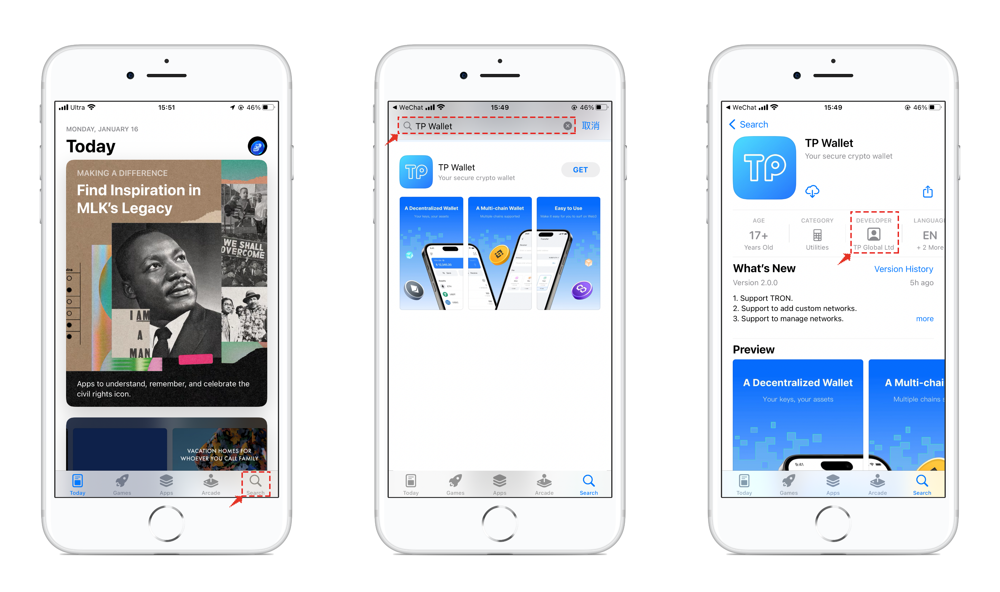

# How to Identify the Authenticity of TokenPocket’s Website and APP?

**Identify the Authenticity of TokenPocket’s Website.**

Please confirm the domain name of TokenPocket’s official website is \[<mark style="color:red;">**https://tokenpocket.pro/**</mark>]. And there has a \[🔒] symbol in front of the domain name, which means \[Connection is secure].

 (1).png>)

**Identify the Authenticity of TokenPocket’s APP.**

&#x20;**🍎 iOS**

Open and log in to your App Store. Search “ <mark style="color:blue;">**TP Wallet**</mark> ” and see the results. The result in the second one (second is just current rank) is the right TokenPocket. Click to see the details. In the details interface,  if you saw the “ <mark style="color:blue;">**TP Global Ltd**</mark> ”, then it is the right “TokenPocket”.

<mark style="color:red;">**The developer of the version downloaded from the Apple Store before October 8, 2022 is TOKENPOCKET FOUNDATION LTD and it is an early version from TokenPocket, which is also a real wallet and can be used normally, but the update will not be available later.**</mark>

:mobile\_phone:Android

Open and log in to your Google Play. Search “TokenPocket” and see the results. You can see \[TokenPocket Foundation] in the interface. Click \[Development contact], you can see the website, email,  and privacy policy of TokenPocket, click \[Website] and you can enter the only official website of TokenPocket\[<mark style="color:red;">**https://tokenpocket.pro/**</mark>], then it is the right “TokenPocket”.&#x20;

 (1).png>)

The update is prompted in the App, or download the latest version from the official website. (Note: The only official website of TokenPocket is: [https://tokenpocket.pro/)](https://tokenpocket.pro/\))
