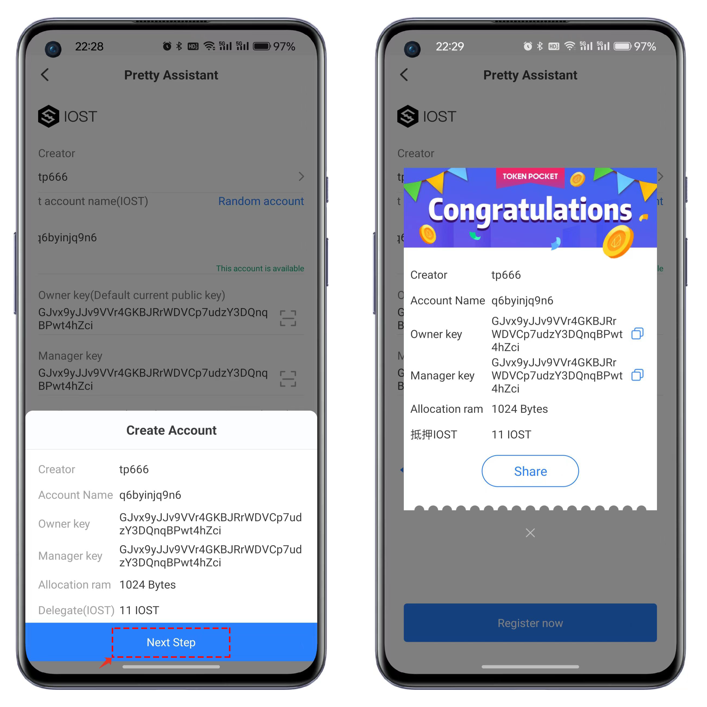

# Use the Passphrase feature to create a "hidden wallet."

### <mark style="color:orange;">What is a passphrase</mark>

When creating a hidden wallet, a passphrase is an essential tool for encryption and protection. It is typically a string composed of words or phrases used to create the private key or seed phrase of the wallet.&#x20;

The purpose of a passphrase is to increase the security of the wallet, ensuring that only those who have the correct passphrase can access and control the assets in the wallet. Without the correct passphrase, it is impossible to recover or reconstruct the wallet, so it is very important to keep the passphrase safe.

### <mark style="color:orange;">Here are some security points to consider when using a passphrase:</mark> 

* Confidentiality: Do not disclose your passphrase to others. Ensure that you alone know and hold the passphrase. Avoid revealing the passphrase in social media, chat applications, or public places.
* Complexity: Choose a sufficiently complex passphrase. It should contain random words or phrases and avoid easily guessed content, such as common phrases, dates, personal information, etc. Using a random password generator to create strong passwords can enhance security.
* Backup: Ensure correct backup of the passphrase. Write it down on paper and keep the paper backup in a safe place, away from internet and physical threats. Don't just rely on electronic devices or online storage, as they may suffer from data loss, failure, or hacking.
* Regular change: Regularly changing your passphrase is a good security practice, especially if you suspect that your passphrase may have been leaked or is no longer safe. Changing the passphrase also means that your wallet address changes along with it!
* Beware of phishing attacks: Be aware of phishing attacks and do not click on links from unknown sources or suspicious websites to prevent being lured into entering your passphrase.&#x20;

Remember, a passphrase is key to accessing and controlling your digital currency assets. If you lose or forget your passphrase, you may not be able to access your assets again, so it's very important to keep it safe and secure.

### <mark style="color:orange;">Passphrase Tutorial</mark>

**Creating a Wallet Using Passphrase**

1. Open TP Wallet version 2.1.1 and click on the first icon in the top-right corner, "Create New Wallet." For demonstration purposes, let's choose the Ethereum blockchain.

<figure><figcaption></figcaption></figure>

2. Since it is the first time using the Passphrase feature, you need to "create a wallet." It is important to note that TP Wallet uses a globally unified password. This means that if you have created a wallet before, the passwords for subsequent wallet addresses will be the same as the first one.

<figure><figcaption></figcaption></figure>

3. The change brought about by the Passphrase is the addition of "Advanced Settings" at the bottom of the interface. When opened, you can set up a Passphrase. Please carefully review the introduction and familiarize yourself with the features and precautions of the Passphrase.

<figure><figcaption></figcaption></figure>

4. The interface for backing up and verifying the mnemonic phrase is no longer demonstrated. After creating a wallet, click on "Receive" to see the wallet address created through the passphrase method.

<figure><figcaption></figcaption></figure>

### <mark style="color:orange;">Importing Wallet Using Passphrase</mark>

In this demonstration, we will compare the regular mnemonic import method with the passphrase import method for importing mnemonics into a wallet.

1. Default mnemonic import: This method is the same as the usual import process. Simply enter the mnemonic and click "Import" to proceed. After importing, the wallet address can be viewed as shown in the following image.

<figure><figcaption></figcaption></figure>

2. Click on "Advanced Mode" in the mnemonic import interface to access the Passphrase setting interface. After entering the correct content, click on "Import" to proceed. At this point, the wallet's receiving address will be the same as the address generated when using Passphrase to create the wallet. (Importing the wallet with an incorrect Passphrase will result in a different address.)

<figure><figcaption></figcaption></figure>
