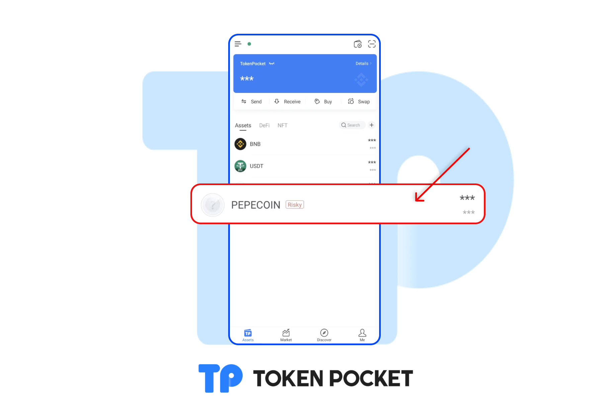
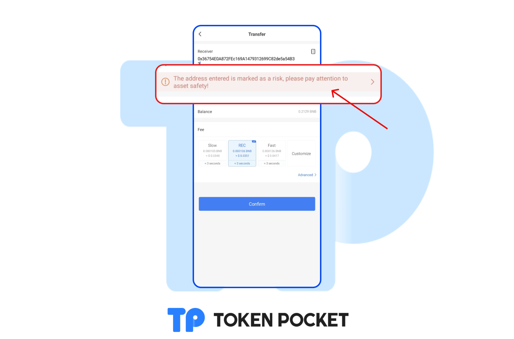
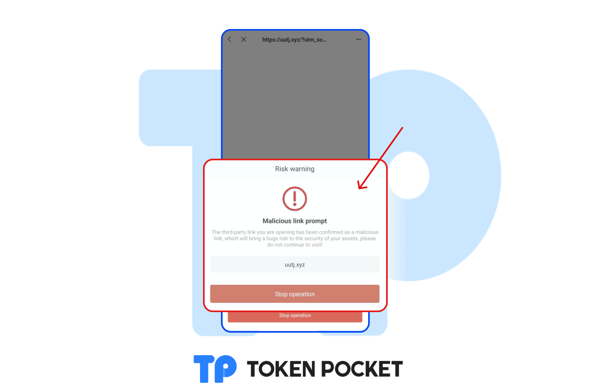

# Pay attention to the tokens and links marked as risky!

To help more users to get away from the fake token, honeypot, and the scam websites. TokenPocket has marked these tokens and websites as "risky". <mark style="color:red;">**If the following interface appears on the asset page or when you open the website, please stop any operations immediately and delete the asset!**</mark>

**The risky token reminder:**&#x20;

In this situation, most of these tokens are honeypot or they have 100% sell tax, or other security problems. You can check on the [**Token Security Detection Function**](https://tokensecurity.tokenpocket.pro).

**The risky address reminder:**

In this situation, please stop tranfer operation and pay attention to assets safety!

**The scam reminder:**

In this situation, please stop operation! This website is total a **SCAM**!

