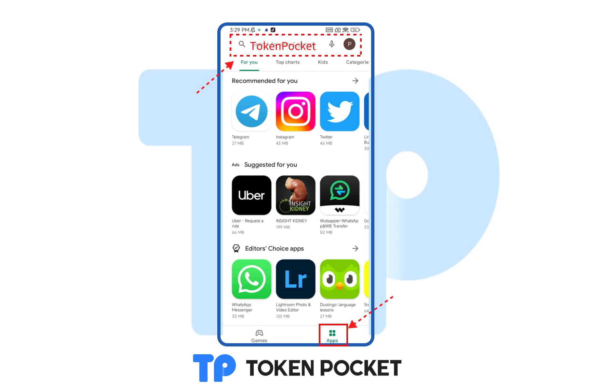
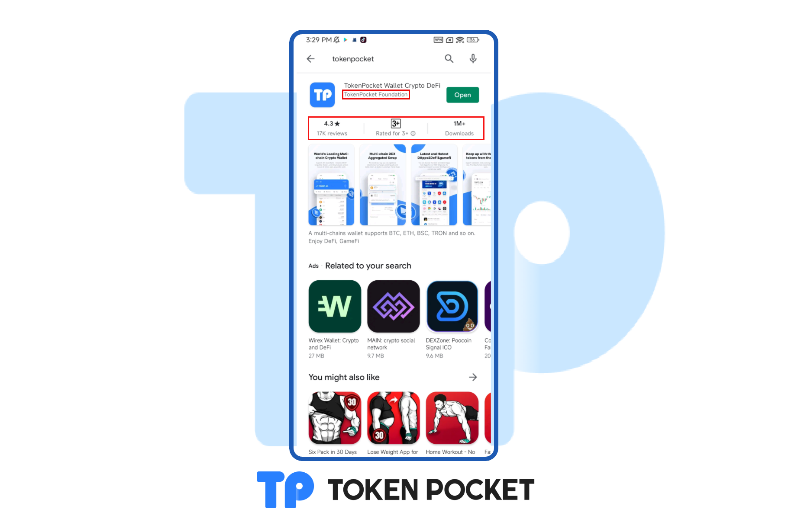

# How to verify the real TokenPocket on Google Play?

It's very easy to verify the real TokenPocket on Google Play which benefits from its having a  complete data statistics system, users just need to search TokenPocket on the search bar, then according to the data you can verify the real TokenPocket quickly!

1. **Open Google Play and open the **<mark style="color:orange;">**APPs**</mark>** menus, and search **<mark style="color:orange;">**TokenPocket**</mark>** on the Search Bar.**

**2. You can see the name of the TokenPocket developer is **<mark style="color:orange;">**TokenPocket Foundation**</mark>**, and then you can see the reviews data, Downloads data, etc.**&#x20;

⚠️If it is a fake wallet, it is impossible to reach this magnitude, so based on this information, you can quickly distinguish the real TokenPocket.

