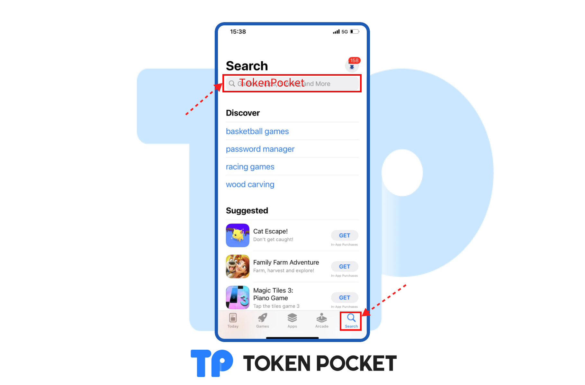
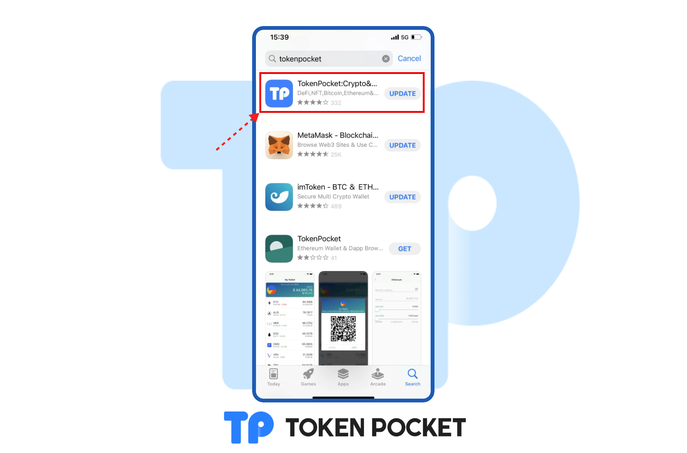
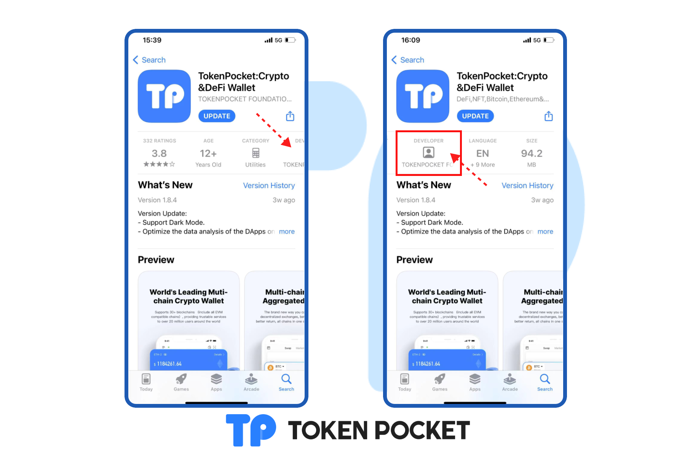

# How to verify the real TokenPocket on App Store?

1. Open App Store and click the <mark style="color:orange;">**Search**</mark>, search <mark style="color:orange;">**TokenPocket**</mark> on the search bar.

2\. You can see <mark style="color:orange;">**TokenPocket**</mark>, and click the APP to see the details.

3\. Swipe left and you can see the TokenPocket Developer is <mark style="color:orange;">**TokenPocket Foundation LTD.**</mark>. If all the messages above are correct, then your TokenPocket is real.

