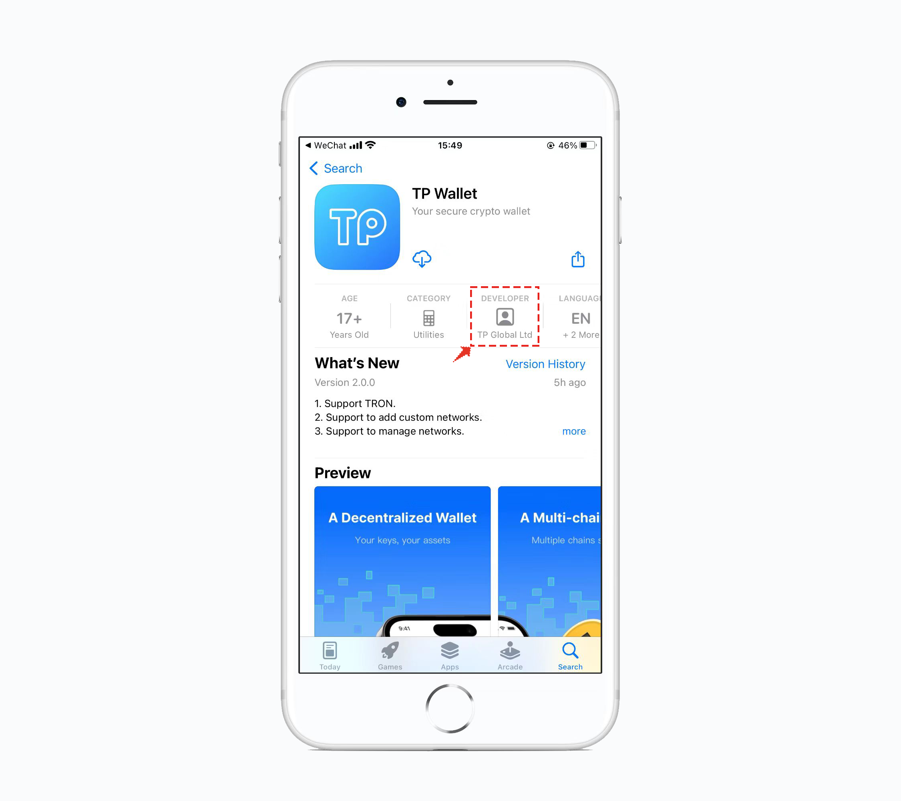

# How to verify the real TokenPocket（TP Wallet） on App Store?

1. Open App Store and click the <mark style="color:orange;">**Search**</mark>, search <mark style="color:blue;">**TP Wallet**</mark> on the search bar.

2\. You can see <mark style="color:blue;">**TP Wallet**</mark>** **<mark style="color:orange;">****</mark> , and click the APP to see the details.

3\. You can see the TokenPocket Developer is <mark style="color:blue;">**TP Global Ltd**</mark>. If all the messages above are correct, then your TokenPocket is real.

