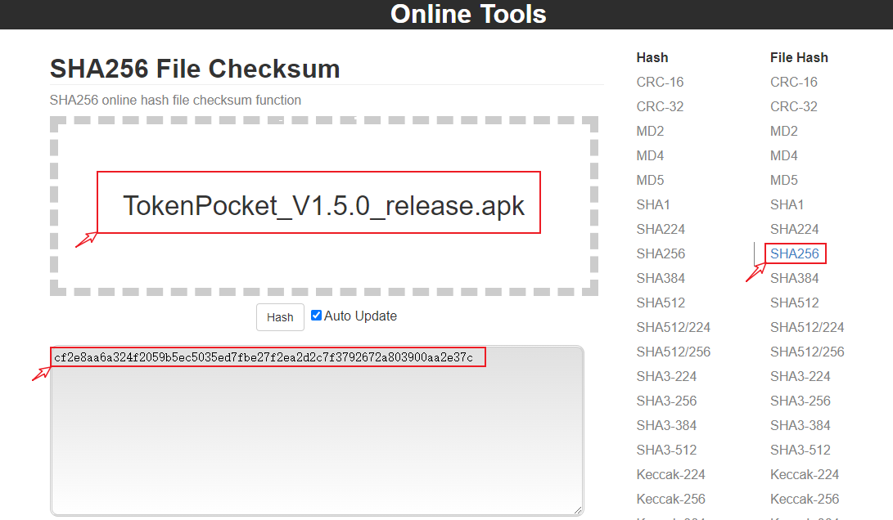
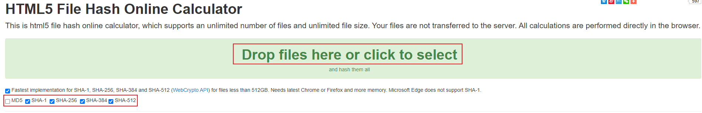

# How to verify whether the wallet is genuine

### <mark style="color:blue;">**MD5 and SHA256 verification tool**</mark>

File hash verification tool refers to the tool that calculates the hash value of the file content. With these tools, the hash value of the file can be quickly calculated, and compared with the official hash value to verify whether the file content has been tampered with.

### <mark style="color:blue;">The purpose of MD5 and SHA256 verification</mark>

Decentralized self-custody wallet is a platform where we import private keys or mnemonics to manage assets on the chain, so how to select and use the platform is particularly important. As a decentralized self-custody wallet with a large number of users, TokenPocket is naturally "concerned" by lawbreakers. They decompiled the genuine APK and added the settings that can import private keys and mnemonics, and then packaged and released it to other websites to "wait for the victims". Once someone downloads and uses the wallet through a search engine or recommendation by others, his private key and mnemonic will be leaked and all assets will be lost.

Judging from the recent feedback from emails and communities, the cases of stealing through fake wallets have increased. That is why we have made this tutorial. By verifying the MD5\SHA256 value on PC and mobile platforms with online tools, we hope to improve everyone's security awareness and learn to use tools reasonably to protect their assets on the chain.

Please be sure to enter the only official website address of TokenPocket: [www.tokenpocket.pro](https://www.tokenpocket.pro)

### <mark style="color:blue;">The difference between MD5 and SHA256 algorithms</mark>

Common points:

1. Both are cryptographic hash functions, and the encryption is irreversible.
2. Both can encrypt objects of any length, and neither can prevent collisions.

As for security

1. SHA256 (called SHA2) is the most secure, but takes more time than the others.
2. MD5 is relatively easy to collide, and not so secure.

### <mark style="color:blue;">MD5 and SHA256 parameters of the official wallet APK:</mark>

<mark style="color:blue;">**Google Play**</mark>

| Version |                MD5               |
| :-----: | :------------------------------: |
|  1.5.5  | 10e6d8860e2b0a1253a3fc9a541ac3a9 |
|  1.5.4  | 53936f73be5c90dce02ea06919f29fb0 |
|  1.5.3  | 24a1df1bc85cdb1c34c780c217ee9c1d |
|  1.5.2  | 10e6f64debae79bf1e40bd830c6a819e |
|  1.5.1  | c30cbf152acc15c5cffafaf7a7a387ad |
|  1.5.0  | a951c032f8723cc1711f0d3b3256725d |
|  1.4.9  | 4b88e2ffa2b3d84fbc2f099e1034fb86 |
|  1.4.7  | feab610e82a1ed694d24994487f3e38c |
|  1.4.6  | 59dbdcd8b2f6580d81f519e555e2b5ec |

| Version |                              SHA256                              |
| :-----: | :--------------------------------------------------------------: |
|  1.5.5  | 95ca32929a294f90de3a2f62ceb792cc4fa442ee632e5df810a6d2bd8b44325d |
|  1.5.4  | d4edad4a5277efc29fc896fcabe71a8f17de1fbf69944e340b52a0709dab9695 |
|  1.5.3  | 30d50fc1f9f008bbfb3bb33fd5d04f6dcd6e3fb1c9b37ab5ec1815d6c9391bed |
|  1.5.2  | f357cf564293ad09026170949e7b69e13342b47e57880200b6575c0e596c4e99 |
|  1.5.1  | f1eb4e4571c9c1e08771ffcd896c6aaab63097e2ddda0d00232754d114dc9313 |
|  1.5.0  | c7f8b8a603d8725ba1df631cf03f2c63dc4c428b5ffe1f3ae3eec400bf3d121b |
|  1.4.9  | 37b571b7644e456be7260e3d1d93ce59d9e38f694215c85e29e4a1476b6bf634 |
|  1.4.7  | b023f39e496ac6a38cc0ef121470cc7c2142f393c75aea504bc8ab979285dffd |
|  1.4.6  | e5255e4a709e05f3a4d35f3ae0c4bbef26a92b40b2e719b55f4b46fe54d3c8f7 |

<mark style="color:blue;">****</mark>[<mark style="color:blue;">**www.tokenpocket.pro**</mark>](https://www.tokenpocket.pro)<mark style="color:blue;">****</mark>

| Version |                MD5               |
| :-----: | :------------------------------: |
|  1.5.6  | b90aca7a51d0b01d21530d987ed5d564 |
|  1.5.5  | 0e2668727560344978dd523925a75a4b |
|  1.5.4  | f510204c4fa7533b05e729b902ebec59 |
|  1.5.3  | 4ebc793117ce677fb07602e31256e7cc |
|  1.5.2  | 938e9252cb21fef1c40fac3c4c9492c6 |
|  1.5.1  | f879845afd51d51fabf42e653011da79 |
|  1.5.0  | aed562118bd5d8c64578f3b52a7b2460 |
|  1.4.9  | bbe46949fcc243ad113c45ec19ce9215 |
|  1.4.8  | 5c5cb0676c72c8d554091ad5a7608471 |
|  1.4.7  | 618c2017ce7f9f75bbdfe09ae06a4467 |
|  1.4.6  | 1d26ffe224b211d5f7906f07f916937c |
|  1.4.5  | e3f8f3f8ac9f0c0eabdfadd5d3ffaf82 |
|  1.4.4  | 3164a854b2cd46d8a6f1dd750bf83bf2 |

| Version |                              SHA256                              |
| :-----: | :--------------------------------------------------------------: |
|  1.5.6  | 1861aa2a7afdc5430f2517e9286a65ccbd1a8de42e9d6596b687ae8aa4b43da3 |
|  1.5.5  | 76bc787cd5933f6f2cd40b7cc227038995c7717985ebaf9031fa61154b0f6360 |
|  1.5.4  | 84e5382013fd5625d684d02836f001d126c31196635e5b1630bc36710ef7afe7 |
|  1.5.3  | 4b35d2b8237b9708b12d1386527b3a6c233a641a989f7c63b9512cdc522af219 |
|  1.5.2  | dfaf358d6f30ead51b52193a5aab8259fd52ac5d8372b47a97951c799842b988 |
|  1.5.1  | a4162187fac4a623ab5762d15953ae17e659e3c6fa518615a70d8046d2f01355 |
|  1.5.0  | cf2e8aa6a324f2059b5ec5035ed7fbe27f2ea2d2c7f3792672a803900aa2e37c |
|  1.4.9  | d8f605a142c6140905cf25a829f0be10d402e232ce1717013553aaec443d6946 |
|  1.4.8  | 5dedd0c8c793c5f22a3d8d4703e31a6fc5e8d483159b31a1fe64265eefc1f7c3 |
|  1.4.7  | 02182af2d93d3c3d63985986c2a0b8c9506223abe15a59278caf67e84f2efece |
|  1.4.6  | 081d1c7765813e576c8610d85472a5bd719b73718bc288960a7d333e9e379439 |
|  1.4.5  | 24f91c19732253afb89b9e588dec2d783d659b9d2bc5bed1d1ba1bb27e06533c |
|  1.4.4  | 0a9a3e23b32215eb3ba0e37f7cc3ea5b7d4139d15930426664005291f57458c0 |

### <mark style="color:blue;">The online tools to verify MD5 and SHA256</mark>

There are many tools for online verification of MD5\SHA256 value, and their usage is similar. You only need to drag or load the apk file downloaded to the PC into the verification platform to wait for the result. The obtained result can be verified by comparing it with the MD5 or SHA256 value of the genuine APP published on the official website of TokenPocket<mark style="color:red;">(There may be advertisements and other content in the online tool page, please use the main verification function, and do not recommend anything else).</mark>

Tool 1: Open the link [<mark style="color:blue;">**https://www.dute.org/file-hash-validator**</mark>](https://emn178.github.io/online-tools/sha256\_checksum.html) to select the hash algorithm, usually MD5 is widely used, and the safest algorithm is SHA256. You can also try other hash algorithms. After selecting or dragging the downloaded APK file at the top, the result will be quickly obtained at the bottom. You only need to copy the result and compare it with the officially announced MD5 or SHA256 hash value to complete the verification.

Tool 2: Open the link http://www.metools.info/code/c92.html, select the file and hash algorithm, click “Calculate”, and you can view the result in the “result”.

### <mark style="color:blue;">**Tools to verify MD5 and SHA256 on PC**</mark>

MD5 tool:&#x20;

Open the official website of the tool [https://www.winmd5.com/](https://www.winmd5.com/,), Click “Download” to download and open it.&#x20;

{% embed url="https://files.gitbook.com/v0/b/gitbook-x-prod.appspot.com/o/spaces%2F-MMF2k4MCaxErpZyah2d%2Fuploads%2FKlS0H63nWrUIDmfdtZwN%2FSnipaste_2022-06-20_21-24-51.png?alt=media&token=3d63d392-ff6c-44df-9fa7-536a3a1d9c19" %}

This tool can only verify the MD5 value. Click “browse” to select the downloaded APK file. After importing, you can see the MD5 value prompted below.

{% embed url="https://files.gitbook.com/v0/b/gitbook-x-prod.appspot.com/o/spaces%2F-MMF2k4MCaxErpZyah2d%2Fuploads%2F6gmzqzprrTYSWsRIgCth%2FSnipaste_2022-06-20_21-31-00.png?alt=media&token=ba4040c8-a3bd-4354-b825-1d0f708a0cd5" %}

SHA256 tool:&#x20;

This tool is our familiar compression/decompression tool 7-Zip, through which you can easily get the SHA256 value of the file.

Open the official website **** [<mark style="color:blue;">**https://www.7-zip.org/**</mark>](https://www.7-zip.org/) **a**nd click “Download” to download the corresponding version and install it.

{% embed url="https://files.gitbook.com/v0/b/gitbook-x-prod.appspot.com/o/spaces%2F-MMF2k4MCaxErpZyah2d%2Fuploads%2FocJZCuQGvkYBRdBjTr2H%2FSnipaste_2022-06-20_21-29-07.png?alt=media&token=3108a86d-bd98-4f23-b8ce-5c1486394f2c" %}

After installation, just right-click on the downloaded APK file and select “7-Zip”—"CRC SHA”—"SHA-256” to see the SHA256 hash value.

**Tool :**Click to <mark style="color:blue;">****</mark> [<mark style="color:blue;">**download the tool**</mark>](https://cr5.198254.com/com.hobbyone.hashdroid.apk)**.** This tool is more powerful and supports multiple hash algorithm verifications such as MD5 and SHA256. After the same installation, click to switch to “HASH A FILE”, and tick “Select a hash function” to choose, next press “CLICK HERE TO SELECT THE FILE TO HASH” to find the apk that needs to be verified, then click “CALCULATE” after loading. The result can be compared with the official parameters.

{% embed url="https://files.gitbook.com/v0/b/gitbook-x-prod.appspot.com/o/spaces%2F-MMF2k4MCaxErpZyah2d%2Fuploads%2FBq7gJnSwv9Nz5ZqWyMez%2F2.png?alt=media&token=02354ca7-d56d-4c61-8ec0-5119565ec5f3" %}
