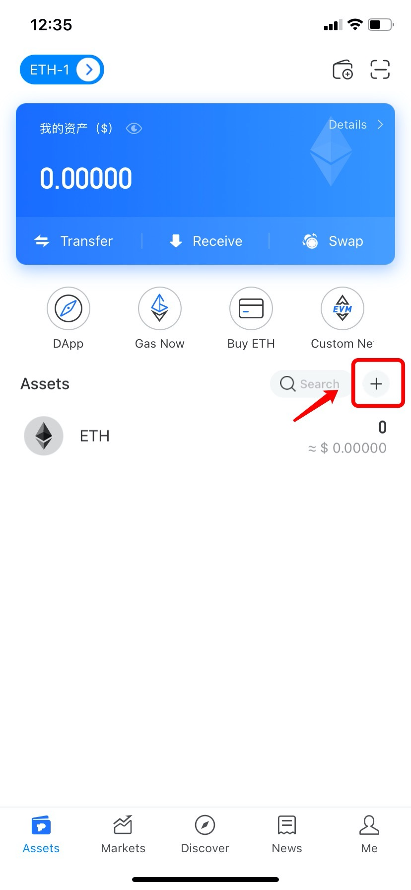

# How to Add Tokens?

1.Open TokenPocket, select a wallet you need to search and add tokens, click \[+\] to add new tokens;

2. Enter the contract address of the token, and then click \[+\] on the right side of the token to add it. \(Take adding TPT as an example\)

**Tip:** If you import other wallet addresses to TokenPocket, you need to add tokens manually to display your assets.

