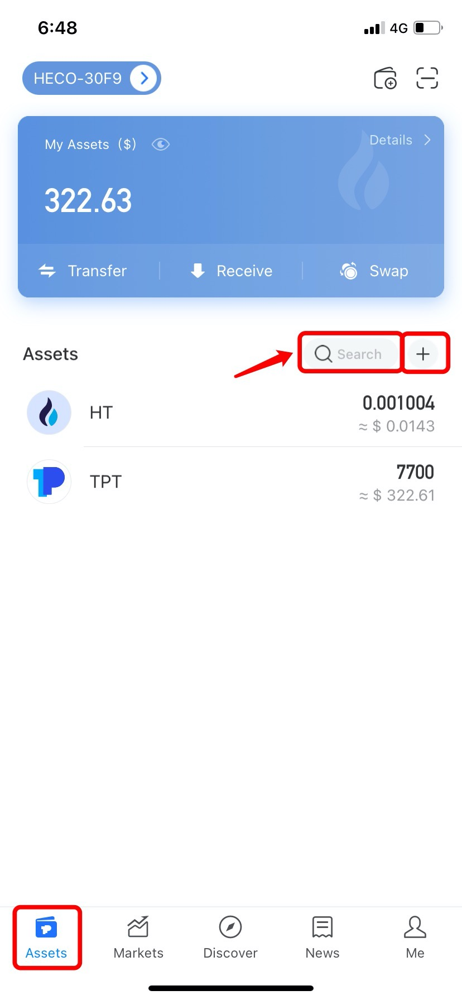

# How to Search and Add Tokens?

1.Open TokenPocket, select a wallet you need to search and add tokens, click search bar can search tokens in your assets, click \[+\] can add new tokens;

**Tip:** If you import other wallet addresses to TokenPocket, you need to add tokens manually to display your assets.

**Related tutorial:**  
[How to Add Tokens?](https://tphelp.gitbook.io/en/token-management/how-to-add-tokens)

