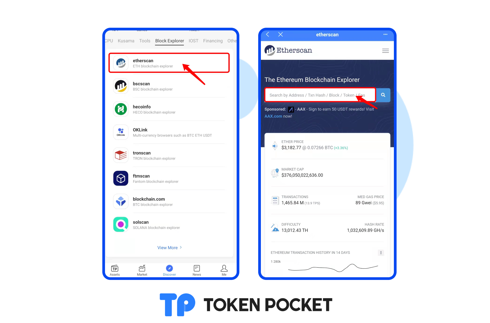
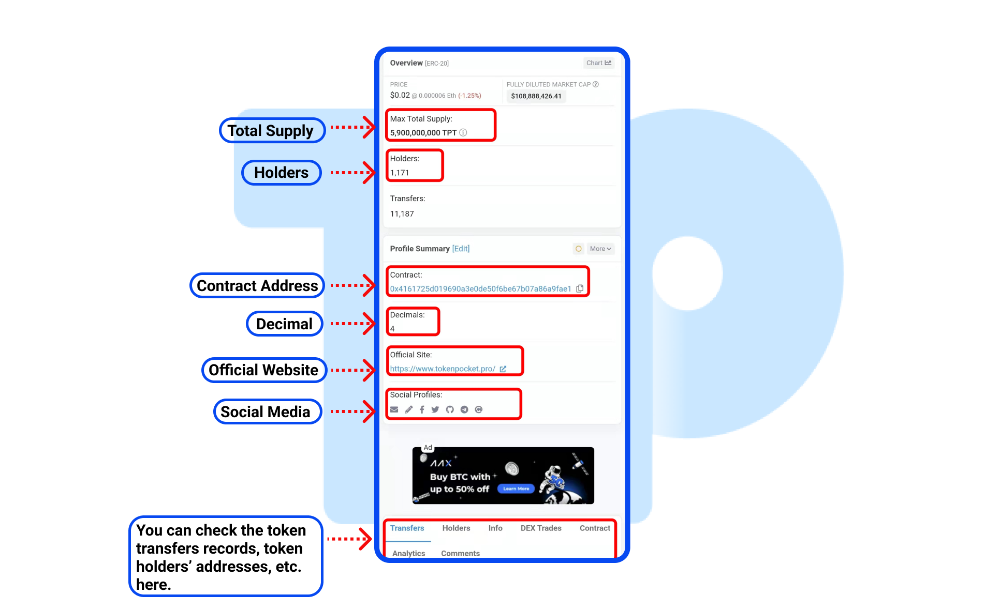

# Query the token's information on ETH explorer.

1. Open TokenPocket APP, click the \[etherscan] on the \[Block Explorer] section of the \[Discover] page. Enter the token's contract address on the search bar.

2\. The token details page includes basic information such as the token's total supply, token holders' addresses, contract address, decimals, official website, etc.

