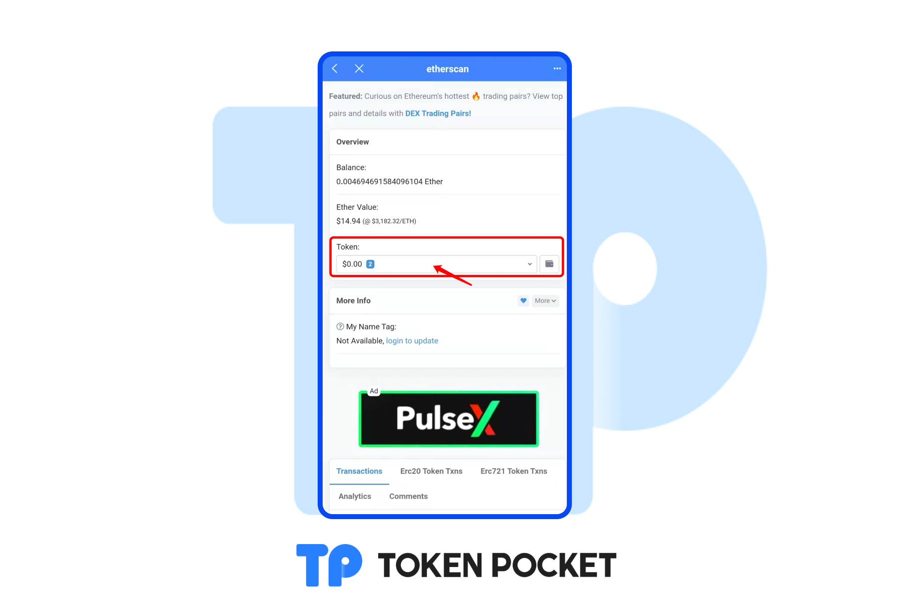
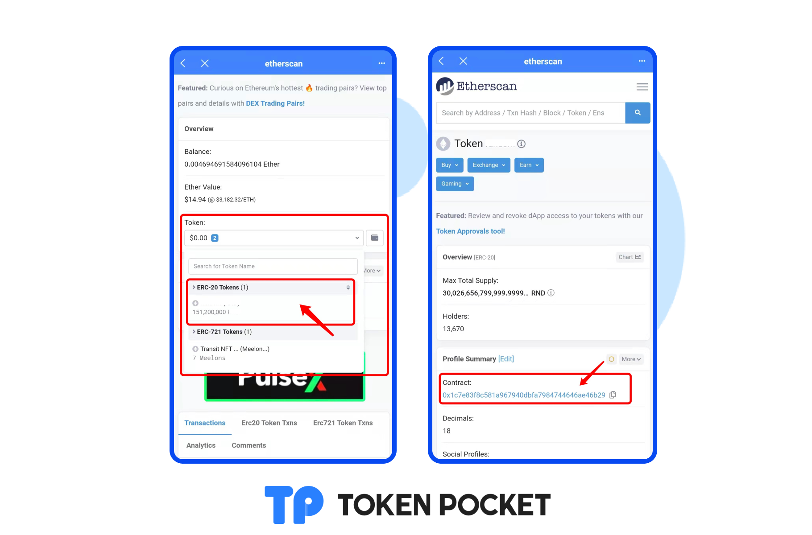

# Query your assets on ETH explorer.

1. &#x20;Open TokenPocket APP, click the \[etherscan] on the \[Block Explorer] section of the \[Discover] page. Enter your wallet address on the search bar.

2\. Click \[Token], you can view all your assets on your wallet address.&#x20;

3\. If the assets have not been shown on TokenPoket, you just need to copy the contract address and paste it on the \[+] on TokenPocket's Assets page. **(**[**How to add token?**](https://help.tokenpocket.pro/en/token-management/how-to-add-tokens)**)**

<mark style="color:orange;">**Attention: The contract address is the only criterion for distinguishing the real tokens. When adding tokens, do not directly enter the token's name.**</mark>

