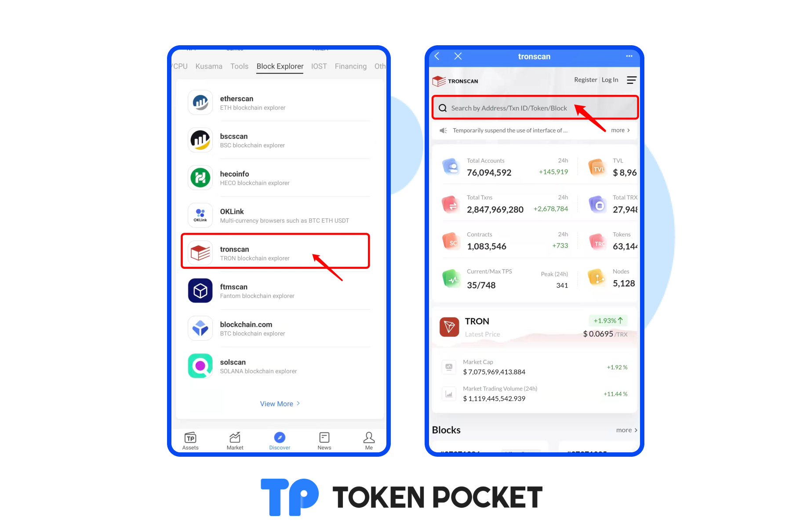
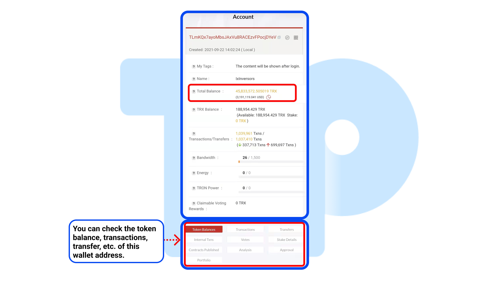
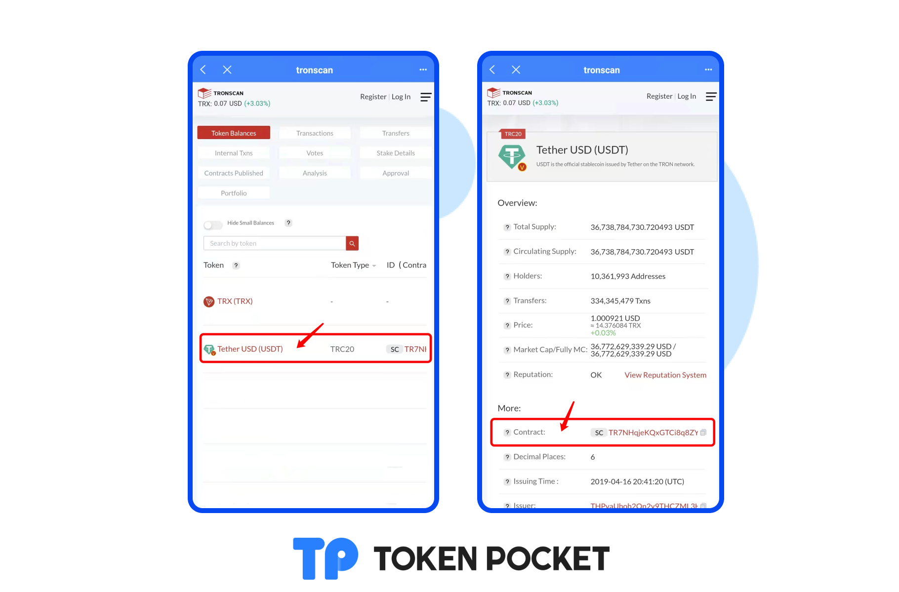

# Query your assets on TRON explorer.

1. Open TokenPocket APP, click the \[tronscan] on the \[Block Explorer] section of the \[Discover] page. Enter your wallet address on the search bar.

2\. You can check your total balance on this page, and you can check the token balance, transaction, transfer, etc. of the wallet address.

3\. If the assets have not been shown on TokenPoket, you just need to copy the contract address and paste it on the \[+] on TokenPocket's Assets page. **(**[**How to add token?**](https://help.tokenpocket.pro/en/token-management/how-to-add-tokens)**)**

<mark style="color:orange;">**Attention: The contract address is the only criterion for distinguishing the real tokens. When adding tokens, do not directly enter the token's name.**</mark>

